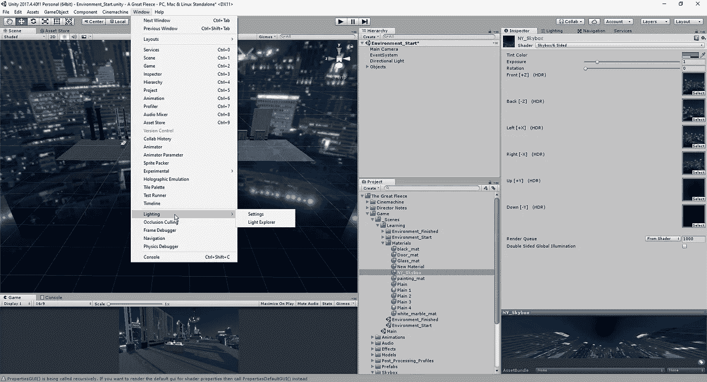
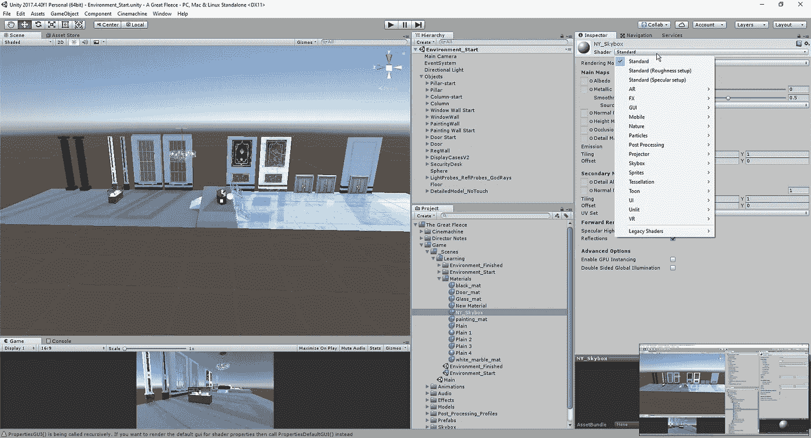
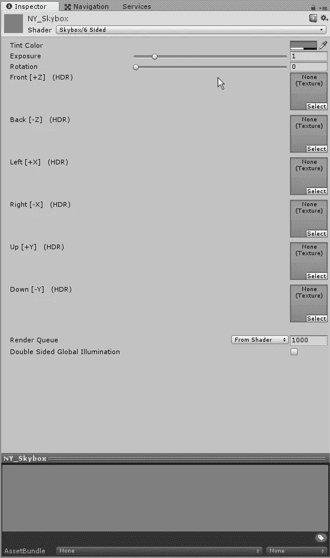
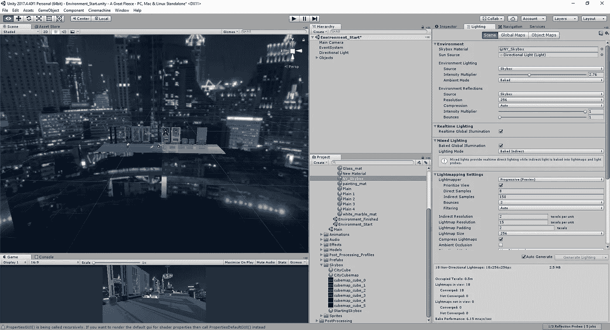
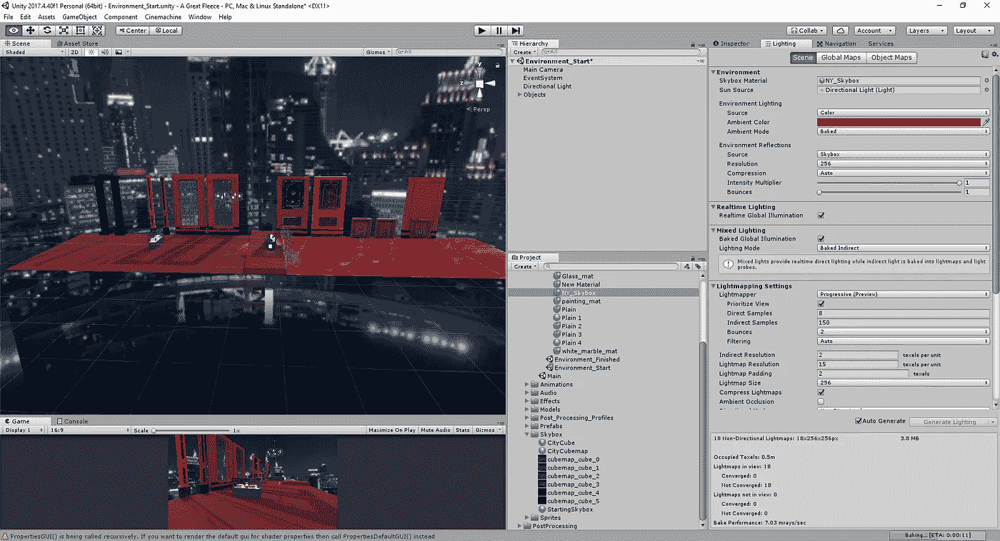

# Unity 中的天空盒带来的乐趣

> 原文：<https://medium.com/nerd-for-tech/fun-with-skyboxes-in-unity-40ec43151f78?source=collection_archive---------23----------------------->

这一次，让我们看看 skyboxes 能做什么，并稍微摆弄一下源代码，看看我们如何改变场景的外观。首先，我们需要打开我们的照明设置，以便我们可以调整天空盒材质:

从这里，我们将创建一个新的材料，并调整我们的着色器类型:

一旦我们选择了我们的着色器类型，我们就可以将我们希望用于边盒的图像拖动到不同的位置:

接下来，我们将进入“lighting”选项卡，我们可以将刚刚制作的 skybox 材质拖到适当的位置:

如果我们愿意，我们可以改变光的颜色，而不是让光源从天空盒中出现:

这就是我们如何创建一个新的天空盒材质，并将其应用到我们正在处理的场景中，如果我们想让它看起来有某种方式，还可以对颜色进行调整。