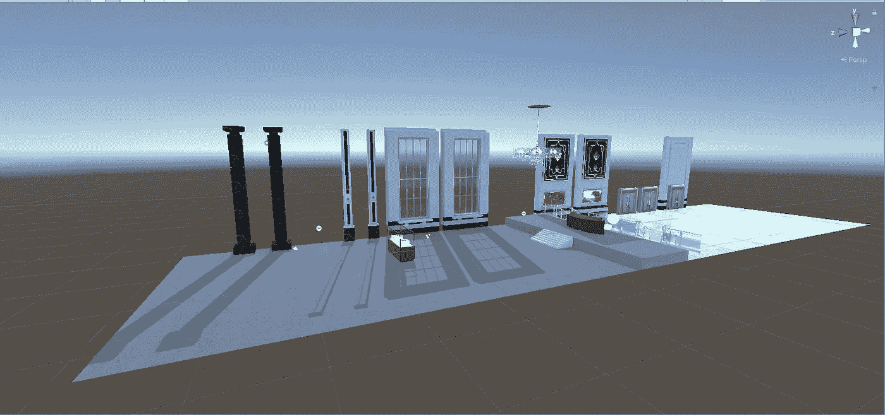
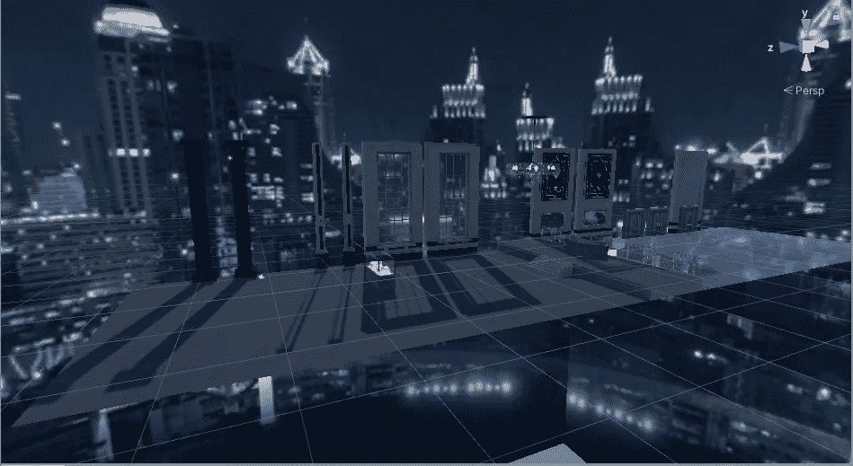
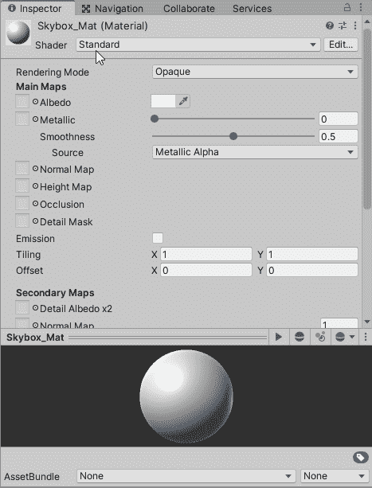
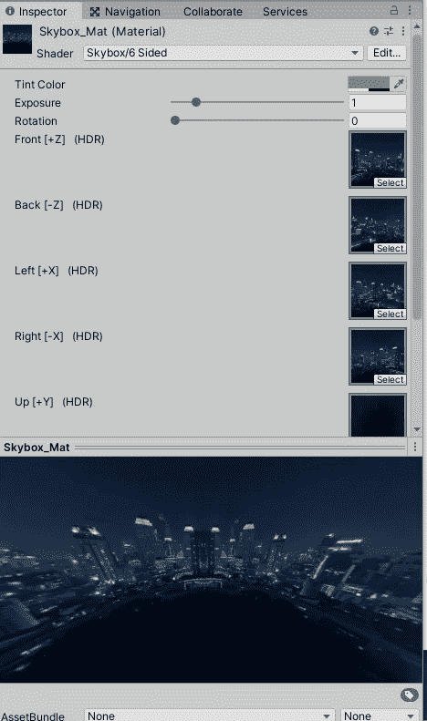
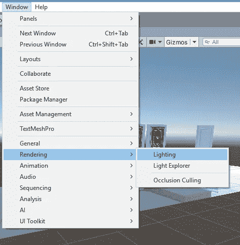
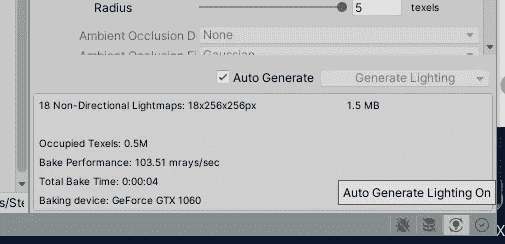
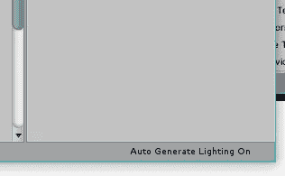
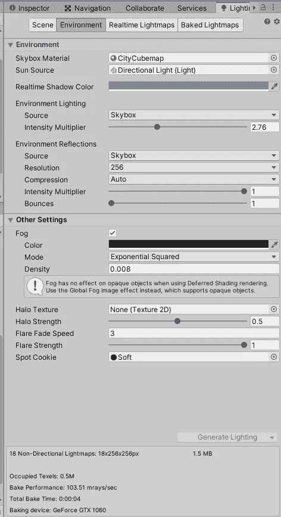
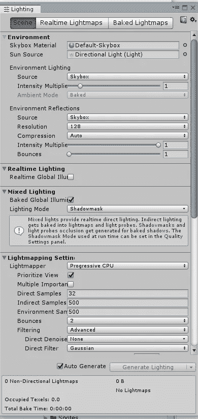
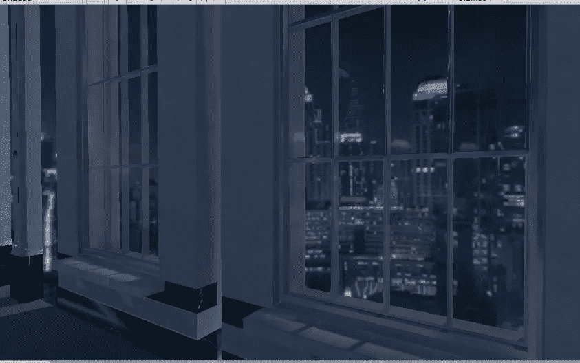

# 在 Unity 中享受 Skybox 的乐趣

> 原文：<https://medium.com/nerd-for-tech/fun-with-skyboxs-in-unity-1bde3f37f001?source=collection_archive---------20----------------------->

## 目标:在 unity 中建立一个 skybox。

天空盒对于屏幕上的照明非常有用，我们可以添加一个夜空的天空盒，让它改变照明来匹配，而不是改变一切来让它看起来像是在晚上。拥有天空盒的另一个积极的副作用是增加远处的细节，而不是必须全部重做。

正如你所看到的，有了天空盒和没有天空盒相比，有了白天和黑夜的区别。

要添加一个天空盒，我们可以添加一个新的材质，并将其命名为天空盒，因为我们希望这是一个天空盒，我们希望将其着色器更改为天空盒着色器。我将使用 6 个图像来组成天空盒，所以我们可以选择 6 面选项。

现在，我们可以将这 6 张图片添加到天空盒的材质中。

既然 skybox 已经完成了，我们现在需要做的就是利用它。为此，我们进入照明设置。点击窗口，然后渲染，然后照明。

根据您使用的版本，可能会有所不同。我发现可以在多个版本上工作的一个方法是点击 unity 窗口的右下角，那里写着自动生成照明开/关。点击它将会调出灯光设置。

左边是 2020.3.12f1，右边是 2019.2.12f1

在到达灯光设置后，我们想切换到环境选项卡，并将天空盒材质更改为我们刚刚制作的材质。它可能在场景下，取决于你使用的 unity 版本。

左边是 2020.3.12f1，右边是 2019.2.12f1

几秒钟后(取决于你的电脑),它会更新场景的照明。现在，当我们从那些窗户往外看时，外面就像是一座不夜城。

这只是进入 3D 环境和照明世界的又一步。有太多的东西需要探索和体验。也许我们可以一起探索更多。下一集再见！