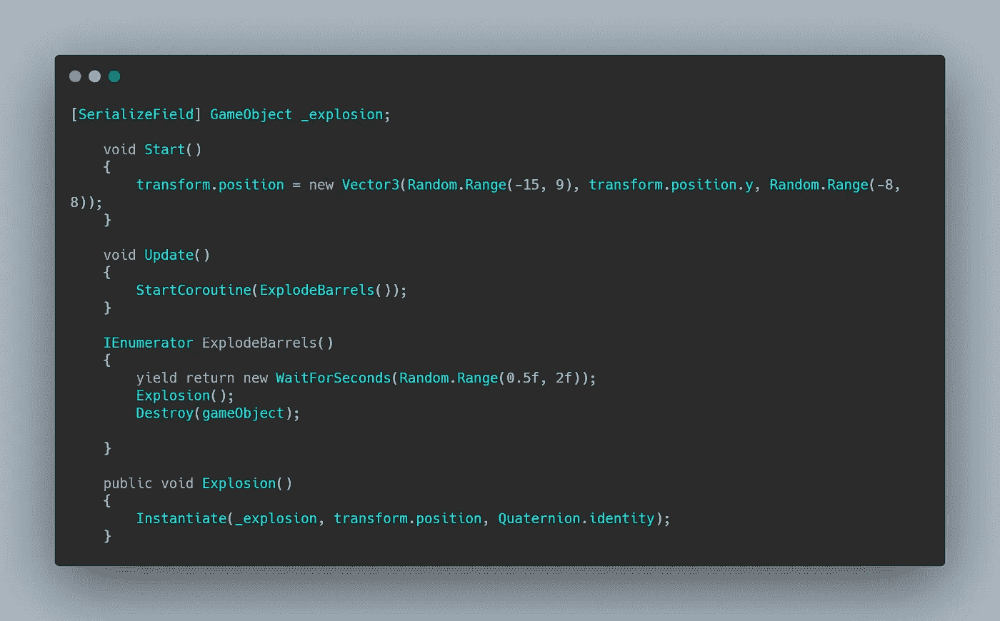
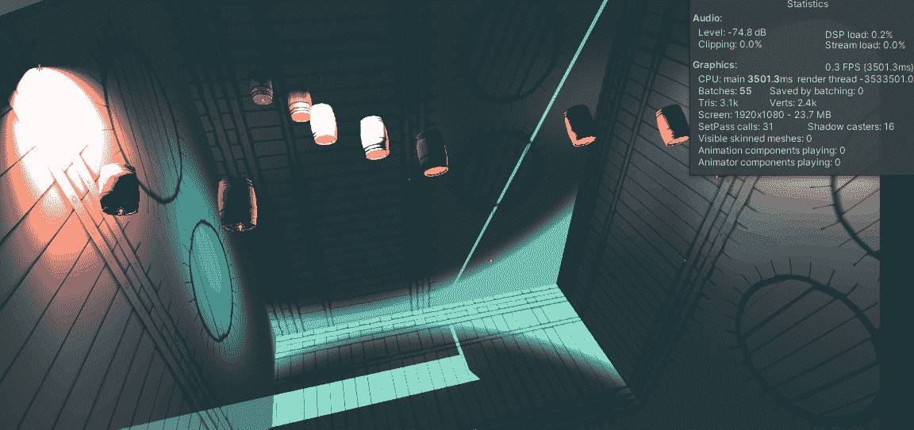
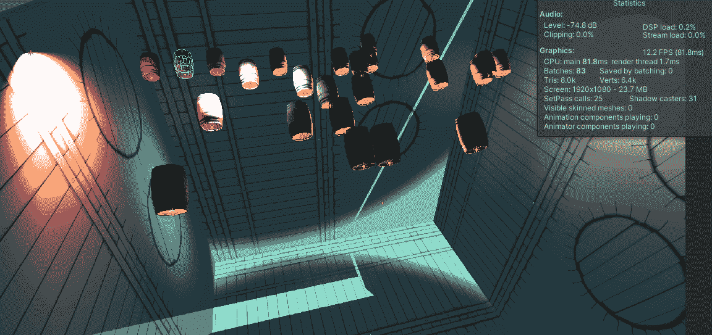
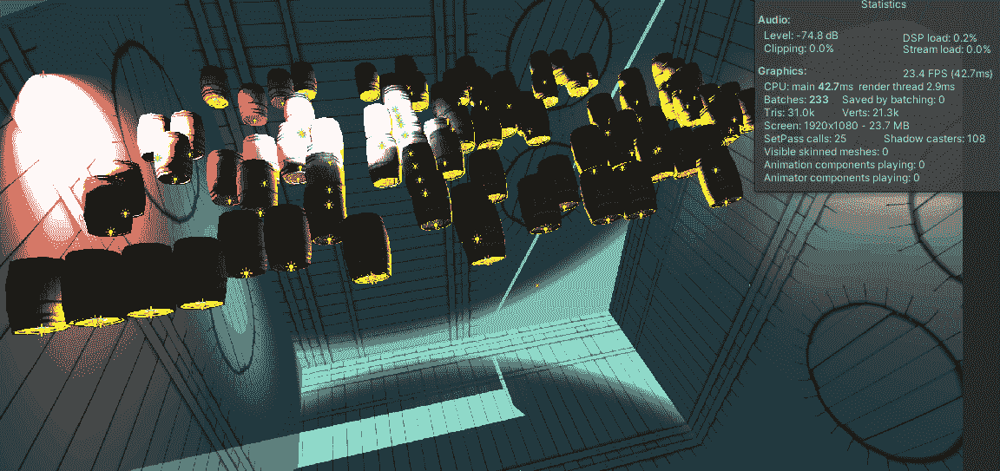
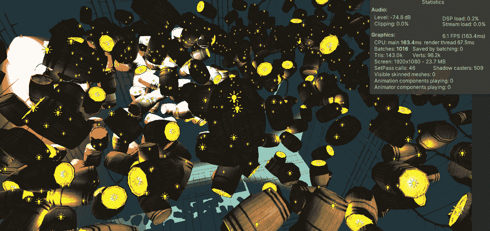
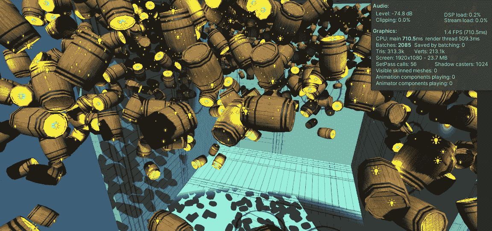
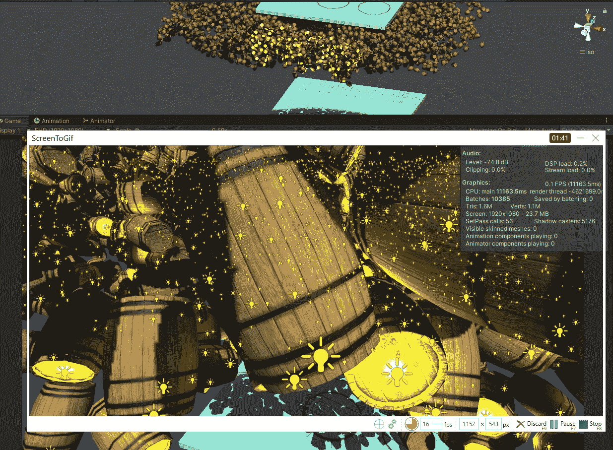
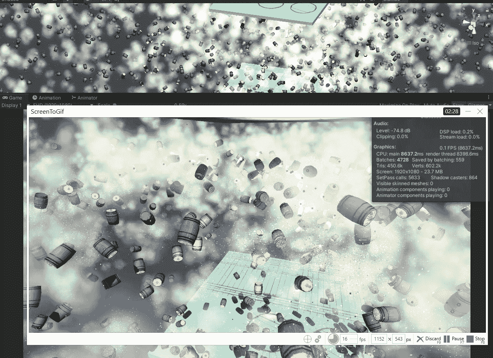
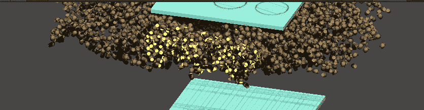

# Unity3D 的乐趣:能爆几个才破？

> 原文：<https://medium.com/nerd-for-tech/fun-with-unity3d-how-many-can-it-explode-before-it-breaks-f02ff0244c6b?source=collection_archive---------20----------------------->

享受 unity 的乐趣应该永远是你做的任何项目的核心，无论是游戏项目还是软件项目。

> 于是我就有了这个晚上在脑子里爆炸，把我惊醒的想法:在 Unity 破之前，我还能爆炸多少桶？

## 准备

为了快速制作原型，我从 Unity Asset Store 下载了《战争特效》中的[桶 3D 道具](https://assetstore.unity.com/packages/3d/props/barrels-32975)和[大爆炸 VFX。组装了一个快速房间和 C#脚本来控制桶在开始时的位置，并用随机性实例化爆炸。这个桶有一个碰撞器和一个受重力影响的刚体。](https://assetstore.unity.com/packages/vfx/particles/war-fx-5669)

桶形脚本

## 10 桶

让我们从简单的 10 桶开始。

平稳的爆炸

## 25 桶

一切都还顺利

## 100 桶

仍然运行流畅，保持 60fps，尽管当桶爆炸时 fps 有很大的下降。

## 500 桶

让我们增加爆炸例程的随机性，以便分隔爆炸并查看差异。

Unity 开始努力模拟所有的碰撞和爆炸。

## 1000 桶

它能撑得住吗？

这几乎打破了它，非常起伏达到每秒 1 帧

## 5000 桶

这是最终的考验…大爆炸来了。

我甚至不能正确地记录一个 GIF，它花了 unity 1 分 40 秒来启动序列

达到 0.1 FPS，Unity 差点破了但还在坚持。

Unity 没有崩溃，我的 GIF 录像机真的崩溃了。Unity 花了大约 10 分钟的时间爆炸所有的桶并恢复正常。

这是一个有趣的实验，只要记住这是使用 URP 完成的，没有任何优化。

厄运之桶