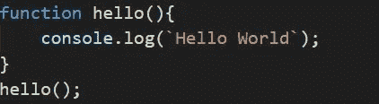
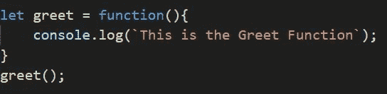

# JS 中的函数表达式

> 原文：<https://medium.com/nerd-for-tech/function-expressions-in-js-6f5cf48ba6d0?source=collection_archive---------24----------------------->

正在创建函数表达式…

[https://pix abay . com/vectors/JavaScript-js-logo-source-code-736400/](https://pixabay.com/vectors/javascript-js-logo-source-code-736400/)

函数是为了减少重复编写相同代码而编写的一些代码块。在 Javascript 中，一个简单的函数编写如下:

声明并调用了函数 Hello()

现在回到函数表达式，
函数表达式几乎与函数相似，唯一的区别是在函数表达式中我们可以忽略写函数名。
函数表达式也可以用作[life(立即调用的函数表达式)](https://developer.mozilla.org/en-US/docs/Glossary/IIFE)创建匿名函数和一定义就能运行的函数。

一个简单的函数表达式定义和调用如下:

函数表达式

上述程序的输出将是，

函数表达式的输出

关于函数表达式的更多信息可以在这个[站点](https://developer.mozilla.org/en-US/docs/web/JavaScript/Reference/Operators/function#description)找到。