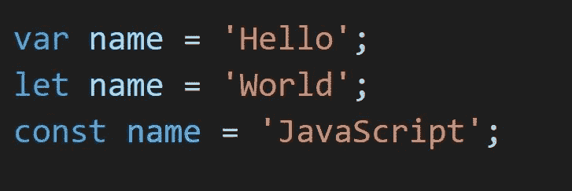
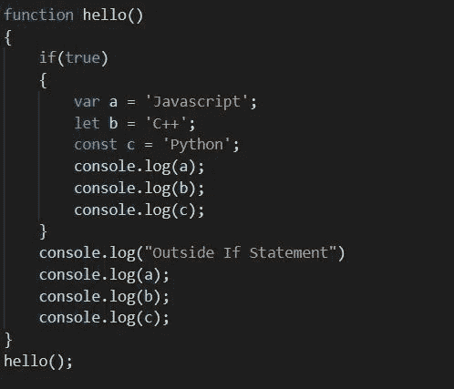
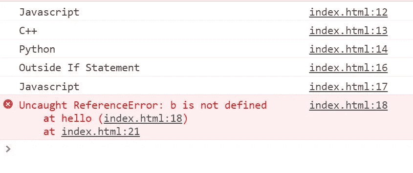

# JS 中的函数作用域和块作用域

> 原文：<https://medium.com/nerd-for-tech/function-scope-block-scope-in-js-d29c8e7cd216?source=collection_archive---------0----------------------->

Var vs Let vs Const

JavaScript ES6 有不同的方法来声明和使用变量。这经常导致混淆什么时候使用哪个关键字，在这篇文章中，我已经使这变得容易弄清楚什么时候使用哪个关键字。

为了知道使用哪个关键字，我们必须首先了解 javascript 中的作用域。顾名思义，它的“作用域”意味着哪个变量是可访问的，以及在哪个点上是可访问的。因此，在 javascript 中，整个文档是**全局作用域**，所有其他函数和变量都包含在这个全局作用域中。

另一个是**局部作用域**，在函数内部声明的变量被认为是局部作用域的，进一步分为函数作用域和块作用域。

**函数作用域**:当变量在函数内部声明时，它只能在函数内部访问，不能在函数外部使用。

**块范围**:当变量在 if 或 switch 条件或 f or 或 while 循环中声明时，可以在该特定条件或循环中访问。考虑到花括号内声明的变量在块范围内被调用。

回到关键字的使用上来，
***var*** 被称为函数作用域，也就是说，如果一个变量是用 var 关键字声明的，那么它在整个函数中都是可访问的。

***let&const***也被称为块作用域，即它们在特定的块内是可访问的。这里 let 用于表示在程序运行过程中可以改变的变量，而 const 用于表示在程序结束前不会改变的变量，也就是说它在整个程序中保持不变。

以下程序解释了 var、let 和 const 的用法:

以下程序的输出将是，

正如输出所示，当我们试图在 if 语句之外访问变量 b 和 c 时，它会给出错误，因为它是使用 let 和 const 关键字声明的，而这些变量可以在 if 语句内部访问。