# 函数∈Javascript∩数学

> 原文：<https://medium.com/nerd-for-tech/functions-javascript-mathematics-4bcbce8f121?source=collection_archive---------13----------------------->

在我目前的职业转型到计算机科学之前，我在数学领域度过了过去的十年。在那段时间里，我也做了一些编程工作，但这不是我的主要工作。就像，你知道你和那个朋友相处得非常好，而且真的和*(那不是一个 JS 双关语，但也不是* ***不是*** *一个 JS 双关语...)*但是你们大概一个月左右才见一次面。那是我和 CS。另一方面，数学是我一周见 5 次以上的朋友。你可以说我们很亲密。在学习数学和教授数学之间，我和数学花了相当多的时间在一起。

作为一名数学家，我很清楚数学和编程之间有很多重叠之处。举几个例子，很多时候编程涉及到计算和递归，或者从零而不是从一开始索引，等等。也许最明显的是编程的逻辑性有多强。不仅仅是“事情必须有意义”这种意义上的逻辑，而是更正式的数学/哲学意义上的逻辑——有 And、or、NOTs、条件句、布尔值等等。

我第一次接触编程(当时是 Java)也是在大约 10 年前，所有的逻辑部分对我来说都很容易，因为我擅长数学思维方式。当我了解到“*方法*”时，我当然也没有失去与数学函数的联系。但是我最近在学习 Javascript 的时候才发现一件事，就是在 JS，∃(“存在”)中这些被称为' ***一级*** *函数*'的东西。

在我的编程之旅中，这个概念对我来说是全新的。Java 的方法不是一级函数。Ruby 的方法不是一级函数。Python 显然拥有它们，但是在我接触 Python 的一点点时间里，我还没有深入到 Python 中去。所以就是在学习 JS 的时候，我第一次有了这个想法。但是我很快意识到这又一次像数学中的函数一样。为什么好吧，让我解释一下，就好像我在教一个代数和预备计算班，函数是什么，我们可以用它们做什么。

_____________

在数学中，函数是接受一个输入或一组输入，并给出一个输出的东西。每个独特的输入组合应该总是给你相同的输出。例如:

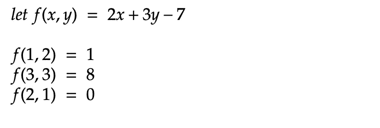

*(例 1)*

在这里的第一行，我们有我们称之为*的函数定义*。它定义了函数的名称(" *f* ")以及如何根据给定的输入预测结果。它接受两个输入(用变量 *x* 和 *y* 表示)，并输出一个值。然后，在接下来的三行中，我们*在一些独特的输入组合上评估*这个函数，每一个都给我们一个输出。听起来熟悉吗，程序员？请考虑以下情况:

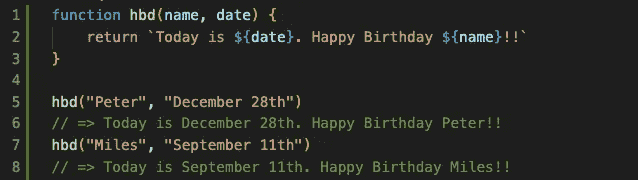

*(例 2)*

好吧，这是怎么回事？第 1-3 行是我们所说的*函数定义*。它定义了函数的名称("`hbd`")以及如何根据给定的参数预测返回值。这个函数也有两个参数(由变量 *name* 和 *date* 表示)，它返回一个值。然后在第 5 行和第 7 行，我们*调用*或*调用*一些独特的参数组合的函数，每个都给我们一个返回值。

~

在这两种情况下，函数的一个非常重要的特征是它们只能给你一个输出。在我们上面的函数 *f* ( *x* ， *y* )中，我们每次得到一个数字。在我们的`hbd(name, date)`函数中，我们为每次调用返回一个字符串。这并不是说我们的输出和返回值必须总是简单到只有一个数字或一个字符串。我们当然可以:

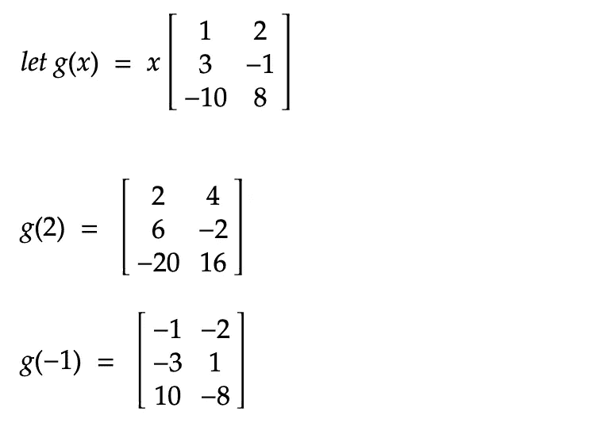

*(例 3)*

或者:

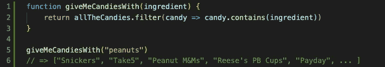

*(例 4)*

在 *g* ( *x* )中，我们得到了 6 个值的输出……但是它们实际上都被打包成了一个 3x2 矩阵，所以我们实际上仍然只得到一个输出。在`giveMeCandiesWith(ingredient)`中，我们得到许多字符串的一个长列表(或*数组*，但我们仍然只得到一个列表*返回的*。在任何一种函数中，无论是数学还是 Javascript，你都只能得到一个输出，不管你给了多少个输入。

好吧，目前为止还不错。但是我假设的代数 2 /计算前的学生可能会说“哈哈，我的家伙，我们在代数 1 中学到了这个，这是什么？”好的，耐心点。我们正在努力向上。在理解了函数*是*的概念之后，让我们继续来看看除了评估函数之外，我们还能对函数*做什么。对许多学数学的学生来说，一个新概念是*复合函数*的概念。事实证明，这个概念在数学和 Javascript 上下文中也同样存在。如果你是一个没有丰富数学背景的程序员，你可能没有意识到你在做这些，但是你可能一直在使用复合函数。在数学中使用复合函数的一个例子是:*

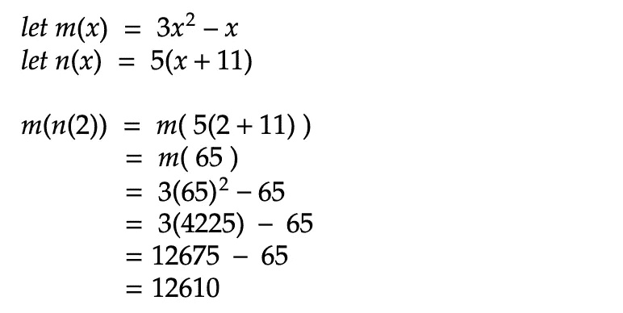

*(例 5)*

这里， *m* ( *x* )和 *n* ( *x* )都是普通的、非复合的、 *reglar-ol'* 函数，但是接下来我们不是只对 *m* 或 *n* 求值，而是对 *n* 的 *m* **求值是连锁评价。我们甚至没有评估 m(2)。这里我们做的是先对 *n* (2)求值，得到它的输出，然后取**那个** *输出* (65)，用**那个**求值 *m* 作为它的*输入* : *m* (65)。由此得出的最终结果是 12，610。在函数求值的基础上求值的函数——复合函数🤯。JS 中的一个例子:**

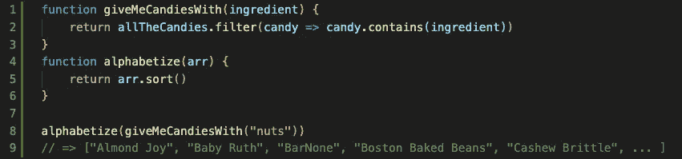

*(例 6)*

在这个例子中，我们有两个常规函数。但是在第 8 行，两者都被调用。当我们有了`alphabetize(giveMeCandiesWith(“nuts”))`后，首先在`“nuts”`上调用`giveMeCandiesWith()`，它返回一个未排序的糖果列表，然后我们的`alphabetize()`函数在 ***上调用*使**** *返回`giveMeCandiesWith("nuts")`的值*，然后`alphabetize()`为我们返回新的列表，现在已按字母顺序排序。根据函数调用的返回值调用的函数—复合函数。

甚至当你在 JS 中做一些像`console.log(giveMeCandiesWith(“caramel”))`一样简单和普通的事情时，你也在使用一个复合函数；首先在`“caramel”`上调用内部`Candies()`函数，然后在内部函数的返回值上调用外部`console.log()`函数*。如果你经常使用`console.log()`，你可能会比你意识到的更经常地使用复合函数。*

~

到目前为止，这些事情并不是 Javascript 或“一级函数”所独有的。我上面解释的也适用于没有一流函数的语言，比如 Java 和 Ruby。那么一级函数从何而来，它们是什么？为了解释，首先我来举例说明。让我们考虑几个数学例子。

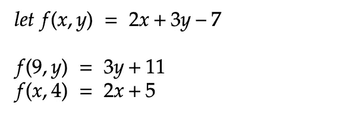

*(例 7)*

这里我从上面回收了我的函数 *f* ，但是我对它的评估有点不同。以前，在评估函数时，我的两个输入都是数字。然而，在这里，我给出了一个数字，留下了一个变量。如果我们记得我们的代数，第一次评估会告诉我们用 9 替换所有的 x，用 9 替换所有的 y..嗯， *y* 。这将给我们 18+3 *y* -7，然后组合相似的术语得到 3 *y* +11。好吧，暂停一下，检查一下:我是不是打破了什么东西？我前面说过，函数接受一个输入或一组输入，并输出一个东西。嗯，我仍然得到了我应该得到的两个输入，在这个例子中是 9 和 *y* ，我仍然得到了一个东西。但是这次我得到的输出不是一个数字…而是…另一个函数:3 *y* +11。在这种情况下，我的函数 *f* 的输出是一个新的不同的函数。如果愿意，我们甚至可以给它起个名字，比如*h*(*y*)= 3*y*+11 之类的。同样，对于我们的第二个评估，我们给它一些输入， *x* 和 4，得到 2 *x* +5 作为我们的输出，它是 *x* 的函数。在这两种情况下，通过很少的魔术和一些非常普通的代数，我们得到了一个*函数，作为函数*的 ***输出*** *。很好，现在把这个想法放在你的口袋里，我们来看下一个例子。*

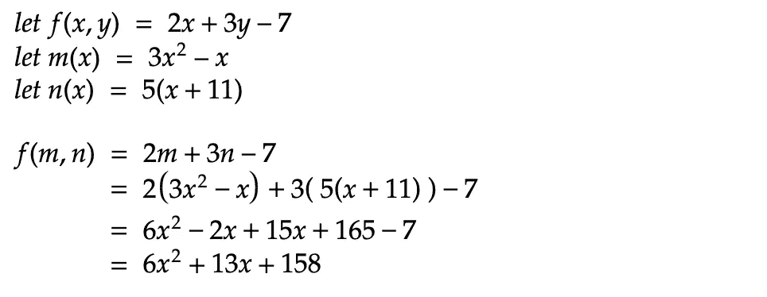

*(例 8)*

好吧，再次回收我之前的功能*(我能说什么呢……我爱环境？或者他们只是做了很好的例子🤷‍♂ 🤷‍♀️️)* 。但这次重要的是评估步骤。注意我是如何计算这个函数的。这不是一个新的函数定义，尽管看着它可能会很容易想到这一点。这是一个带有两个输入的函数的评估，但是现在这两个输入不是数字，而是它们本身也是函数: *m* ( *x* )和 *n* ( *x* )。我们把它们放在 *x* 和 *y* 曾经在 *f* 的地方，当我们把它们都简化后，我们得到的结果，也就是函数 *f* 的输出，又是另一个函数。

在示例 7 中，我们从一个函数中得到新的函数作为*输出*，在示例 8 中，我们使用函数作为函数的*输入*。如果有帮助的话，再举一个简单快捷的例子:考虑寻找一个函数的*导数*，比如说 *h* ( *t* )。当你求 *h* ( *t* )的导数时，函数 *h* ( *t* )本身就是你的输入，输出就是一个新的函数:*h’*(*t*)。这里没有数字或矩阵或值作为输入或输出-所有的实际功能。

我想让你注意到在例 7 和例 8 中，我们没有像以前那样使用复合函数，而是使用了 *m* ( *n* (2))。在这种情况下，我们是基于另一个函数的*评估*来评估一个函数。但是在 *f* ( *m* ， *n* )中，我们并不是根据 *m* 或 *n* 的*评价 *f* ，而是对**上的 *f* 函数 *m* 和 *n* 本身进行了评价。这是一个至关重要的区别，而且非常重要。***

这正是“一级函数”的含义。在 Java 和 Ruby 以及其他没有一级函数的语言中，你可以将来自 *函数调用*的*返回值作为参数传入，或者作为返回值传入(就像数学中函数求值的结果一样)，但是你不能将*函数本身*作为参数或返回值传入。另一方面，在 Javascript 和 Python 这样的语言中，如果*有*的第一类函数，你可以将*函数本身*作为参数和返回值传递。我举两个 JS 里的例子。*

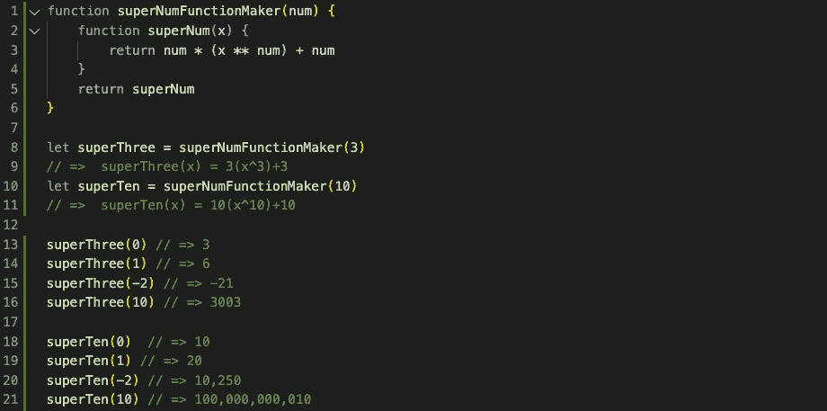

*(例 9)*

在这里，我们在第 1–6 行定义了一个函数，它接受一个数字作为参数(`num`)，并使用该数字创建和返回一个新的*函数* ( `superNum`)。在第 8 行和第 10 行，当用不同的参数调用`superNumFunctionMaker()`时，它每次输出(或返回)一个新的`*function*`，而不是一个值。因此，`superThree`和`superTen`是*函数*，可以在参数`x`上调用，如第 13–21 行所示。一级函数是可以作为函数的返回值返回的函数。

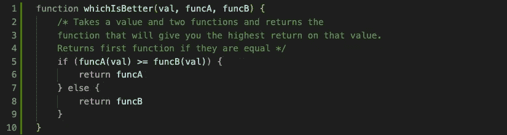

*(例 10)*

在这个例子中，我们有一个函数接受一些值(一个数字，一个字符串，一个数组，等等。)，以及两个*函数*作为其参数。它用给定的值评估这些函数中的每一个，并且*返回函数*，该函数将为您提供该值的最高输出。它不返回计算的值，而是函数本身。

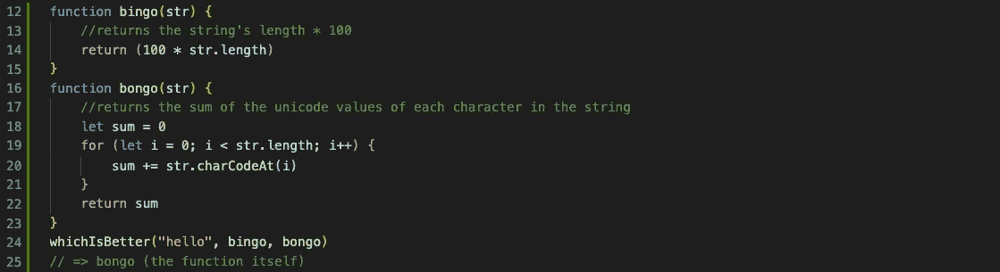

*(例 10a)*

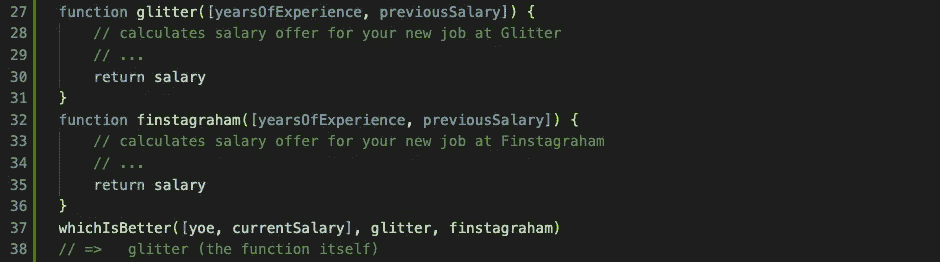

*(例 10b)*

在`bingo()`和`bongo()`上调用`whichIsBetter()`会告诉你这两个函数中哪一个给你的字符串提供了最高的数字。在`glitter()`和`finstagraham()`工资计算器上调用`whichIsBetter()`将会告诉你基于你的工作经验和当前工资，哪份工作会给你最高的工资。在这两种情况下，我们传入一个值和两个*函数*作为参数，我们得到一个返回的*函数*。一级函数是可以作为返回值从函数**返回的函数，而**可以作为参数传递给函数。

在一些编程语言中，你能从函数中得到或得到的只有值或对象。但是在函数被认为是“第一级”的语言中，未调用的函数本身可以以同样的方式处理，作为参数传入，或者作为输出返回，就像它们在数学领域中一样。

我认为这很棒。