# 基础数据建模和数据仓库

> 原文：<https://medium.com/nerd-for-tech/fundamental-data-modeling-and-data-warehousing-b599183d998a?source=collection_archive---------1----------------------->

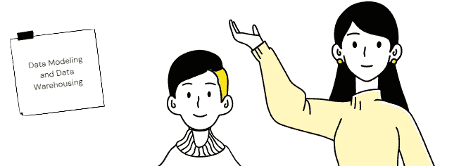

数据建模

**什么是数据建模？**

模型是真实数据表示，为我们提供适用于数据的特征、关系和规则。它实际上不包含任何数据

**数据模型让我们了解了**

数据模型帮助我们设计数据库。当制造一架飞机时，你不会从制造引擎开始。你首先创建一个蓝图。创建数据库也是一样，首先要对数据建模。

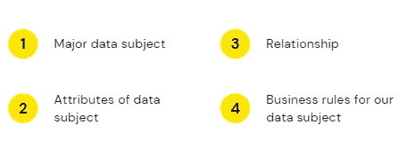

模型

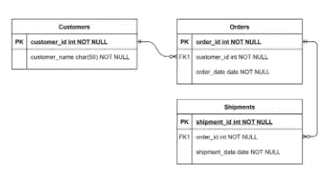

例子

*   该数据是关于客户交易的订单和发货
*   每个表的属性如图所示
*   订单和客户表通过 customer_id 连接，同时，订单和发货表通过 order_id 连接。客户和发货表通过订单表连接
*   一个客户可能会多次订购，并且每个订单可能会发送多批货物

**数据建模中的一些术语**

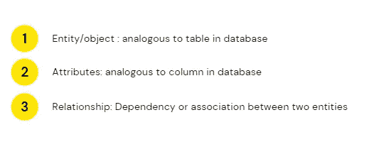

术语

**数据建模的类型**

数据建模的类型

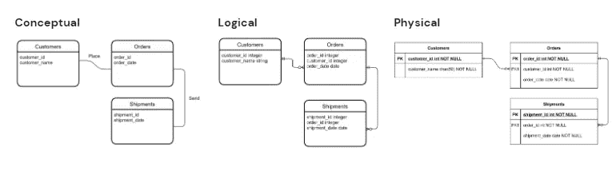

例子

**基数**

基数

**乌鸦脚符号**

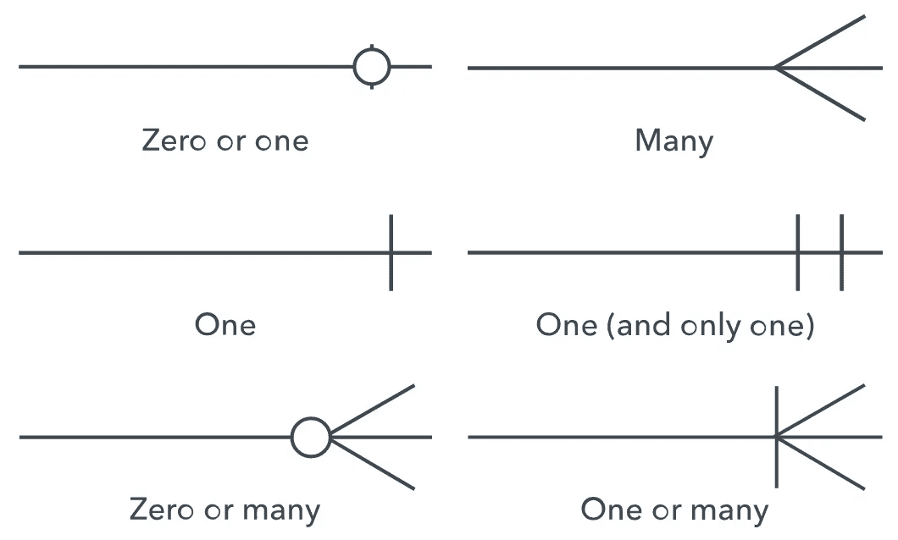

基数符号

**规范化与反规范化**

***规范化***

试图通过减少数据副本的数量来提高数据完整性。需要添加或更新的数据将在尽可能少的地方完成。

***反规格化***

试图通过减少表之间的连接数量来提高性能(因为连接可能很慢)。数据完整性可能会受到一点影响，因为会有更多的数据副本(以减少连接)。

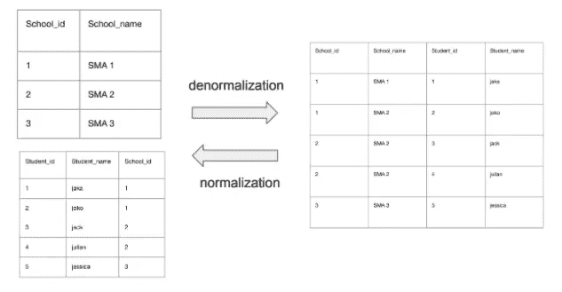

例子

**OLTP vs OLAP**

**OLTP(在线交易处理)**系统在数据库中捕获并维护交易数据。每个事务都涉及由多个字段或列组成的单个数据库记录。示例包括银行和信用卡活动或零售结账扫描。

**OLAP(在线分析处理)**针对数据挖掘、分析和商业智能项目，对从 OLTP 数据库和其他来源聚集的大量历史数据应用复杂的查询。

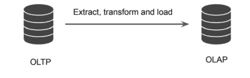

OLTP 与 OLAP

**什么是数据仓库？**

*   从技术上讲，数据仓库是充满数据的仓库
*   我们从各种来源收集数据，将其集中在一个数据仓库中
*   数据仓库不同于数据库。数据仓库以数据库为平台
*   数据不是移动的，而是复制的。

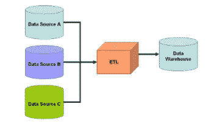

数据仓库

**为什么要建立数据仓库？**

*   为了支持数据驱动决策
*   通过集中分散的数据源简化数据分析过程

**传统数据仓库的规则**

*   完整的
*   面向主题
*   时变
*   非易失性(批处理)→目前已经有了将数据流式传输到数据仓库的架构

**数据集市**

数据集市专注于组织的单个功能领域，包含存储在数据仓库中的数据子集

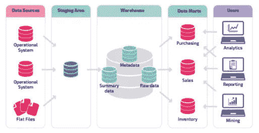

数据集市

**数据湖**

数据湖，一种在数据仓库之外存储数据的概念选择

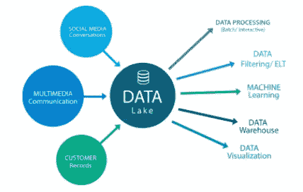

数据湖

**数据仓库 vs 数据湖**

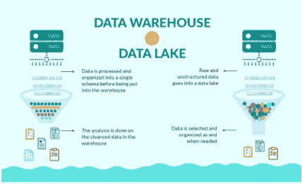

数据仓库与数据湖

**什么是维度造型？**

维度建模总是使用事实(度量)和维度(上下文)的概念。事实通常(但不总是)是可以聚合的数值，而维度是定义事实的层次结构和描述符的组。例如，销售额是事实；时间戳、产品、注册号、商店号等。是维度的元素。维度模型是按业务流程领域构建的，例如商店销售、库存、索赔等。因为不同的业务流程领域共享一些而不是所有的维度，所以使用一致的维度，即使用跨主题领域的共享维度的一个副本，来实现设计、操作和一致性的效率

**关系模型**

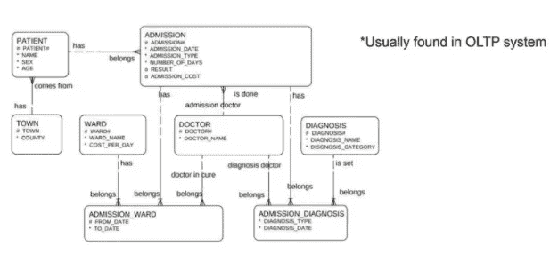

关系模型

**尺寸模型**

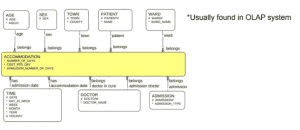

维度模型

**维度建模中什么重要？**

*   尺寸
*   语境

**事实和维度**

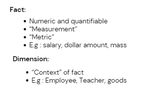

事实和维度

**尺寸建模步骤**

*   ***确定业务流程***
*   ***识别纹路***
*   ***确定尺寸***
*   ***认定事实***
*   ***构建模式***

**数据模式建模**

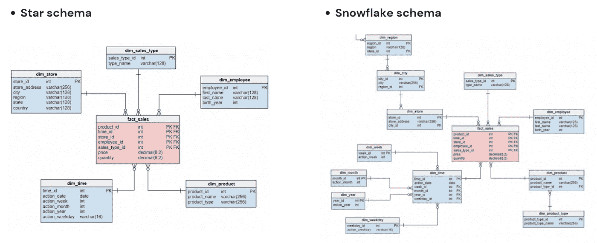

星星 vs 雪花

**尺寸建模的数据库关键字**

维度建模中使用了两种键:

*   **主键**:用于保证表中数据唯一的一列。
*   **外键**:关系数据库表中的一列或一组列，提供两个表中数据之间的链接。

在建模数据仓库中，有两种类型键用于主键:

*   **自然关键字**:来自数据源表的主键
*   **代理键**:数据进来时数据库生成的主键

确定维度建模模式中的关键点的提示:

*   将代理键作为数据添加到数据仓库中
*   Kepps 自然键作为次元键

**如何设计维度表？**

维度表提供了度量上下文。维度表有两种类型:

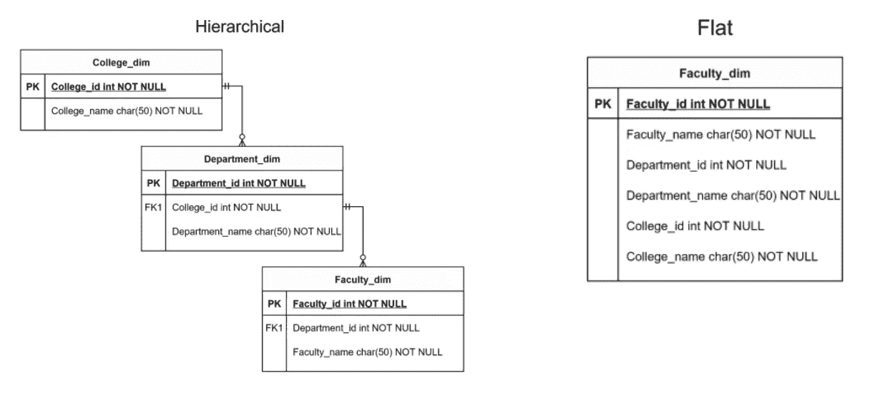

维度表

**如何设计事实表？**

事实表的类型:

*   **交易事实** **表**；包含数据交易
*   **定期快照**:定期跟踪给定的测量
*   **累积快照:**跟踪正式定义的阶段的进度
*   **无事实:**无计量且记录为 0 的交易发生记录

**如何为历史数据创建策略？**

3 历史数据的主要策略(尤其是在维度表中):

*   写得过多
*   保持无限的历史
*   维护有限的历史

**数据管道**

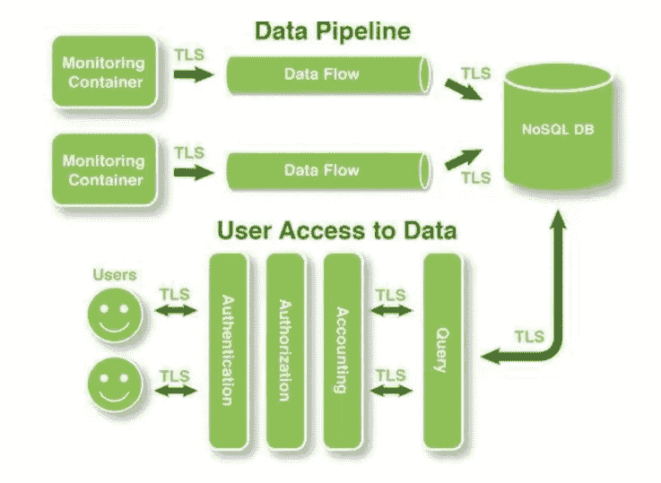

数据管道

数据管道可以是简单的数据提取和加载过程，或者可以设计为以更高级的方式处理数据，例如用于机器学习的训练数据集。来源:数据源可能包括关系数据库和来自 SaaS 应用程序的数据。

**结论**

管理大量结构化和非结构化数据是信息系统的主要功能。数据模型可以描述存储在数据管理系统(如关系数据库)中的数据的结构、操作和完整性。因此，了解数据建模非常重要。

参考

[什么是数据仓库中的维度建模？(guru99.com)](https://www.guru99.com/dimensional-model-data-warehouse.html)

[数据模型—维基百科](https://en.wikipedia.org/wiki/Data_model)

[维度建模—维基百科](https://en.wikipedia.org/wiki/Dimensional_modeling)

[什么是数据管道？过程和实例(stitchdata.com)](https://www.stitchdata.com/resources/what-is-data-pipeline/)

[OLTP 和 OLAP:实用比较| Stitch 资源(stitchdata.com)](https://www.stitchdata.com/resources/oltp-vs-olap/)