# 银河射手 2D——相机抖动

> 原文：<https://medium.com/nerd-for-tech/galaxy-shooter-2d-camera-shake-21-f88583db0779?source=collection_archive---------38----------------------->

## 增加伤害反应的冲击力和强度！

视频游戏中经常使用相机抖动来增加游戏的感觉，强化某些动作，增加沉浸感。这是一个混乱的细节，但却是一个改善玩家体验的微妙细节(当它没有被过度使用或处理不当时)。

当玩家被击中时，我使用相机抖动，随着 VFX 伤害增加强度。

# 设置

要摇动相机，我需要修改相机的变换位置，但这样做会阻止我移动它(它会不断地将相机的位置覆盖回摇动的值)。

为了解决这个问题，相机将是一个空游戏对象的子游戏对象，我将它命名为 CameraContainer，在那里将发生抖动。这样，相机将能够自由移动，并保持从父游戏对象的抖动。

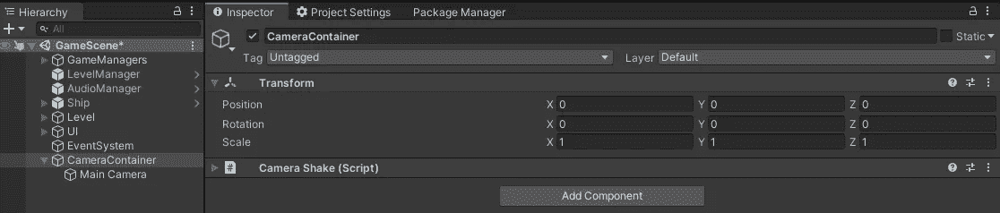

# 震动

为了正确地摇动相机，我至少需要两个变量或值:摇动相机的随机方向和摇动的强度。

为了在任何方向随机移动相机，我首先使用了 Random。返回-1 和 1 之间的随机值。

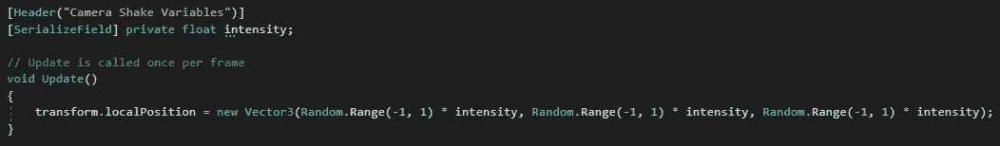

这种方法的问题是运动不平稳。在较高的值，这很容易被注意到，它是混乱的，有点令人不快。

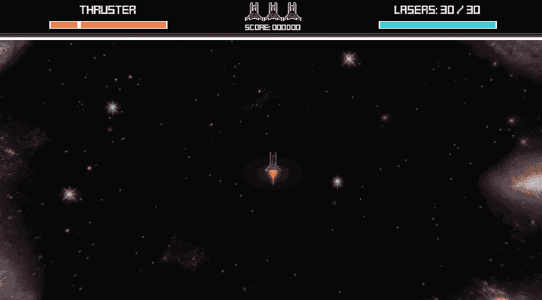

# **平稳摇动**

> [**Unity API:** Mathf。柏林噪声](https://docs.unity3d.com/ScriptReference/Mathf.PerlinNoise.html)

通过使用柏林噪声，它可以生成一个保持连续性的随机值，它非常适合我试图实现的目标:平滑的抖动。

PerlinNoise 接受两个参数:X 和 Y 值。它所做的是生成一个 2D 柏林噪声纹理，寻找给定坐标的灰度值，并返回该值，范围在 0 和 1 之间(纯黑、所有灰色阴影和纯白)。

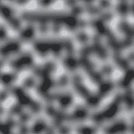

我将使用 X 参数设置一个“随机”的固定种子，使用 Y 参数使用 ***Time.time*** 在纹理中不断移动。在轴之间设置不同的 X 值非常重要，否则整个运动将在同一方向同步。

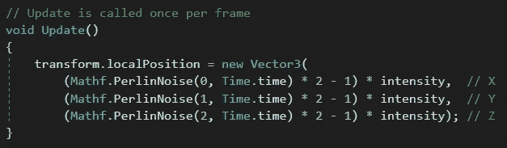

此外，该数值范围并不理想，因为这意味着它不会向轴的负方向移动。为了解决这个问题，我们将 PerlinNoise 的值乘以 2，然后减去 1，将其转换为-1…1。

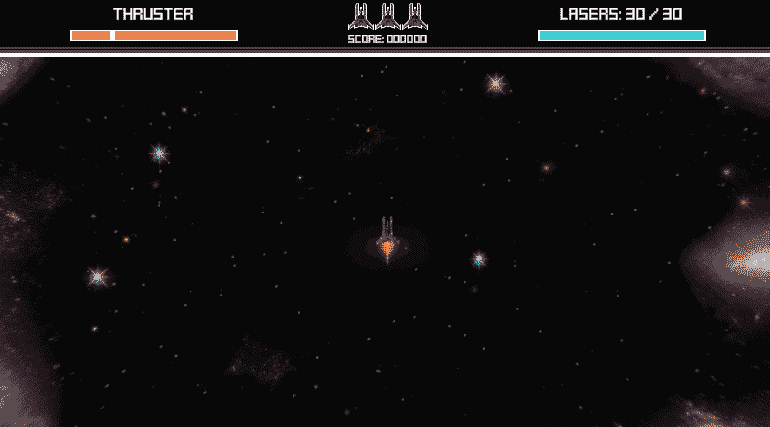

如果我们在 X，Y，Z 柏林噪声中设置相同的 X 值，就会发生这种情况

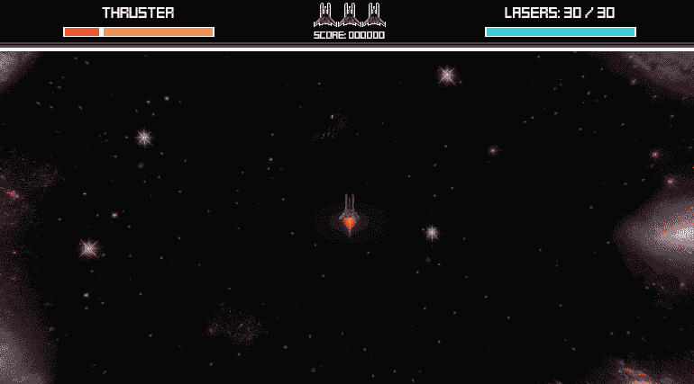

这样好多了，但是移动相当慢，而且是因为 Y 参数( ***Time.time*** )滚动太慢。添加一个新的变量“shakeFrequency”并将其乘以 Y 参数将解决这个问题。

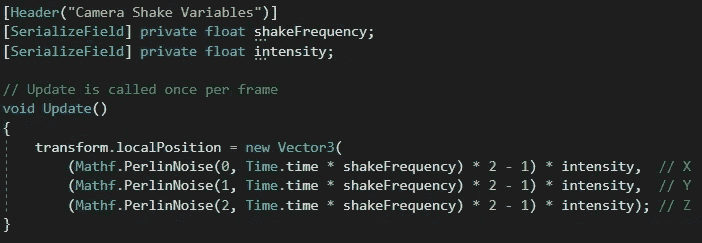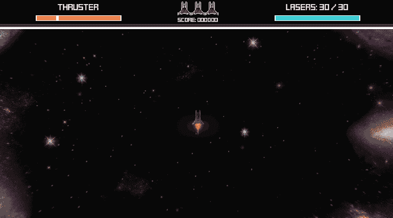

频率设置为 8。这样不是感觉好多了吗？

# 更多改进

这篇文章有点长，所以，我把我做的其他改进列在这里(你也可以做):

*   脚本还可以抖动相机的旋转。
*   从更新切换到协程，以避免每帧执行代码。
*   设置最大平移/旋转量，以避免相机过度抖动。
*   添加创伤和创伤衰减(这是介于 0 和 1 之间的相机抖动量)。
*   通过动画曲线修改创伤值，使抖动更加平滑。

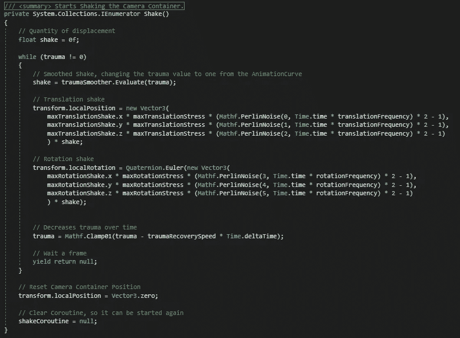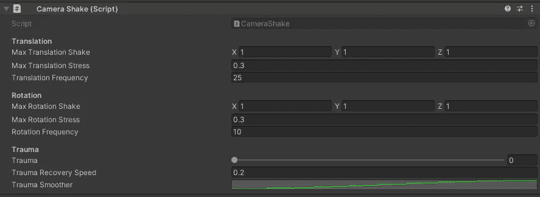