# 银河射手 2D——热寻的激光

> 原文：<https://medium.com/nerd-for-tech/galaxy-shooter-2d-heat-seeking-lasers-20-a8347dfde1b4?source=collection_archive---------29----------------------->

## 敌人甚至不知道是什么袭击了他们！

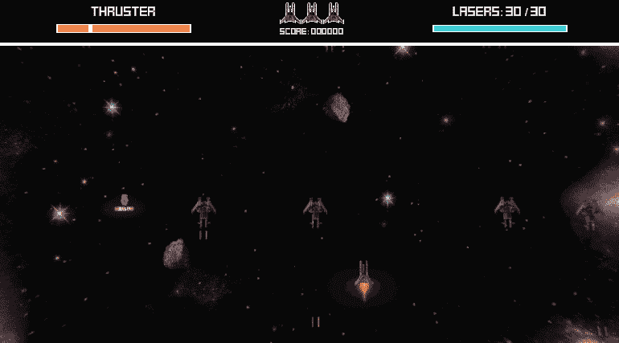

我的船上武器库已经有点过时了，只有两种武器(如果你包括默认的那种)。我已经决定增加热寻的激光，只寻找飞船目标(小行星被忽略，但这并不意味着它们会碍事)。

这是一个基本的武器，但需要一些工作来实现和优化。这就是为什么这篇文章完全专注于解释我是如何实现的。

# 准备

*   这种武器只能通过热追踪启动获得。我添加了一个新的 sprite 和[添加了一个新的 enum 来保存 powerup 引用。](https://pablogomezplaton.medium.com/galaxy-shooter-2d-modularity-9-4d8927c8dc46)

*   我在飞船脚本中实现了武器交换，它将暂时替换热搜索的默认激光预设。

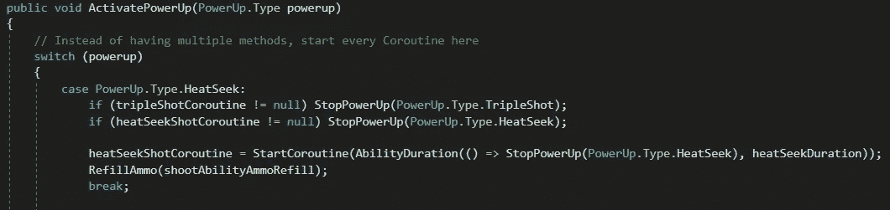

我使用[协程](https://pablogomezplaton.medium.com/galaxy-shooter-2d-coroutines-3-bacf9cca8574)来处理每次加电的持续时间

*   我创建了一个“新的”激光预制体，热寻激光脚本将被添加进去。

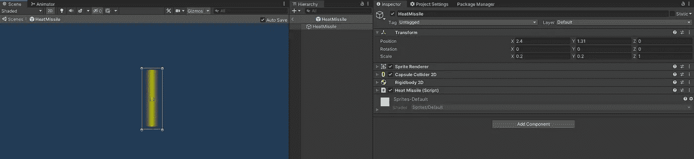

# 履行

记住，在实现一个特性之前，你应该首先设计它。你可以在设计的过程中设计它，但是这会花费你更多的时间来编码，因为你要同时考虑这个特性应该做什么以及如何编码。

热寻的激光器应该表现如下:

*   激光器需要一种方法来探测激光器周围的敌人。最理想的是，使用 ***协程*** 来避免检查每一帧的敌人，并使用 ***Physics2D。OverlapCircleNonAlloc*** 检测敌人将允许快速和优化的碰撞查询。
    ***协程*** 将以 OnEnable()方法启动，并一直处于活动状态，直到激光被破坏或禁用。

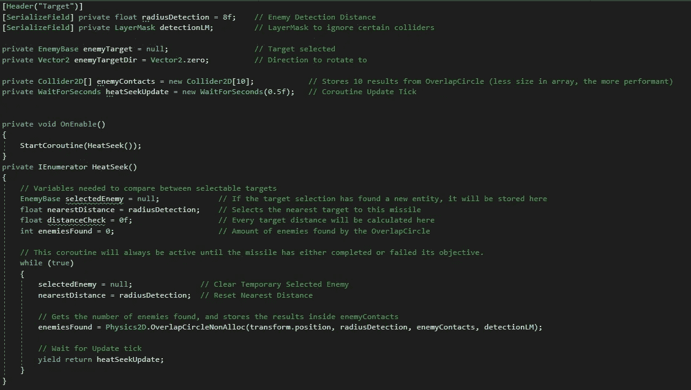

单击以缩放。这些变量是激光器工作所必需的。

*   激光将只追逐一个有敌方脚本的目标，并且是距离激光最近的目标(小行星被解散)。这意味着，对于每一个探测到的敌人，激光都必须检查谁是最近的。

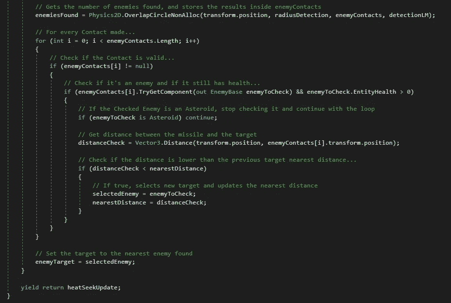

为了获得最近的接触，激光必须绕过探测到的敌人。这是一个有点昂贵的操作，因此，为了应对这一点，这就是为什么我选择使用协程，以避免每帧检查碰撞器/目标。

*   如果选择了一个目标，游戏对象将朝着激光和选择的目标之间的方向旋转。在任何情况下，激光总是以恒定的速度沿其局部轴线向上运动。

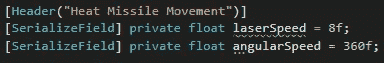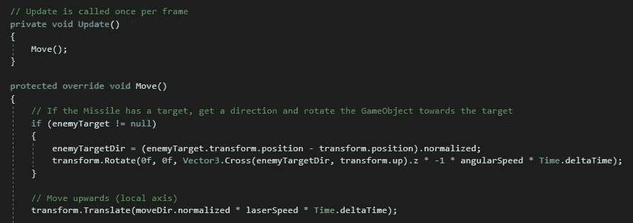

*   当选择的敌人没有生命了，或者失去了对该敌人的参照时，目标被取消选择。激光会锁定那个敌人，直到敌人被消灭，我们也跳过了寻找敌人的昂贵操作。

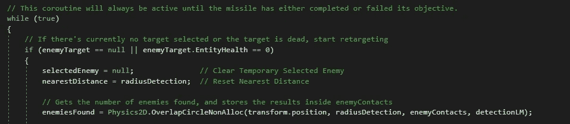

*   当激光接触到一个**可伤害的**实体时，对该实体造成伤害并自毁(或自失能)。

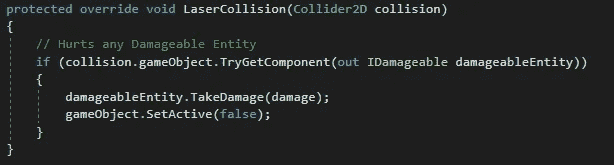

*   如果激光在水平轴上离开屏幕，激光将会绕回并从离开屏幕的另一侧再次进入。同样，如果它存在于垂直方向，它将自毁/自失能。

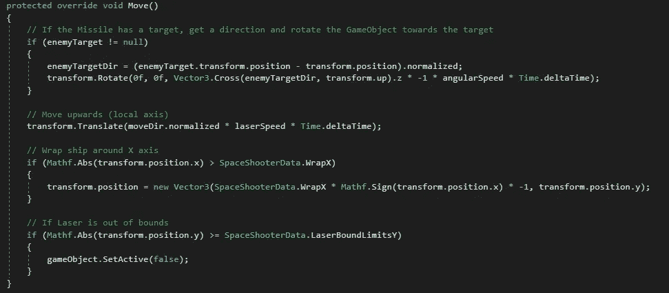

*   作为一个临时演员，为了平衡/调试的目的，我想想象一下激光的半径。为此，我使用了 ***小发明*** 。

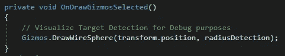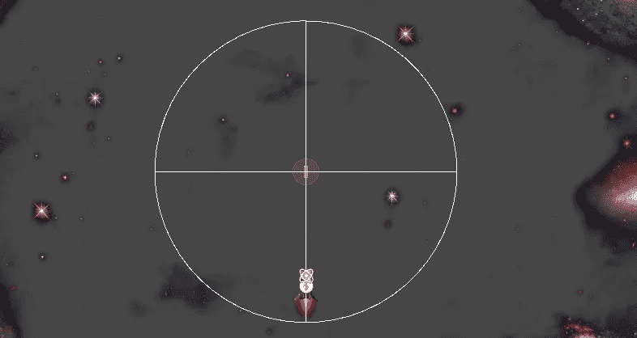

# 最终结果

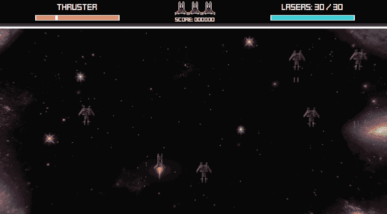

有时，一个基本特性有其自身的复杂性。只要记住，当你估计编码一需要多少时间的时候。