# 银河射手 2D——激光束

> 原文：<https://medium.com/nerd-for-tech/galaxy-shooter-2d-laser-beam-22-21e317363941?source=collection_archive---------29----------------------->

## 我是一个“开火”的人！！

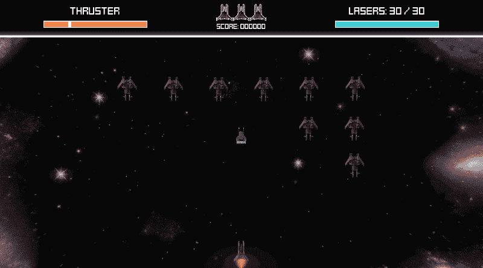

是时候让大人物上场了！今天，我要展示我的游戏中最新加入的: ***激光束*** ！一种强大的大规模杀伤性武器，可以迅速消灭任何挡路的实体(包括激光)，因此优化后的游戏甚至不会丢一帧！

这里有很多东西要打开。不幸的是，我将不得不删除一些多余的内容，以保持这篇文章简单。尽管如此，我还是实现了这个特性:

*   [**激光束设计**](#0abb) **-** [**加电**](#430c) **-**[**组件**](#30ff) **-**[**【无碰撞器】**](#749b) **-**[**状态**](#a5b8)
*   [**激光束代码**](#58ff)[**-光束对撞机检测协程**](#7ed1)[**-主光束协程**](#d0df)
*   [**游戏内成绩**](#1fc7)

# 激光束设计

## 通电

激光束是一个无限保持时间的加电拾取器(意味着玩家将保持加电，除非玩家开始使用它或者已经拾取了另一个武器加电)。

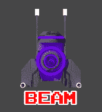

## 激光束组件

横梁由以下材料制成:

*   ( **PlayerBeam** )一个带有切片精灵的精灵渲染器(你需要安装 ***2D 精灵*** 包来制作一个)，激光束脚本将被附加到这里，下一个组件将成为其父组件。
*   (**fakedbiamarealight**)一个假的 2D 灯光区雪碧。因为我没有在我的项目中使用 2D 照明，我需要伪造它。我们游戏开发者称之为纸板把戏。只要玩家没有注意到他们，你就能侥幸逃脱！
*   ( **BeamChargeUpPS** )一个粒子系统，它会给光束增加更多的冲击力或感觉。
*   ( **BeamForceFieldPS** )粒子系统力场，用粒子系统创建轨道效果。

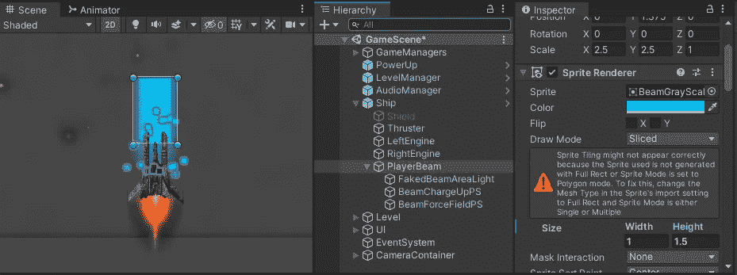

我还在 **PlayerBeam** GameObject 中添加了一个动画师，让精灵在光束变得可见时发光，并添加了一个 ***音频源*** 来添加声音！

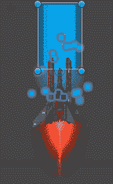

## “没有碰撞器”

我知道调整碰撞器的大小会导致性能下降，这是非常不幸的，因为光束会不断地调整大小，即使光束已经完全退出了屏幕。我本来可以忽略这一点，使用标准的 2D 盒碰撞器，但是因为我关心性能，我决定使用物理的。OverlapBoxNonAlloc 检查光束体积内的敌人。

灰色的盒子是激光束对撞机探测器，全部由代码组成。此外，为了避免 spawn killing，Beam sprite 不断调整大小，以避免超过我设置的 Y 值。

后来，它对我产生了反作用，因为我意识到我不能实现特定类型的敌人，因为代码冲突查询不能被其他查询检测到(不能检测到一个 ***与另一个*** 重叠)。因此，我最终使用了一个碰撞器，只有当激光束开始/停止调整大小时，我才启用和禁用它(另一个纸板把戏，允许其他功能注册碰撞器)。

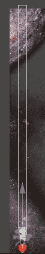

## 光束状态

一旦玩家通过按下“ ***火*** 输入决定使用它，激光束将经历 3 个状态，由一个 ***协程*** 处理:

*   ***充电(阶段 1)*** :从 0–25%的激光束充电开始， **FakedBeamAreaLight** 将慢慢点亮(通过将 alpha 值设置为最大)。超过该百分比后，灯将闪烁，直到 ***上紧*** 状态。
*   ***充电(阶段 2)*** :充电到 50%时， **BeamChargeUpPS** 开始发射粒子。
*   ***光束发射***:100%时， **PlayerBeam** 开始增长，一旦接触到最大 Y 值，光束持续时间开始倒计时，并开始检查碰撞器(通过 ***协程*** )。
*   ***上紧***:**player beam**将开始倒退，**fakedbamarealight**将慢慢淡出，**beam charge PPS**将停止发射粒子。一旦 **PlayerBeam** 完全倒退，激光束状态将切换到 ***非活动*** 状态，并停止检查碰撞器(停止两个 ***协程*** )。

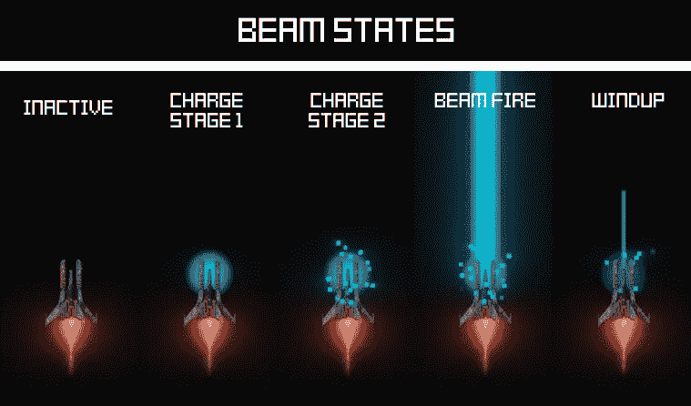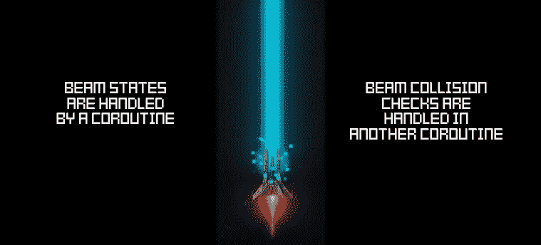

# 激光束代码

有大量的代码需要检查。为了简单起见，我将只展示其中最重要的片段，大部分描述/解释将在下面的代码图片中进行注释。

## 束对撞机检测程序

就像我的 [***热寻激光***](/nerd-for-tech/galaxy-shooter-2d-heat-seeking-lasers-20-a8347dfde1b4) ，它会检查对撞机的每一次更新帧(这在任何情况下都可以随时更改)。

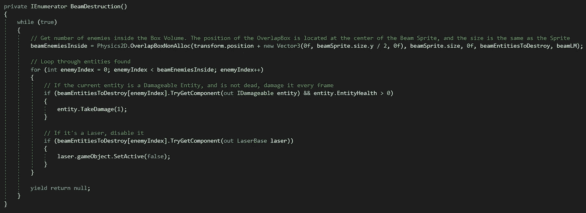

## 主光束协程

我决定做一个小 a ***有限状态机*** ，其中激光束的每一个状态都有一个**启动、执行和退出**的方法。 ***FSM*** 多用于开发 ai，但也可以应用于其他游戏玩法机制。

唯一的区别是这些状态是硬编码的(不会为一个小项目编写一个灵活的 ***FSM*** 框架，你知道吗？)在一个协程中，都遵循一个序列。

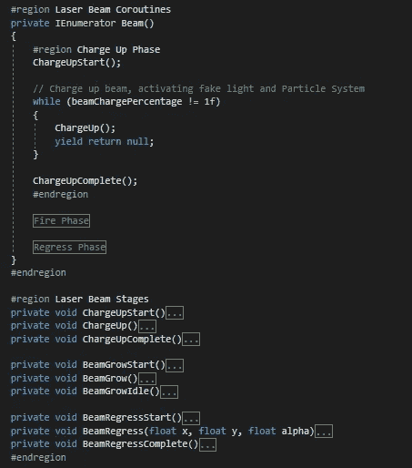

这篇文章很长，如果我要解释 LaserBeam 脚本中的每一个方法和行为，这篇文章会拖得更长。所以，为了结束这篇文章，下面是注释代码的 ***电荷*** 和 ***光束火*** 状态。

*   ***充电***

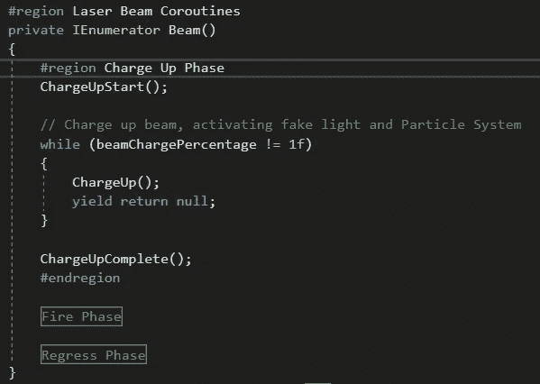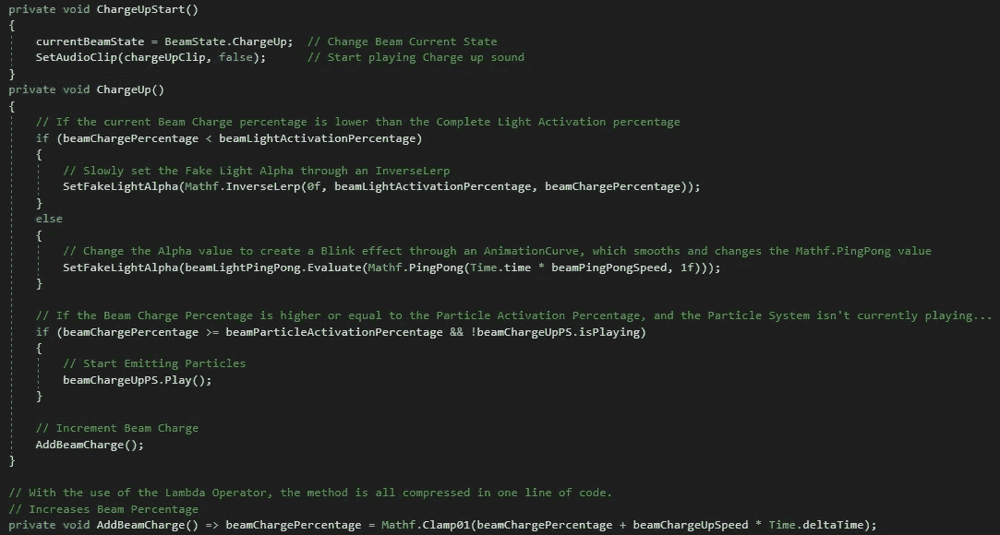

*   ***火光束***

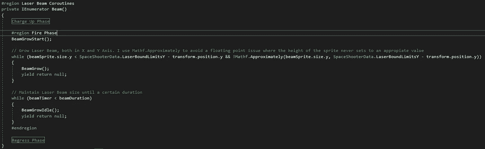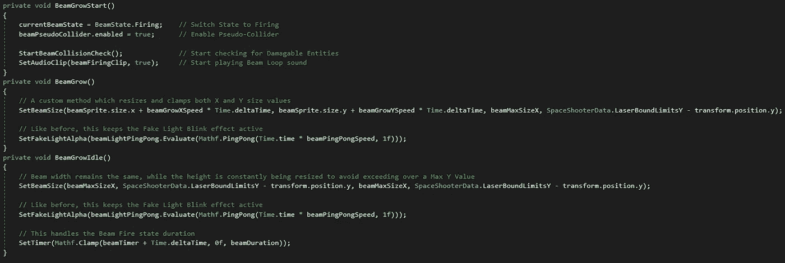

# 游戏中的结果

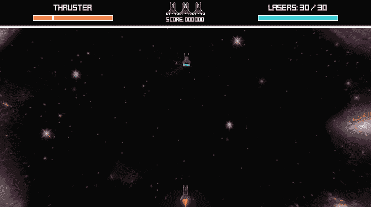