# 银河射手 2D —对象池

> 原文：<https://medium.com/nerd-for-tech/galaxy-shooter-2d-object-pooling-23-ef91000076e0?source=collection_archive---------16----------------------->

## 回收游戏对象可以大大提高性能！

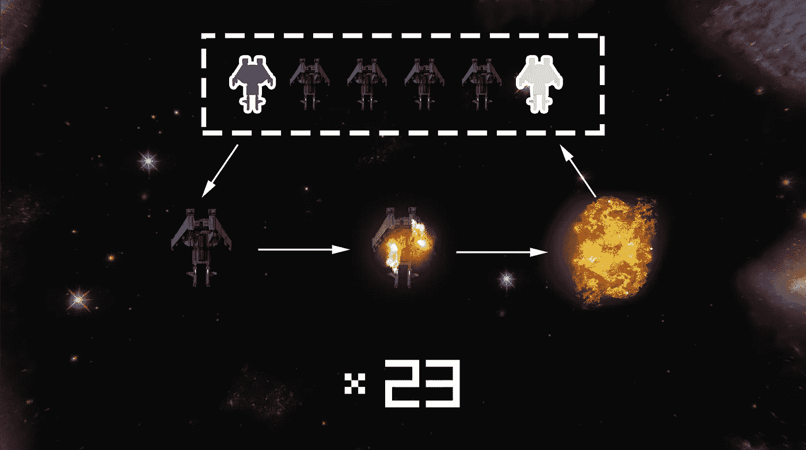

对象池是视频游戏行业使用的一种常见技术，通过重用实体的相同实例并在不再使用时存储它们来提高性能。

在我的游戏中，有无限的敌人波，有成吨的激光要被敌人和玩家实例化，不断产生和破坏游戏对象会在**垃圾收集器**中产生开销，从而导致性能峰值。

在本文中，我将通过使用**对象池**来防止这种情况。

# 我是如何实现的

*   一个通用的**对象池**有以下变量:
    -要实例化和存储的游戏对象预置。
    -预置初始化池的拷贝数。
    -所有**池化游戏对象**的列表，在这里它将检查是否有可用的对象。

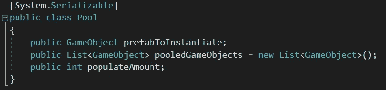

*   我对原始公式做了一些修改，以适应我心目中的**对象池**结构。

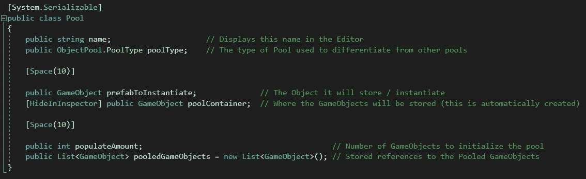

*   现在，真正的 **ObjectPool** 类在技术上是每个可用池的整个管理器。所以，它必须是一个单例的**，并且它应该有一个所有**池**的**列表**，以及一个**字典**来快速简单地获取它们。**

**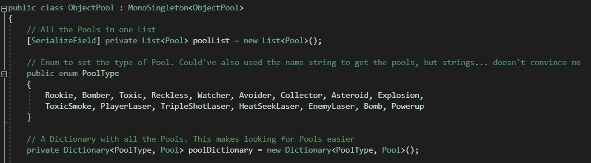**

**这个枚举有一些未来的大剧透**

*   **在 **Start** 上，我调用了一个名为 **PopulatePools** 的方法，顾名思义，这个方法用它们各自的游戏对象填充这些池。**

**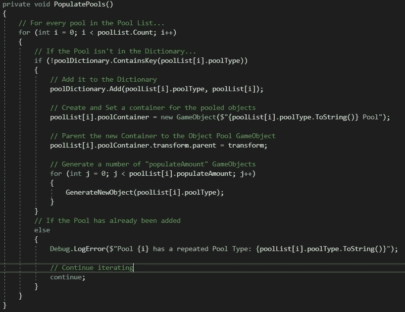**

*   ****GenerateNewObject** 方法将所需的游戏对象实例化到其各自的**池**中，并将其添加到**池列表**中。为了防止**池**耗尽游戏对象，我将该方法设置为游戏对象返回类型。**

**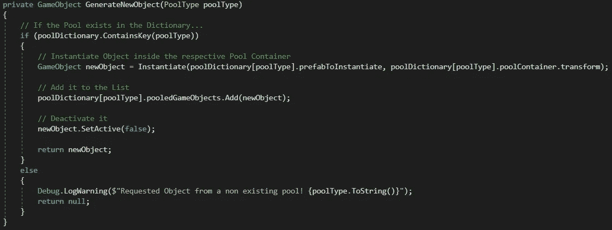**

*   **现在，我需要一个公共方法来请求一个**池化游戏对象**。这个方法将返回一个去激活的游戏对象，并用一个新的位置和旋转来激活它。如果池中没有可用的游戏对象，生成一个并返回。通常，位置和旋转由请求游戏对象的脚本来处理。然而，对我来说，在**对象池管理器**中设置这些属性似乎更合适，并且避免在每个脚本中重复相同的代码行。**

**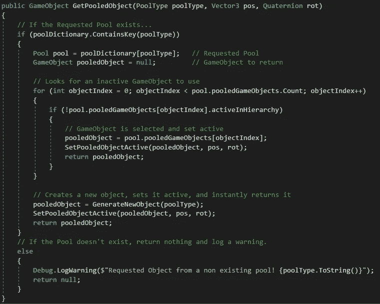****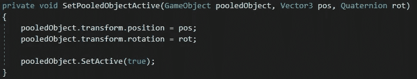**

*   **最后，那些想要使用**池化游戏对象**的脚本需要访问**对象池管理器实例**来请求游戏对象。**

**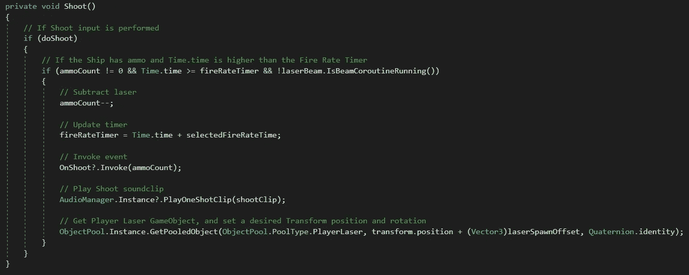**

**最后一行代码是它如何从对象池中获得一个玩家激光。**

# **快速笔记**

**池中的所有游戏对象都必须有一个脚本，该脚本具有停用它们自己的功能。重用它们的唯一方法就是这样做。**

**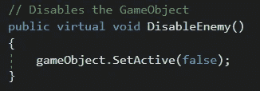**

**同样，将你的初始化行为放在 **OnEnable** 方法中(每次游戏对象被激活时调用)，而不是 **Start** (只调用一次)**。你也可以使用**禁用**来清除数值或者在游戏对象被禁用之前做一些事情。****

****

# **结果**

## **编辑器中的对象池管理器**

**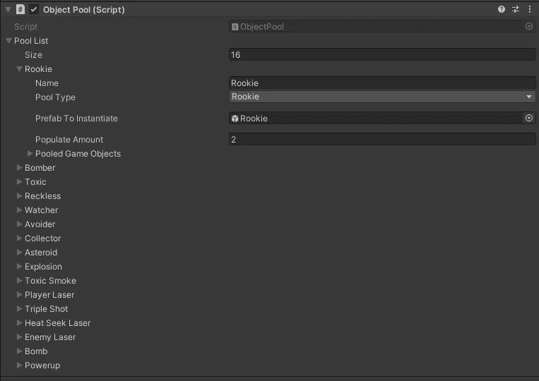**

## **运行中的对象池**

**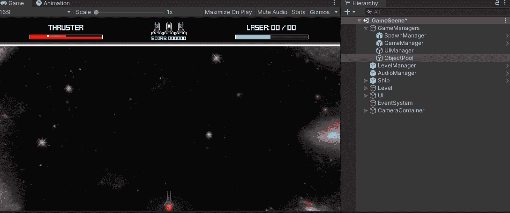**