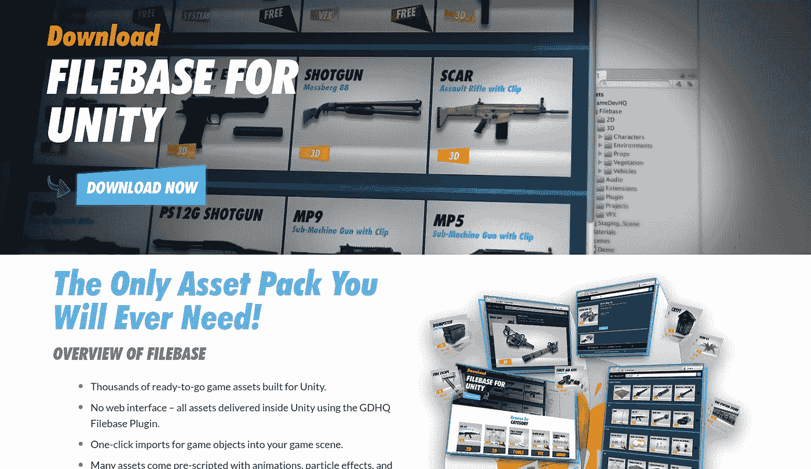
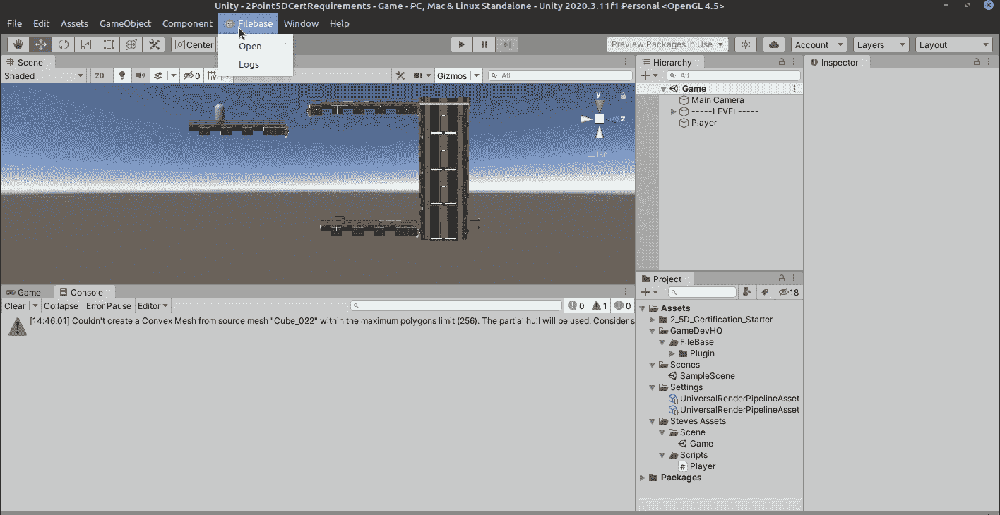
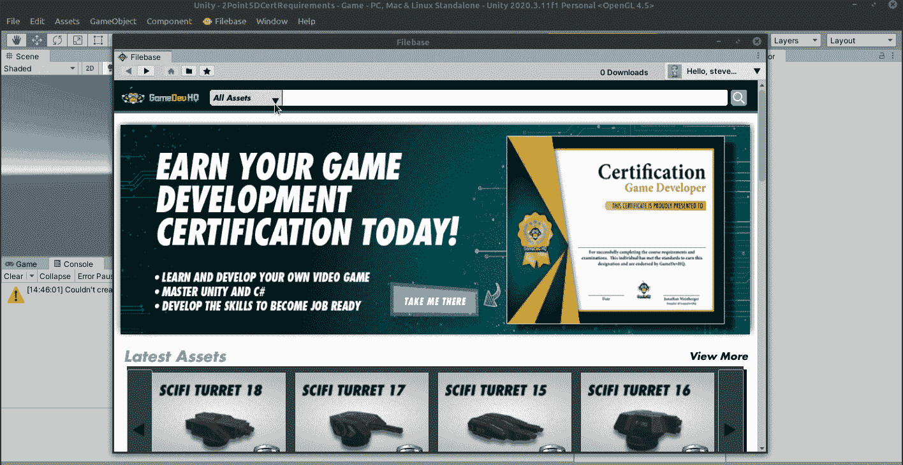
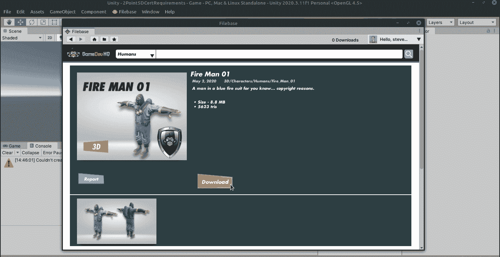
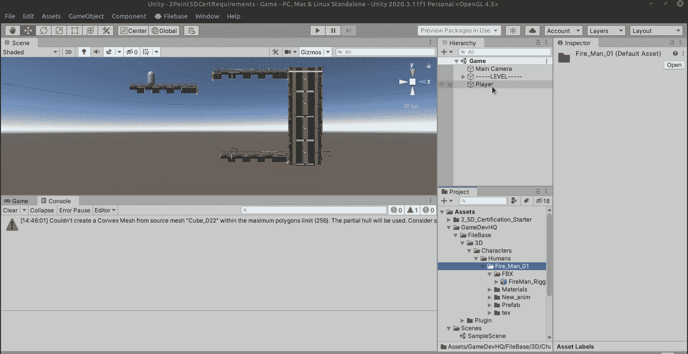
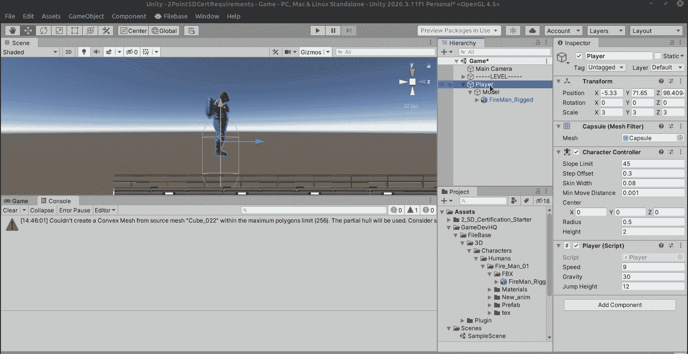

# 通过 Filebase 的游戏资产

> 原文：<https://medium.com/nerd-for-tech/game-assets-via-filebase-d6be7f62ee9c?source=collection_archive---------26----------------------->

成为 GameDevHQ 成员的一个优势是可以访问他们庞大的资源库和额外的教程以及名为“ [FileBase](https://filebase.gamedevhq.com) ”的挑战。虽然这是一项任何人都可以注册的服务，而且一年 99 美元非常划算，因为一旦你下载了他们的任何资产，即使期限到期，你也可以在你的游戏中保留和使用它们。我正在学习的当前项目要求我们从 filebase 下载一个模型，所以我将与您分享这个过程。这很容易。

在 Unity 中下载并安装软件包后，退出并重启，你会在顶部看到一个文件库菜单和其他菜单选项。去打开它。

一旦菜单出现，进入“资产”下拉菜单，选择“角色/人类”并寻找要下载的角色。

这个消防员看起来很酷，我们要用他来玩游戏。因此，只需点击下载，我们可能需要登录，一段时间后，所有的资产将被下载。只要点击定位，你就会被带到相应的文件夹。

为了把模型放到我的游戏中，我为玩家准备了一个临时的胶囊，我将删除 MeshRenderer 组件，放入一个新的空的，并将其命名为 model，然后将模型拖动到空的 FBX 文件夹中。它显示为紫色，因为我们需要将纹理转换为通用管道，所以我们将进入 dit/渲染管道/通用渲染管道/升级项目材质…让它发挥它的魔力。

之后，只需要调整角色控制器，使其更好地包裹模型，但仅此而已！

接下来，我们将进入动画！明天见！