# 通过 Filebase | Unity 获得游戏资产

> 原文：<https://medium.com/nerd-for-tech/game-assets-via-filebase-unity-95cc7fdc05c8?source=collection_archive---------11----------------------->

## 统一指南

## 关于如何在 Unity 中从 Filebase 引入游戏资源的快速指南

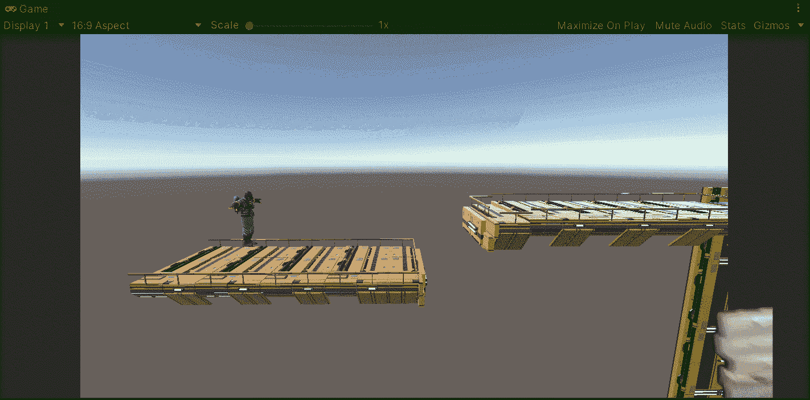

**目标**:用 Unity 从[文件库](https://filebase.gamedevhq.com/)中引入游戏资产到我们的项目中。

在上一篇文章中，我介绍了如何通过 Unity 升级一个项目来使用通用渲染管道。现在，是时候从 Filebase 引入一些游戏资产来继续构建我们的项目了。

# 当前阶段

首先，让我们看看游戏的当前阶段。我们有几个平台和一个由胶囊代表的玩家(带角色控制器):

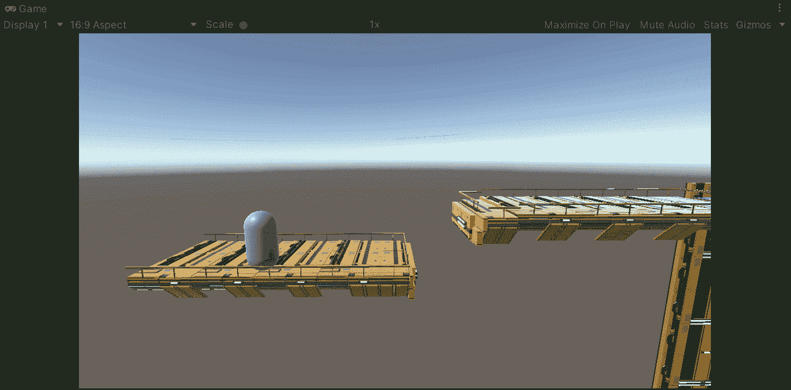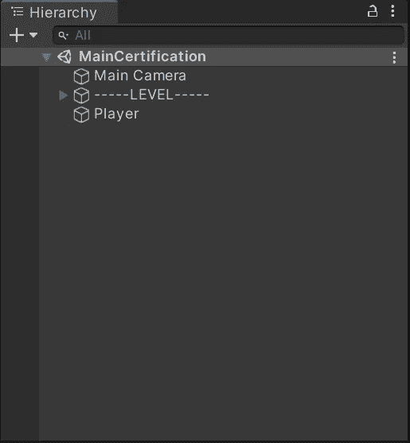

因此，为了继续构建我们的游戏，让我们在 Filebase 中找到一个角色模型，以停止使用简单的胶囊。

# 使用文件库

Filebase 是一个工具，它提供了一个具有高质量资产的库，而无需在您的游戏上花费数千美元。Filebase 是由 [GameDevHQ](https://gamedevhq.com/) 创建的，我们可以使用这个网站上的 Unity 插件来访问它:

 [## Unity 的文件库- GameDevHQ

### 按类别排序，键入搜索词，或浏览最近添加的资产。找到你喜欢的东西，点击…

filebase.gamedevhq.com](https://filebase.gamedevhq.com/) 

在此页面中，您可以看到 Filebase 在订阅服务时提供的所有好处，如果您像我一样觉得它很有用，那么您必须通过点击下一步按钮来下载 Unity 软件包:

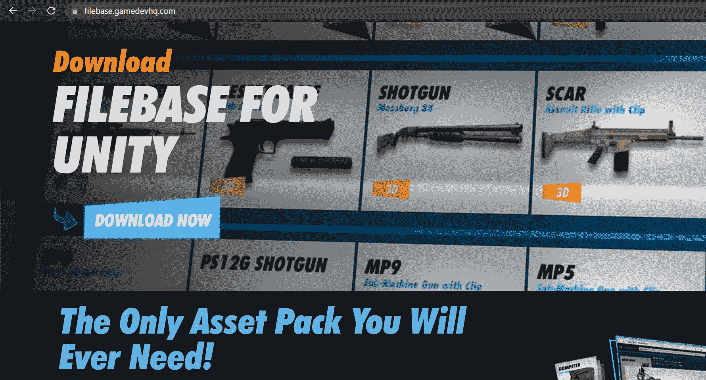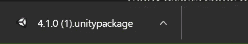

下载完成后，使用 Filebase 所要做的就是在 Unity 编辑器打开的情况下执行，将包导入到项目中。现在，导入后，我们将能够在顶部看到一个 Filebase 选项卡，我们可以在其中打开一个带有 Filebase 界面的窗口:

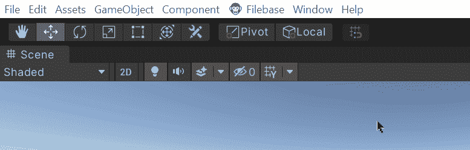

然后，在 Filebase 界面中，我们将能够在右上角登录，并检查我们能够在 Unity 项目中使用的不同游戏资产:

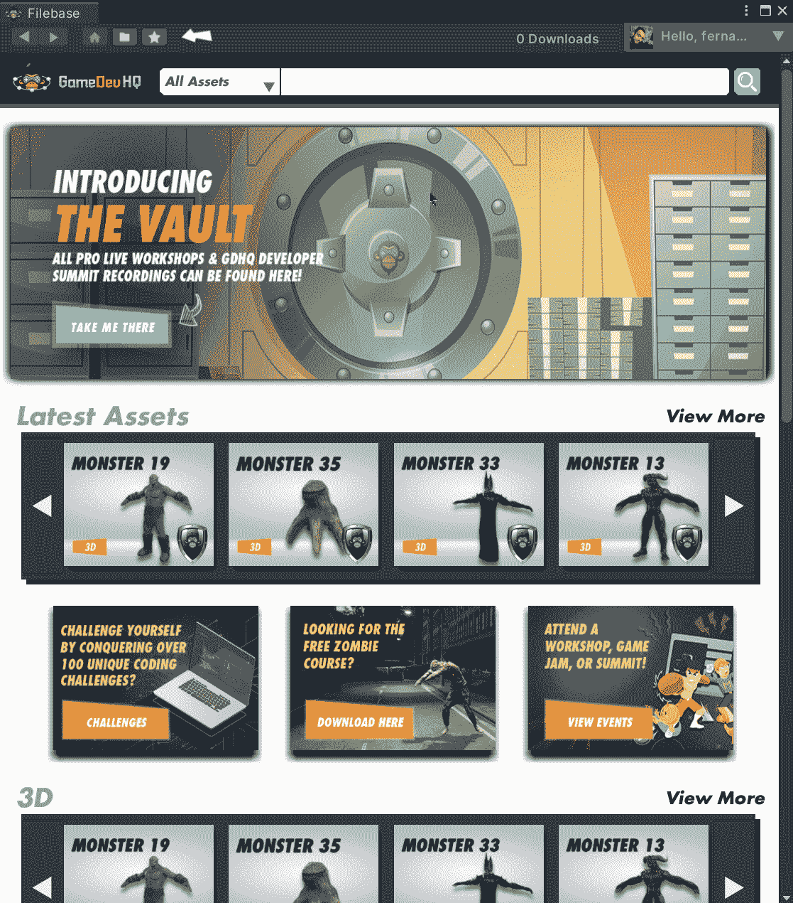

# 导入游戏资产

所以，假设我想要一个模型来代替代表我的玩家的胶囊。为此，我可以单击 3D 角色资源，然后在选择一个后点击下载按钮:

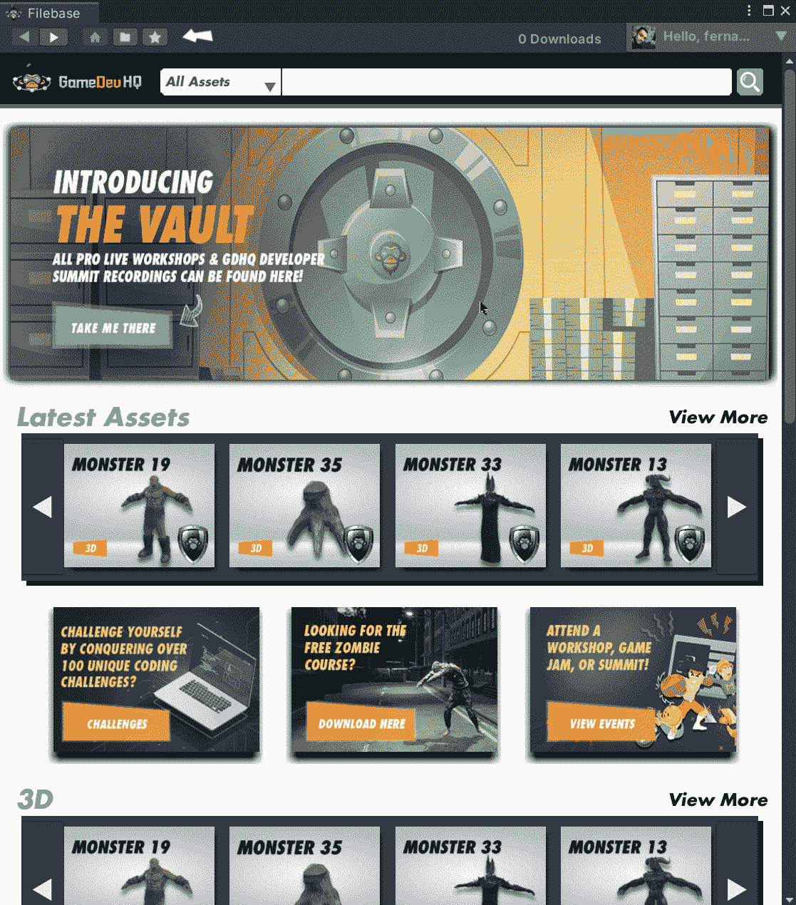

如果我目前没有登录，这将提示一个窗口输入我的凭据，以验证我可以使用我选择的资产:

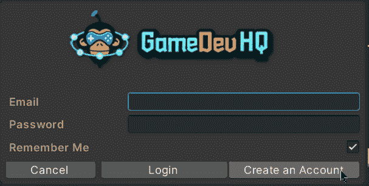

如果我的会员资格不允许使用该资产，则会提示以下消息:

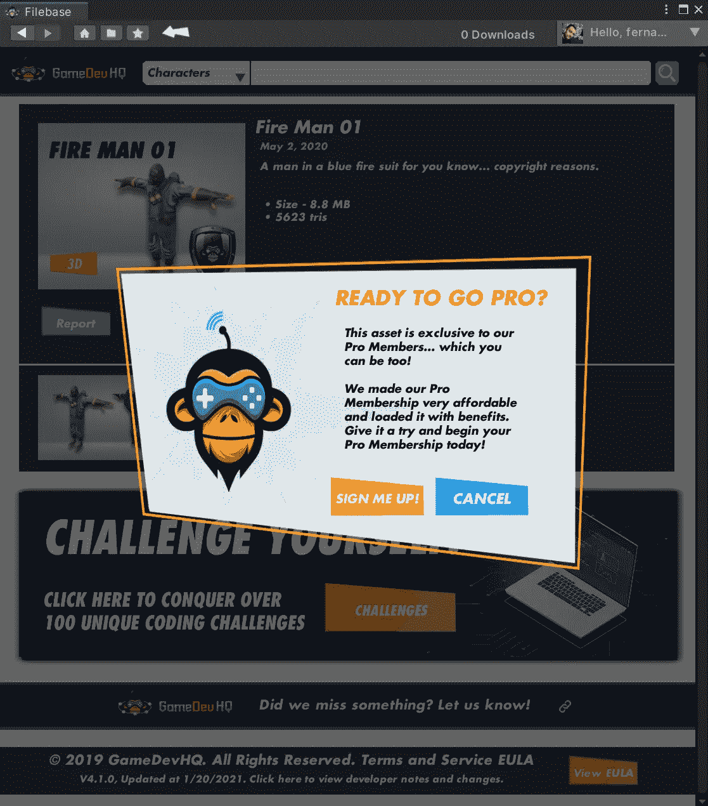

否则，它将提示一个窗口将相应的资产导入到我们的项目中:

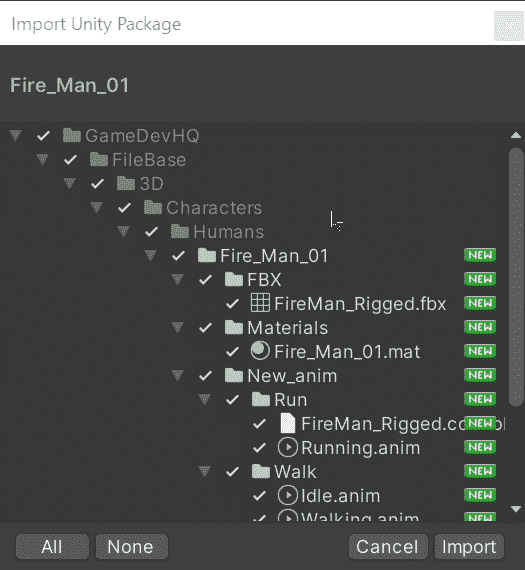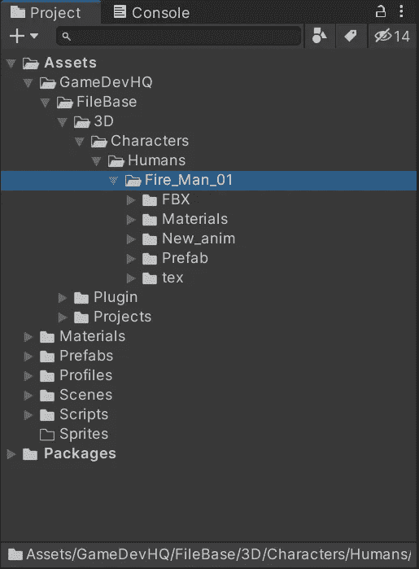

模型导入后，让我们从胶囊中移除网格渲染器，并创建一个新的空子对象来存储玩家的模型:

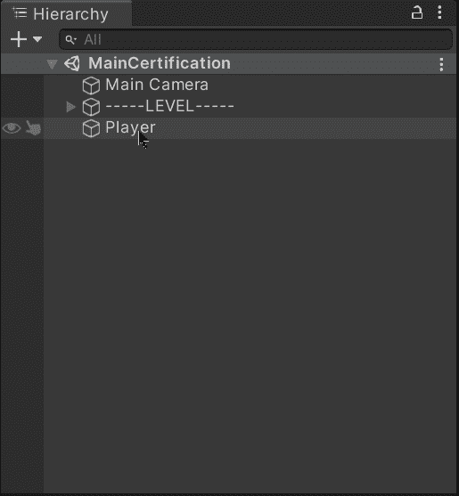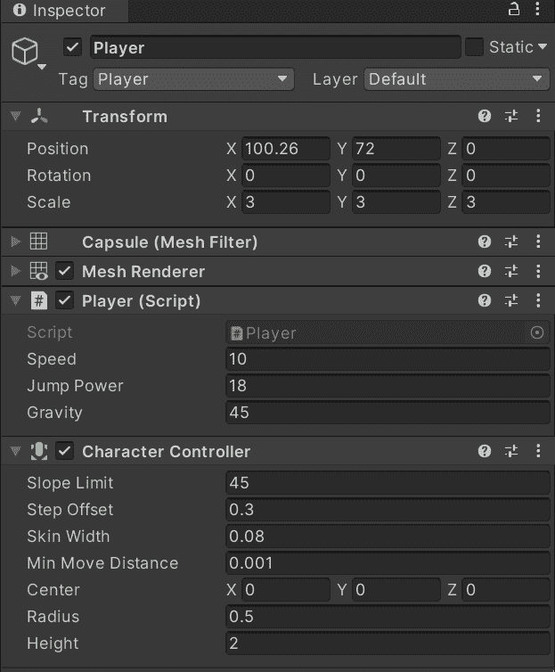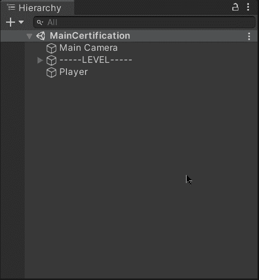

然后，为了使用这个模型，让我们把相应的预置从文件夹中拖到空的游戏对象中:

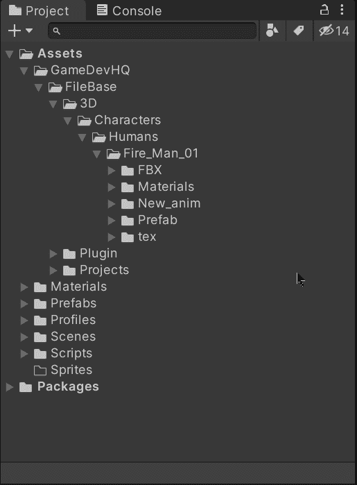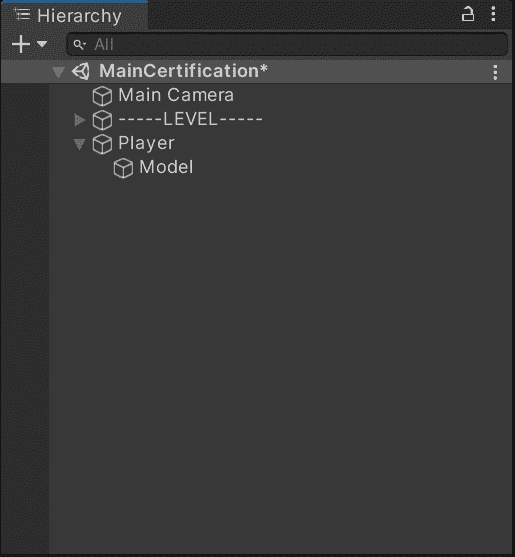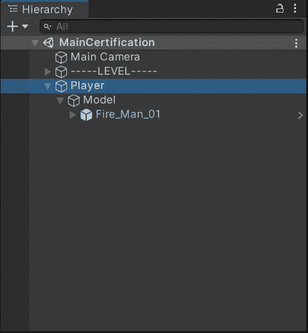

一旦拖动，模型就可以作为我们的播放器使用了:

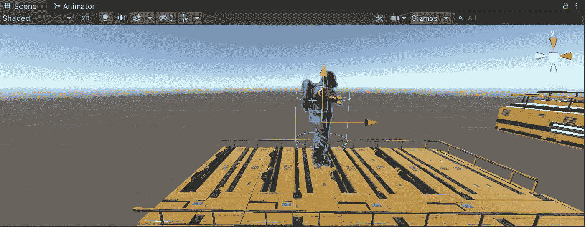

正如我们在下一张 gif 中看到的，游戏资产也包含动画。因此，这证明了通过使用 Filebase 将高质量的资产引入我们的项目是多么容易:

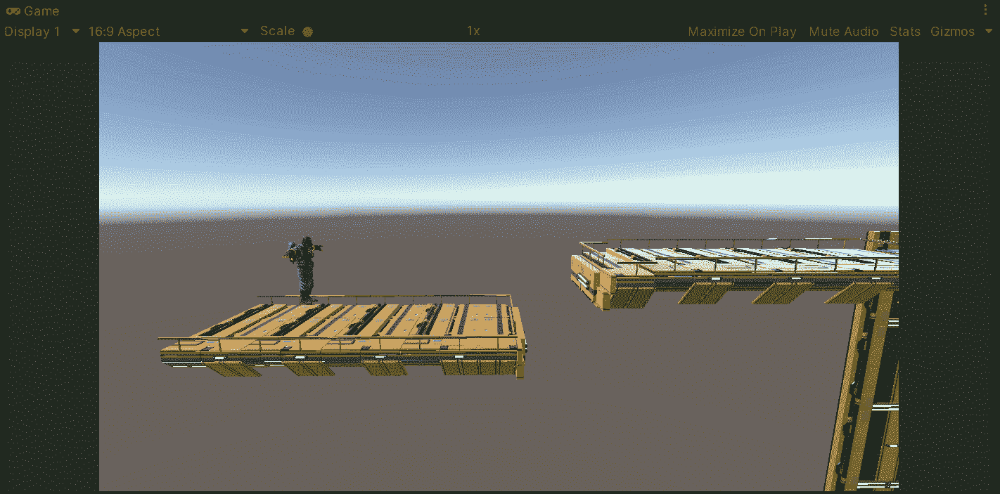

就这样，我们在项目中引入了来自 Filebase 的游戏资产！:d .我将在下一篇文章中看到你，在那里我将展示如何用 Unity 激活我们的玩家。

> *如果你想更多地了解我，欢迎登陆*[***LinkedIn***](https://www.linkedin.com/in/fas444/)**或访问我的* [***网站***](http://fernandoalcasan.com/) *:D**