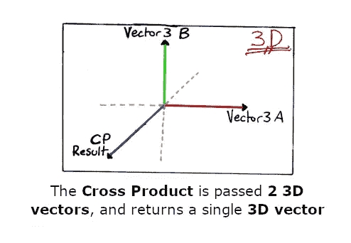

# 游戏数学—叉积

> 原文：<https://medium.com/nerd-for-tech/game-maths-cross-product-69864de02944?source=collection_archive---------2----------------------->

## 最近我一直在重温游戏开发中用到的一些有用的数学知识，从叉积开始。

**今天的目标:**解释与游戏开发相关的叉积数学公式及其用途。

# 数学:

…我觉得这并不令人愉快。我也不是特别擅长。但我希望这些帖子能够帮助任何处于类似情况的人更好地掌握游戏开发和编程背景下几个常见/有用的数学公式的重要部分。

如果需要的话，这可能是一个令人筋疲力尽的话题，但幸运的是，在大多数情况下*(根据我的经验)*如今，成为一名优秀的开发人员不需要太多的数学专业知识。我做游戏开发者/程序员已经很多年了，只是现在才开始认真地研究像 Cross Product 这样的东西。

# 目的:

**注意:**虽然我已经用直角矢量展示了这个过程，但是**并不要求所提供的两个矢量彼此成直角。**但结果会是**。**

使用叉积，我们可以找到向量 3，它表示:

> 给定两个向量 3(“A”和“B”)，与这两个向量垂直的向量 3 是什么

# 技术材料:

叉积取 2 个向量 3，返回一个向量 3。

用普通的数学术语来说:

> *叉积(a×b)=*‖**a**‖*‖**b**‖*sin(θ)n**

*其中:*

*   ****θ*** 是 **a** 和 **b** 在包含它们的平面上的夹角(0°到 180°之间)*
*   *‖**a**‖**b**‖是矢量 **a** 和 **b** 的大小*
*   ***n** 是垂直于包含 **a** 和 **b** 的平面的单位矢量*

*或者在 Unity C#中:*

> **向量 3 叉积=向量 3。交叉(Vector3 lhs，vector 3 RHS)；**

*例如:*

> *向量 3.back =向量 3。Cross(Vector3.up，vector 3 . right)；*
> 
> *矢量 3.forward =矢量 3。Cross(Vector3.right，vector 3 . up)；*