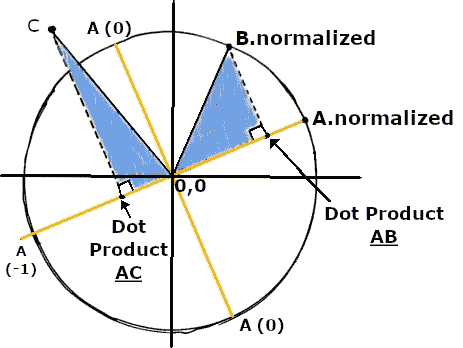
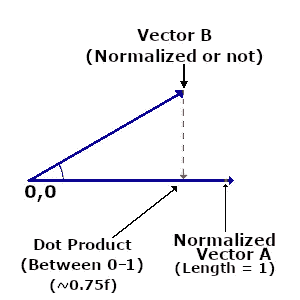
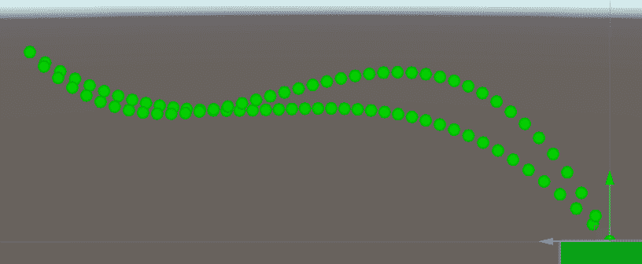
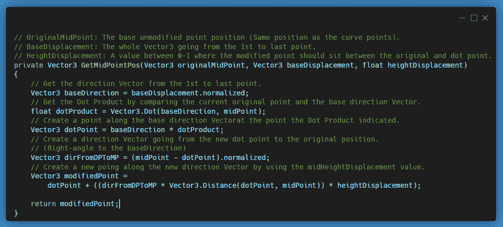
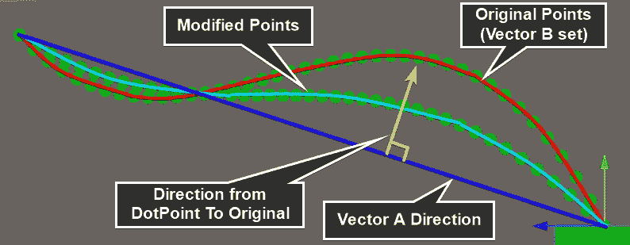

# 游戏数学—点积

> 原文：<https://medium.com/nerd-for-tech/game-maths-dot-product-d3f063192cd6?source=collection_archive---------0----------------------->

## 最近我一直在重温游戏开发中使用的一些有用的数学知识，从点积开始。

**今天的目标:**解释与游戏开发相关的点积数学公式和用途。

# **数学:**

…我觉得这并不令人愉快。我也不是特别擅长。但我希望这些帖子能够帮助任何处于类似情况的人更好地掌握游戏开发和编程背景下几个常见/有用的数学公式的重要部分。

如果需要的话，这可能是一个令人筋疲力尽的话题，但幸运的是，在大多数情况下*(根据我的经验)*如今，成为一名优秀的开发人员不需要太多的数学专业知识。我做游戏开发者/程序员已经很多年了，只是现在才开始认真地研究像点产品这样的东西。

# 目的:

使用点积，您可以找到表示以下内容的浮点值:

> "从直角角度看，向量 B 位于向量 A 的多远处？"

# 技术材料:

点积取 **2 个向量**并返回一个**浮点("标量")**。

用普通的数学术语来说:

> *点积= v1 . x * v2 . x+v1 . y * v2 . y+v1 . z * v2 . z；*

或者在 Unity C#中:

> 浮点点积=矢量 3。Dot(VectorA，VectorB)；

# 一个真实的游戏例子:

我最近在开发一个定制的网格生成器，并在修改一组 Vector3 点时，基于另一组 Vector3 点发现了点积的用法。

我有一条动态生成的曲线，由许多矢量 3 点组成。我想生成另一组点，其中每个点都在第一组点之间，并且在第一个点和最后一个点之间是一条直线。

在这种情况下，直线是**归一化的** *向量 A* ，现有曲线是*向量 B* 的**集合**(其中每个曲线点都是一个单独的向量 B)。

希望这是一个简单易懂的解释，可以在你写代码或者开发游戏的时候帮助你。