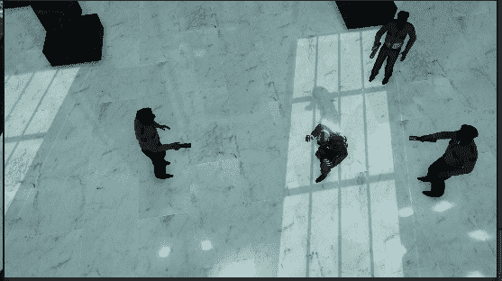

# 过场动画游戏第 1 部分:小车轨道

> 原文：<https://medium.com/nerd-for-tech/game-over-cutscene-part-1-dolly-track-ac00e8a0e1ee?source=collection_archive---------15----------------------->

**目标**:在导演过场动画之前，用我们所学的东西组成游戏镜头

既然我们现在已经在过场动画制作上神魂颠倒了，那就让我们继续其他的吧。下一个将是过场动画上的**游戏，它将允许我们实现一些新的很酷的功能，和一些 UI 菜单。**