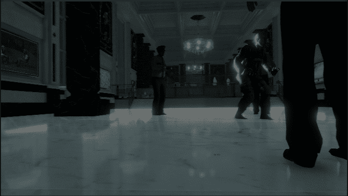

# 过场动画游戏第 2 部分:菜单游戏

> 原文：<https://medium.com/nerd-for-tech/game-over-cutscene-part-2-game-over-menu-11bedc16ed4a?source=collection_archive---------11----------------------->

目标:学习一个简单的技巧，一次制作多个物体的动画

本教程不是关于创建菜单本身的游戏。在这一点上，我们完全有能力做到这一点。简而言之:在为向后移动到天花板的航拍相机制作动画后，我在时间线的开始处添加了一个渐变到 alpha 的动画，并且——使用相同的 UI 图像———