# 游戏结束！是时候再试一次了！

> 原文：<https://medium.com/nerd-for-tech/game-over-time-to-try-again-d0779507d56b?source=collection_archive---------20----------------------->

## 离开生活？重播继续乐趣！

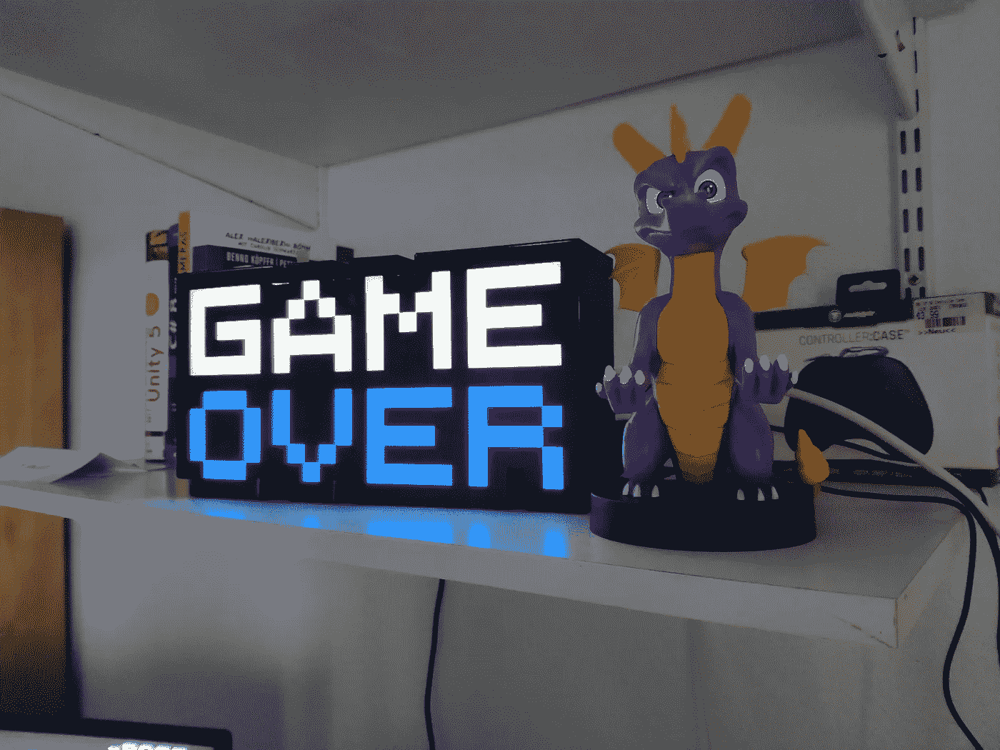

现在每个游戏都有某种形式的屏幕游戏。已经没有生命了？没有在期限内实现主要目标？没子弹了，不能再保护自己了？这种情况通常会导致屏幕上的游戏，或者至少是游戏的行为。至于太空射手，当你没有生命的时候，你会在屏幕上面对游戏。

让我们把这件事做完！

**准备编码** 在我们开始实现这里的逻辑之前，我们需要一些文本框来写入文本。

*   *(2x)右击画布> UI >文本*
*   重命名游戏对象，以明确它是哪个文本框。我们需要一个文本框说“游戏结束”和一个告诉玩家如何重新开始游戏。
*   将文本更改为“游戏结束”和“按‘R’重新开始！”
*   默认文本非常小。改变尺寸让它看起来更吸引人！
    *我对游戏结束使用了 80 号字体，重启文本使用了 28 号字体*
*   你可能已经注意到文本似乎已经消失了。这是因为文本比文本框区域大。我们可以做两件事:
    - (1)使用矩形工具(‘T’键作为快捷键)缩放文本框，使文本适合
    - (2)将*水平溢出*和*垂直溢出* *改为“溢出”*
*   将文本放在您认为合适的位置。
*   如果需要，根据自己的喜好调整颜色和字体

完成后，你的游戏视图可以是这样的:

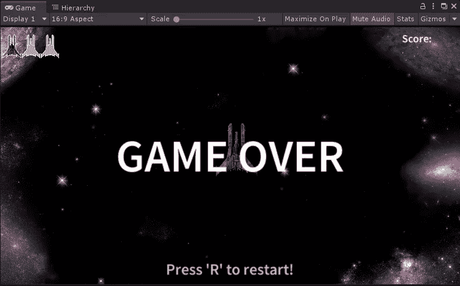

**编码闪烁行为** 现在是有趣的部分，通过代码给这些文本框一些行为！

我们像往常一样开始，我们需要两个类型为*文本的变量。由于我们将所有与用户界面相关的东西都存储到了用户界面管理器中，我们也将把这些句柄放在*用户界面管理器. cs* 脚本中:*

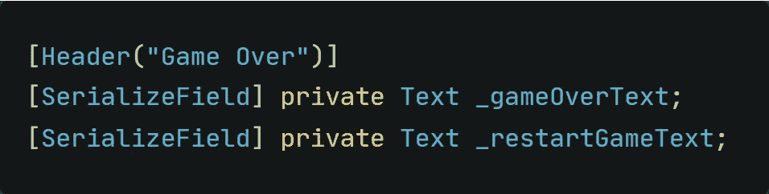

那么，我们想拿它们怎么办呢？我们想要创建一个闪烁的效果。有多种方法可以实现这样的闪烁效果，但是为了简单起见，让我们只改变显示的文本！

*   一个闪烁效果是*重复*。因此，我们需要在指定的时间后更改时间。一个*协程*非常适合这个工作！
*   我们不知道玩家会看到这个屏幕多久，也不知道何时会触发重播。因此，我们需要一个*无休止的 while 循环*。
*   在这个循环中，我们需要改变显示的文本。

这将是我们刚刚写下的逻辑:

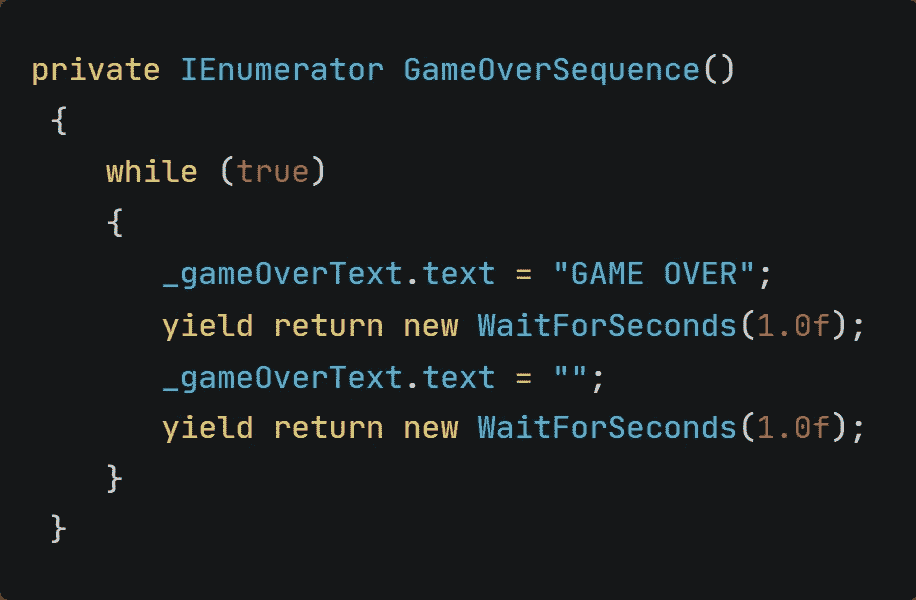

**调用方法** 

*   玩家还剩 0 条命
*   这将导致调用该方法

还记得我们创建的将当前玩家的生活形象化为精灵的 switch 语句吗？我们省略了*案例 0* 部分。现在是时候填写并调用协程了！

*   我们只需要启用两个文本框，然后让它们闪烁

在 *UpdateLives([…])* 方法中，将这些行添加到案例 0 中:

**重启时禁用 GameOver 消息** 文本框现在在闪烁。然而，当我们重启游戏时，文本框并没有消失。

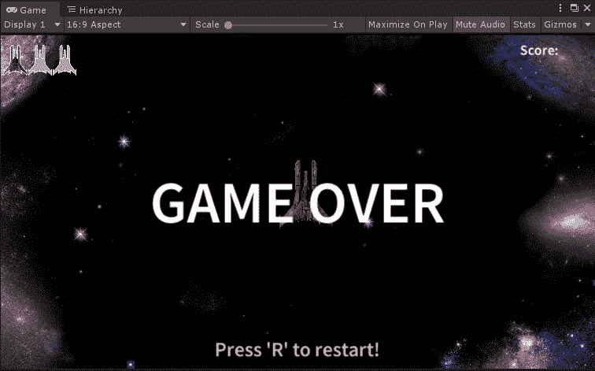

这很容易解决。我们只需要在游戏一开始就禁用这两个游戏对象。让我们为此创建一个新方法，并在 *void Start():* 中调用它

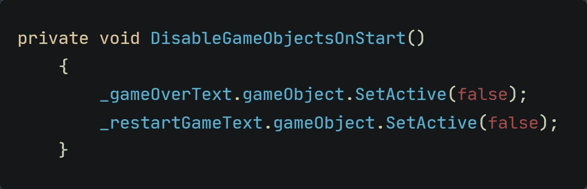

现在我们有了预期的行为:

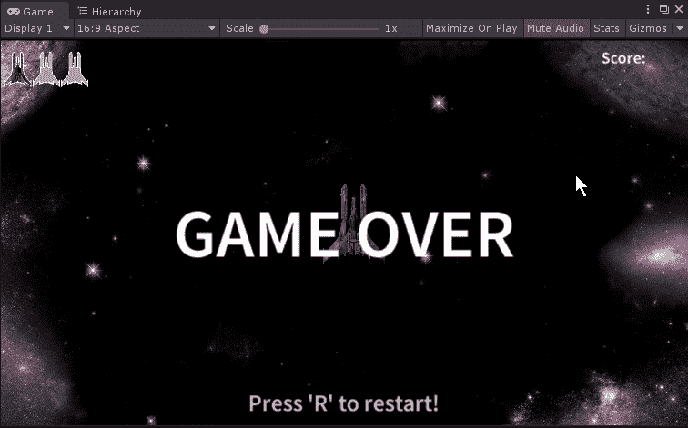

**重启的能力** 玩家不会有 Unity 编辑器简单的重启游戏。我们需要为此创建一些逻辑！

*   如果玩家处于游戏结束状态并按下 R 键，游戏应该重新载入
*   如果玩家不在游戏结束状态，按 R 键没有任何作用

为了检查当前状态，我们应该创建一个 bool 变量。但是，我们将创建一个新的*游戏管理器*脚本，而不是将它放入 UIManager 脚本中，我们将在任何想要使用场景管理的时候使用它。

*   创建新的*游戏管理器*游戏对象
*   创建一个名为*游戏管理器*的新脚本
*   将刚刚创建的脚本附加到游戏管理器游戏对象上
*   打开脚本

我们想要检查玩家是否已经结束游戏。这很容易用一个布尔值来完成！此外，游戏结束序列存储在 UI 管理器中。因此，我们需要一个 UI 管理器脚本的句柄。

*   创建一个 bool 来检查游戏结束状态
*   创建 UIManager 脚本的句柄

完成后，脚本的变量部分可以如下所示:

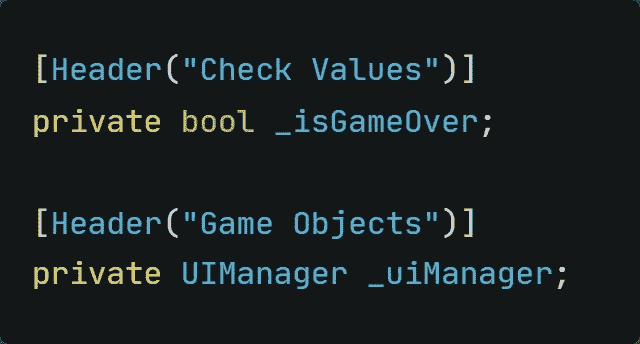

**创建实际逻辑** 照常开始。

*   创建 UIManager 的句柄
*   空-检查句柄！

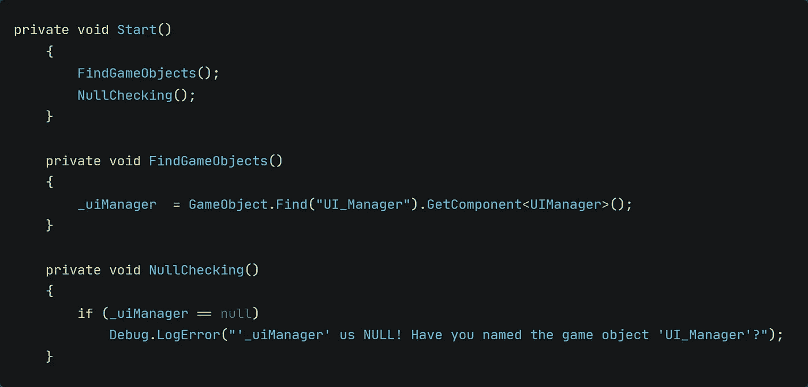

现在是重启逻辑的时候了！
*如果玩家按下 R 键并处于游戏结束状态，则重新载入场景*

将它分解成小块，我们需要检查以下内容:

*   查看州立大学的比赛
*   检查是否按下了键盘上的 R 键。
    *记住一个按键随时可能发生！*
*   如果两者都适用，请重新加载场景

我们检查两个必须满足的条件。否则，我们不想检查 R 键上的输入。if 语句的完美用法！

> 如果你想乱搞场景，Unity 有个方法叫*scene management*integrated。为了能够使用这种方法，您需要集成 *UnityEngine。脚本顶部的场景管理库。*

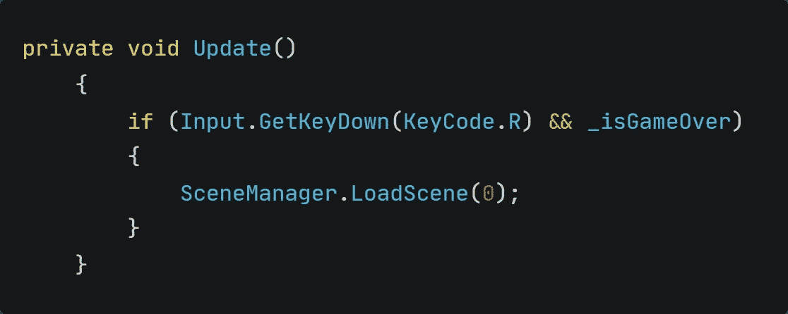

最后，我们需要最后一个小方法来让玩家重新开始游戏。因为我们想从 *UIManager.cs* 脚本中调用它，所以我们需要使它成为一个公共方法。

目的很简单。将 bool 设置为 true。

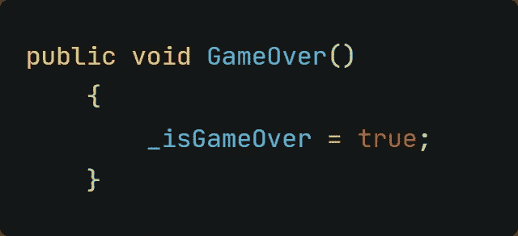

这就是我们所需要的！

**最后的小细节让它按预期工作** 我们想在玩家没有生命的时候调用这个方法。剩余生命的检查在 *UIManager.cs* 脚本中。

*   打开 UIManager 脚本
*   搜索 UpdateLives([…])方法
*   在 switch 语句内部，点击 *case 0*
*   在游戏管理器上调用刚刚创建的 *GameOver()* 方法。

您可能已经注意到您将收到一个错误。

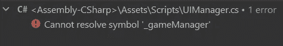

没关系。让我们来看看为什么会出现这个错误。

*   我们试图访问的方法在 GameManager 脚本中。
*   我们希望从 UIManager 调用该方法。
*   然而，UIManager 脚本并不知道我们有一个 GameManager 脚本。
*   我们没有它的句柄，因此无法访问脚本中的方法。

幸运的是，这个问题很容易解决。我们只需要以通常的方式创建一个 GameManager 脚本的句柄。变量>句柄> NullCheck

**管用！** 现在一切都设置好了，应该可以按预期运行了！

让我们看看最终的结果:

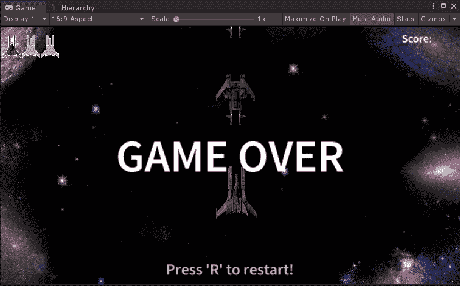