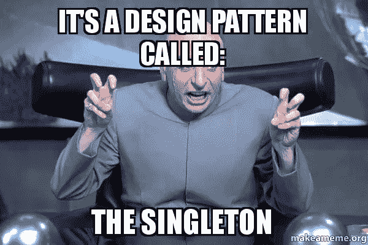
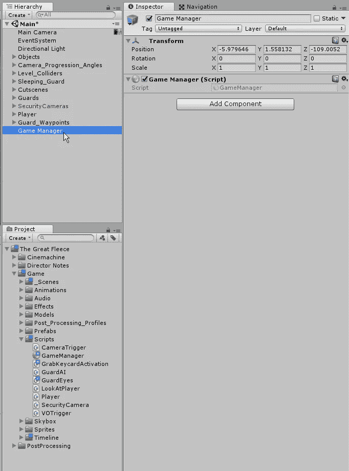
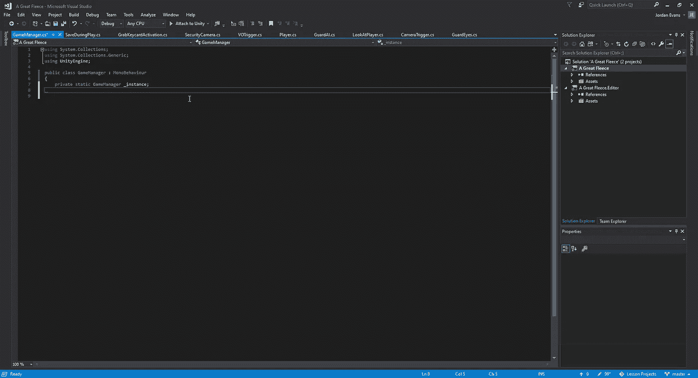
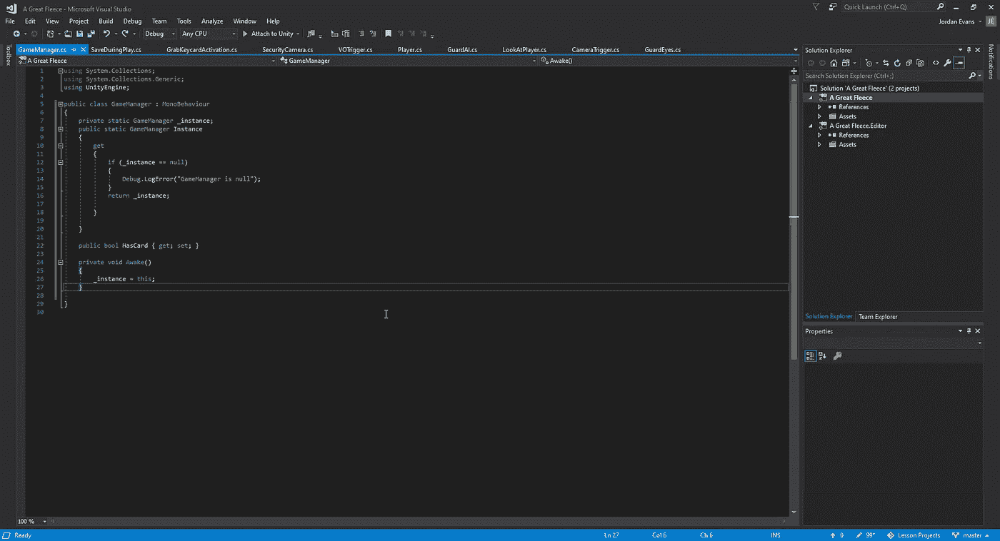
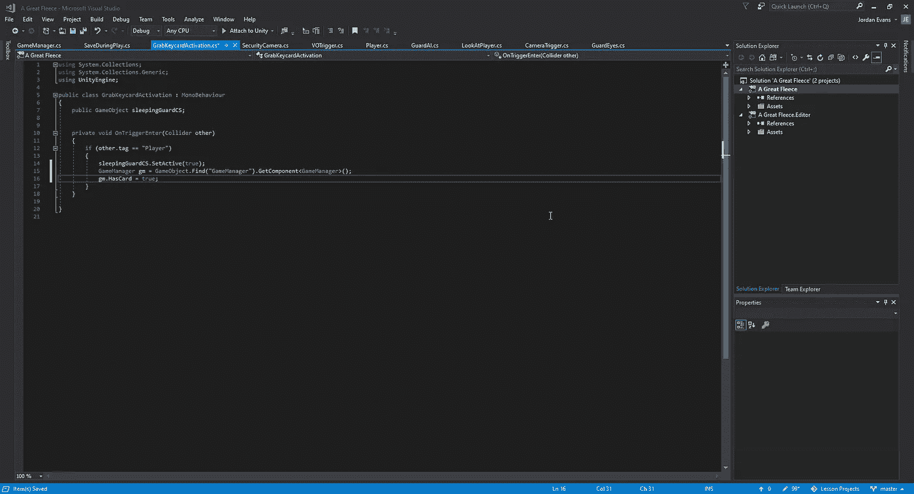
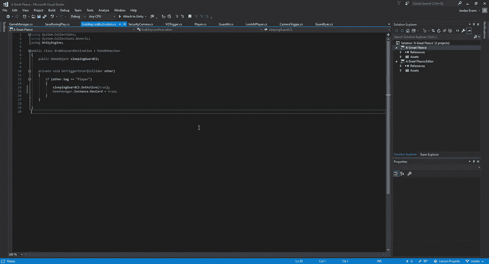

# 游戏编程模式:Singleton

> 原文：<https://medium.com/nerd-for-tech/game-programming-pattern-singleton-249cc9f11401?source=collection_archive---------14----------------------->

在我们开始为游戏的最后几个过场动画创建激活之前，让我们开始创建我们的游戏管理器，以便我们可以使用它来跟踪游戏中的某些目标，并添加更多的声音。一旦我们为游戏管理器创建了脚本，我们就可以将它附加到我们层次结构中的一个新的空对象上，并打开我们的脚本:

当我们进入脚本时，我们将开始创建我们的单例模式。如果我们使用这种类型的模式，我们需要创建一个静态变量来处理这个类:

使用这个静态关键字，它允许每个类都可以访问这个变量。除非你有一个要实例化一次的类，否则永远不要让你的变量成为静态的。我们作为管理器类创建的任何东西，你最好把它们作为单例创建，并使用 static 关键字。现在，为了访问这个变量，我们需要创建一个属性来访问它。为此，我们可以创建一个公共静态，并赋予这个新属性新的特性:

当我们创建一个属性时，我们可以对它应用 get 和 set。在这个例子中，我们不希望任何人访问它的集合，所以我们只有一个 get。为了确保在任何给定的时间场景中只有 1，我们必须对它进行空值检查，以确保游戏没有被破坏。为了分配我们的实例，我们将在游戏加载时创建它。至于第一部分，我们将使用 HasCard 属性，这样我们可以用 Unity 验证玩家收集了安全警卫卡，以实现获胜场景。当它被抓取时，我们可以进入我们的 GrabKey 脚本，并向游戏管理器表示我们已经收集了该卡。
如果没有这种单例模式方法，要正常调用 bool，我们必须:

然而，因为我们使用的游戏管理器有一个静态实例和正在使用的 singleton 属性，我们可以跳过所有这些多余的代码编写并简化它:

这种方法允许我们进行完全相同的调用，只是简单得多，所以以后更容易阅读代码中任何可能的错误。
现在我们已经创建了我们的游戏管理器，我们可以看看如何使用它对这个场景进行最后的润色。