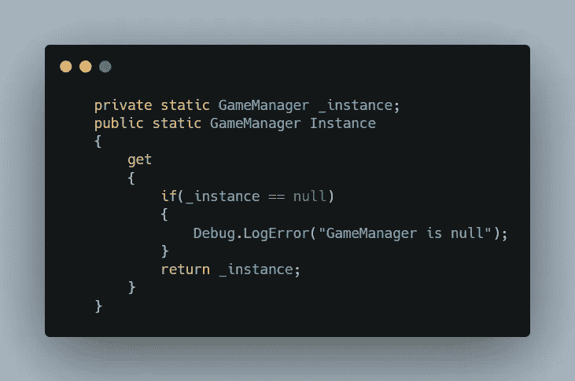
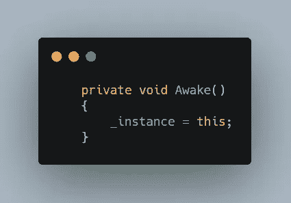
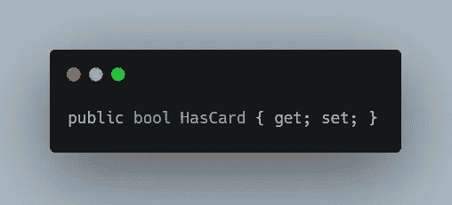
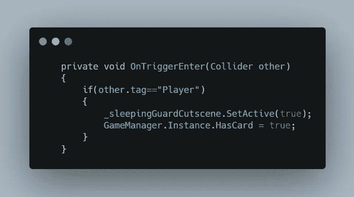
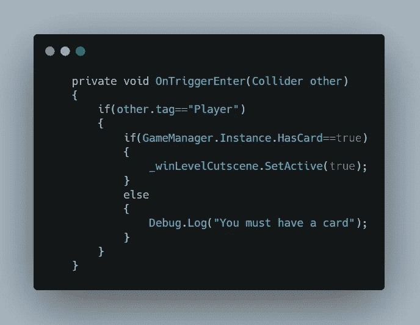

# 游戏编程模式:Singleton

> 原文：<https://medium.com/nerd-for-tech/game-programming-pattern-singleton-a05511375f4c?source=collection_archive---------15----------------------->

秘密游戏和电影摄影

目标:使用单例模式创建一个游戏管理器

我们已经创建了游戏对象，并在其中存储了同名的脚本。现在让我们写一些代码

现在，在 GameManager 脚本中，我们创建了一个与脚本类相同类型的静态变量，并将其设置为 private，这样您就不能从脚本外部直接访问该变量。

然后创建另一个静态类型的公共静态变量，但只定义 get 属性，以便其他脚本可以访问这个 script _instance 值，但不能通过只使用 get 属性来更改它。

然后，一旦 gameobejct 使用 Awake 初始化，就将脚本存储在 _instance 中。

现在有了这个，你就可以轻松地访问这个脚本中的任何公共变量和方法。

为了了解它是如何工作的，让我们创建一个函数来改变 bool 值，它告诉我们卡是否被盗。因此，创建一个 HasCard bool 并将其属性设置为 get 和 set，以便其他脚本可以访问和修改它的值。

现在，在玩家触发偷牌过场动画后，我们可以将 HasCard 的 bool 值更改为 true，这样我们就可以通过使用 ScriptName 调用公共实例变量来完成此操作。实例(GameManager。实例)，这与您访问脚本时的工作方式相同，现在您可以访问所有的公共变量和方法。这里，我们将 HasCard 的值更改为 true。

我们也可以在其他脚本中做同样的事情。这里我们检查 HasCard 的值，这样只有当它为真时，玩家才在触发后赢得游戏。

现在的问题是我们如何做到这一点？答案很简单，因为我们把变量定义为静态的，它把自己存储在一个特殊的地方，所有人都可以访问，而不需要找到它。这就像当你需要一些食物时，你可以看看冰箱里的东西，每个人都很容易拿到，不需要叫别人来找。但是如果食物没有储存在冰箱里，那么你需要联系供应商或者打电话寻求帮助。在我们的例子中，我们可以在管理器中获得所有的变量和方法，但是如果在管理器类中不可用，我们仍然需要调用其他脚本来获取值。