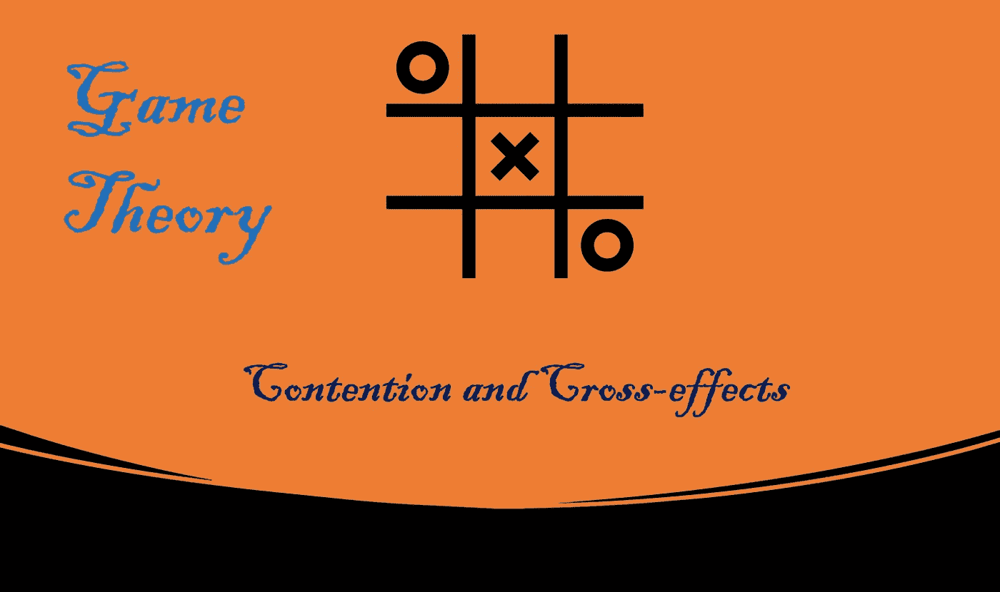
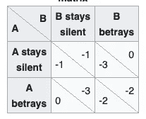
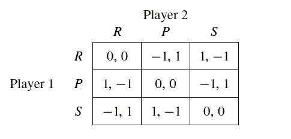

# 博弈论:竞争和交叉效应(第三部分)

> 原文：<https://medium.com/nerd-for-tech/game-theory-contention-and-cross-effects-c8cc9f6f0af2?source=collection_archive---------1----------------------->

## 静态博弈、囚徒困境和**策略简介**

# 介绍

到目前为止，我们已经讨论了理性个体可能面临的决策问题。但是，随着我们越来越接近现实，我们越来越经常面临决策问题，我们的福祉不仅取决于我们的行动，还取决于其他决策者的行动。正如你试图优化你的决策一样，他们也是如此。

为了最大化你的幸福，你不仅要考虑你的行动，还要猜测其他玩家在做什么，以最大化你的奖励。你的竞争者也和你一样理性，他们以相似的方式做决定。
让我们引入一些理论框架来形式化这个新的决策问题。

# 静态游戏

静态博弈是这样一种博弈，其中每个玩家在不知道其他玩家选择的行动的情况下选择他们的行动，然后这些选择将导致特定的结果，或者结果的概率分布。

我们需要一些假设，以便战略环境中的每个参与者都能理性行事。我们假设战略博弈中的所有参与者都知道:
1)所有参与者的所有可能行动
2)所有可能结果
3)交叉影响
4)每个参与者对结果的偏好

我们可以引入一个决策问题，参与者(不止一个)必须从行动空间中选择行动，这些选择的组合会产生结果。决策问题中的每个参与者都对这些结果有偏好。我们有每个参与人的一套行动和每个参与人的一套收益函数。正规形式博弈中的支付函数:它给出了在正规博弈中每个玩家选择的行为组合的支付值。纯粹的战略就是简单的行动计划。让我们讨论一个简单的例子，让读者看得更清楚。

## 例子:囚徒困境

博弈论中一个众所周知的简单例子，我们在许多博弈论教科书中反复遇到这个问题。

> 两名犯罪团伙成员被捕入狱。每个囚犯都被单独监禁，无法与他人交流。检察官向每个囚犯提出了一项交易。每个囚犯都有机会通过证明对方犯了罪来背叛对方，或者通过保持沉默来与对方合作。可能的结果是:

1.  如果 A 和 B 都“背叛”了对方，他们每个人都要在监狱里服刑两年
2.  如果 A 背叛了 B，但 B“保持沉默”(RS)，A 将被释放，B 将在监狱服刑三年(反之亦然)
3.  如果 A 和 B 都保持沉默，两人都将只服刑一年(罪名较轻)。

玩家:N= {A，B}
策略集:S= {BE，RS}
收益:vA(sA，sB)是玩家 A 的收益，vB(sA，sB)是玩家 B 的收益

vA(BE，BE) = vB(BE，BE) = -2
vA(RS，RS) = vB(RS，RS) = -1
vA(BE，RS) = vB(RS，BE) = 0
vA(RS，BE) = vB(BE，RS) = -3
用矩阵表示这些数更方便。

*行*:代表玩家 A 策略
*列*:代表玩家 B 策略
*矩阵条目*:A/B 的收益

就像上一篇博客中介绍的决策树结构一样，这种矩阵表示法完全定义了一个战略博弈。

# 石头剪刀布。

回想一下，石头(R)打败剪刀(S)，剪刀打败布(P)，布打败石头。
设赢家的收益为 1，输家的收益为 1，如果出现平局(选择相同的行动)则收益为 0。这是两个人的游戏

玩家:N = {1，2}
策略集:S= {R，P，S}
收益矩阵:

**策略配置**:基本上是玩家采取的一组动作，有 9 种可能的策略配置。例如{R，R}是一个策略配置，这意味着参与人 1 和 2 都决定选择摇滚。

vᵢ(s)是参与人 I 的收益，来自策略 s = (s₁，s₂，.。。、sᵢ₋₁、思、。。，sn)。我们将策略曲线 s₋ᵢ ∈ S₋ᵢ定义为所有非 I 的参与者的一个特殊的可能策略曲线

# 结论

到目前为止，我们强调了在战略环境中，不同的特殊玩家决策组合的收益表现。在我们应用某种模型来预测一个给定参与者的决策，并考虑到其他参与者的预期决策之前，这些表示是没有用的。我们将在下一篇博客中理解这些预测模型。

谢谢你的时间。