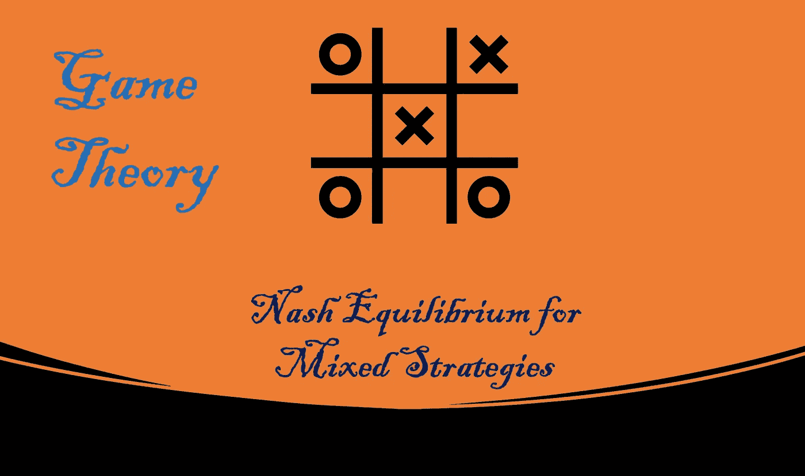
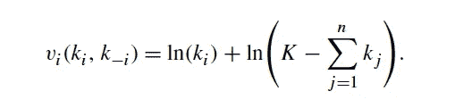
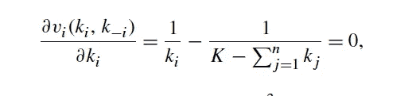
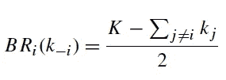
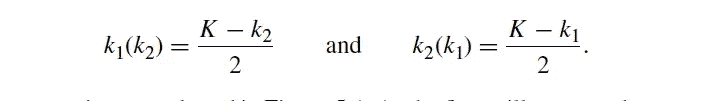
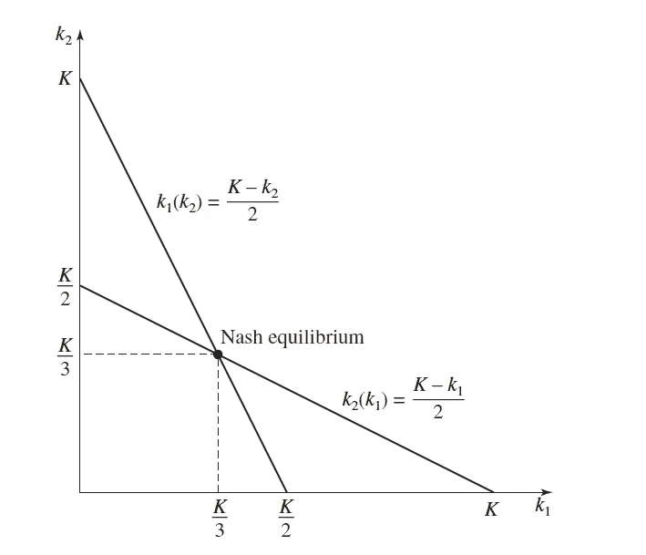
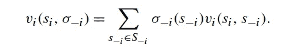
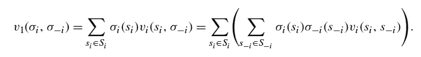
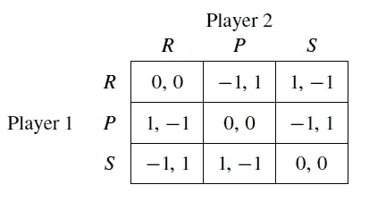

# 博弈论:混合策略的纳什均衡(第六部分)

> 原文：<https://medium.com/nerd-for-tech/game-theory-nash-equilibrium-for-mixed-strategies-73ae0c45a399?source=collection_archive---------15----------------------->

## 连续行动和随机战略博弈

# 介绍

我们在之前的博客中介绍了纳什均衡解的概念。在这篇博客中，我们将从一个连续行动的例子开始，我们将讨论纳什均衡在混合策略中的适用性。

混合策略是玩家随机选择行动的一类游戏(也就是说，玩家不是选择单一策略，而是选择策略的分布)。

## 例子:稀缺资源

让我们试着理解在资源稀缺的情况下，利己主义者会如何行动。想象一下，有 n 家肥料制造公司各自选择在淡水湖周围生产多少肥料。每个制造公司都将该湖中的一定量的淡水降级并加以利用，假设该湖中水的总单位是 k。每个玩家 I 选择自己生产所需的净水消耗量，k **ᵢ** ≥ 0，因此剩余的净水量是 **K -⅀ki** 。
消费一笔金额 k **ᵢ** ≥ 0 的收益给予玩家 I 等于 **ln(kᵢ)** 的收益给肥料公司，没有其他玩家从 I 的选择中获益。
每个玩家也喜欢消耗剩余的洁净空气，给每个玩家一个收益 ln(k-**⅀**kj)。因此参与人 I 的总收益是

对于参与人 I 来说，从选择 k= (k₁，k₂，。。。，kn)。
为了计算纳什均衡，我们需要找到一个所有参与者都选择最佳对策的策略配置文件。
那就是我们找到的策略简介(k∗₁，k∗₂，。。。，k∫n)，其中 k∫**ᵢ**= bri(k∫**₋ᵢ**)对于所有 i ∈ N，对于参与人 I，我们可以通过最大化上面写的价值函数来获得最佳响应。为了找到使产业 I 的价值函数最大化的 ki，我们可以将它的导数等于零。

求解上面的方程给出了参与人 I 的最佳对策。

让我们只举两个行业的例子来解决这个问题。ki(kj)是参与人 I 的最佳对策。

让我们把 k1 收益标在 x 轴上，k2 收益标在 y 轴上。

如果我们同时求解两个最佳反应函数，我们会找到唯一的纳什均衡，即两个参与者都参与 k₁= k₂ = K/3。

# 混合策略

到目前为止，我们讨论了纯策略，但我们需要讨论的问题是，参与者可以在他的几个纯策略中随机选择。这种行为有许多有趣的应用，其中玩家随机选择行动(即，玩家选择策略的分布，而不是选择单一策略)。选择任何一个纯策略的概率都是非负的，选择任何一个纯策略事件的概率之和必然等于 1。我们还将密切观察纳什均衡对这些混合策略的适用性。事实上，只有当参与者选择混合策略而不是纯策略时，纳什均衡才适用于博弈。

我们从随机游戏的基本定义开始，当玩家有有限的策略集 **Sᵢ** :
让 **Sᵢ = {sᵢ₁，sᵢ₁。。。，sᵢm}** 是参与人 I 的有限纯策略集。定义**δsᵢ**为 **Sᵢ** 的单纯形，它是 **Sᵢ** 上所有概率分布的集合。参与人 I 的混合策略是一个元素 **σᵢ ∈ Sᵢ** ，所以
**σᵢ= {σ(sᵢ₁)、σᵢ(sᵢ₂)。。。、σᵢ(sᵢm))** 是对 **Sᵢ** 、
的概率分布其中 **σᵢ(sᵢ)** 是参与人 I 对 s **ᵢ** 的概率。

现在考虑石头剪刀布游戏的例子，其中 S **ᵢ** = {R，p，S}(分别代表石头、布、剪刀)。我们可以将单纯形定义为
δsi = {(σ**ᵢ**(r)，σ **ᵢ** (P)，σ**ᵢ**(s)):σ**ᵢ**(r)，σ **ᵢ** (P)，σ **ᵢ** (S)≥0，σ **ᵢ** (R)+σ **ᵢ**

参与人 I 和他的对手 I 都选择混合行动。这意味着参与人对对手的 I 信念不是固定的，而是随机的。因此参与人 I 的信念是对手策略的概率分布。

**定义:**玩家 I 的**信念**由对手策略的概率分布 **πᵢ∈S₋ᵢ** 给出。我们用 **πᵢ(s₋ᵢ)** 来表示参与人 I 分配给他的对手玩 **s₋ᵢ ∈ S₋ᵢ** 的概率。

例如在石头剪子布游戏中，玩家 I 的信念表示为(**πᵢ**(r)**πᵢ**(p)**πᵢ**(s))。我们可以认为σ* **₋ᵢ** 是参与人 I 对对手的信念，π **ᵢ** 抓住了参与人 I 不确定对手行为的想法。

## 预期收益

在纯策略中，收益是直接的。在混合策略中，为了评估收益，我们需要重新引入**预期收益的概念。**

参与人 I 选择纯策略 **sᵢ∈ Sᵢ** 和对手选择混合策略**σ₋ᵢ∈δs−ᵢ**
时的预期收益请注意，纯策略是混合策略的一部分。

当参与人 I 选择混合策略**σᵢ∈δs**ᵢ和他的对手选择混合策略**σ₋ᵢ∈δs₋ᵢ.**

## 举例！

让我们来计算混合策略的收益。

假设参与人 2 选择σ₂(r)= 0.5
σ₂(p)= 0.5
σ₂(s)= 0
我们现在可以计算参与人 1 选择纯策略的预期收益。
V₁(R，σ₂)= 0.5 *(0)+0.5 *(1)+0 *(1)=-0.5
v₁(p，σ₂)= 0.5 *(1)+0.5 *(0)+0 *(1)= 0.5
v₁(s，σ₂)= 0.5 *(1)+0.5 *(1)+0 *(0)= 0

**V₁(P，σ2) > V₁(S，σ2) > V₁(R，σ₂)**

对于参与人 2 的混合策略，我们看到了参与人 1 的最佳对策，也就是行动 p。

现在让我们来理解纳什均衡解概念是如何应用于混合策略的。它实际上比看起来简单，我们只是用混合策略配置文件替换策略配置文件。

**定义:**混合策略简介 **σ* = (σ*₁，σ*₂，。。。，σ*n )** 是一个纳什均衡，如果对于每个参与人来说 **σ*ᵢ** 是对 **σ*₋ᵢ** 的最佳反应。即，对于所有 i ∈ N， **vᵢ(σ*ᵢ，σ*₋ᵢ) ≥ vᵢ(σᵢ，σ*₋ᵢ).∀ σᵢ∈ Sᵢ。纳什均衡中的每个混合策略都是该均衡中所有其他混合策略的最佳对策。让我们在这里结束混合策略的讨论。我们将在我的博客系列的下一篇博客中讨论更多。**

谢谢你的时间。