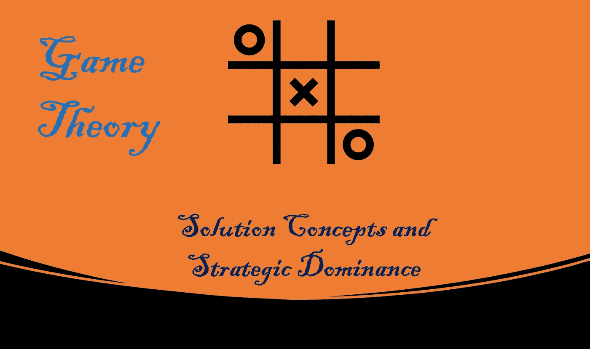
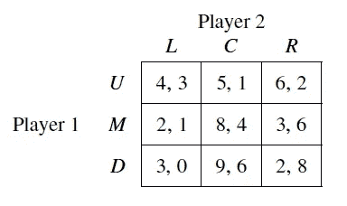
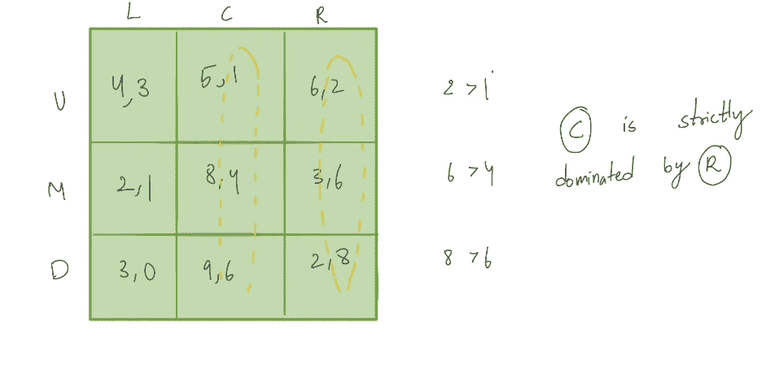
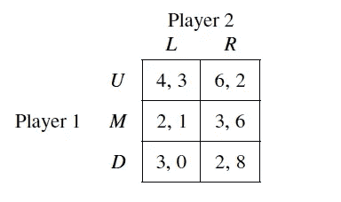
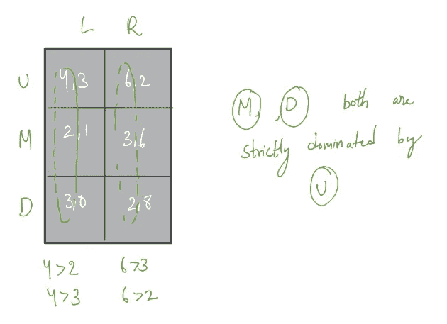
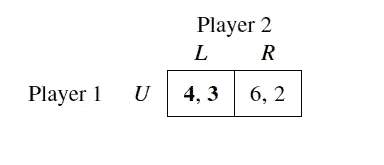
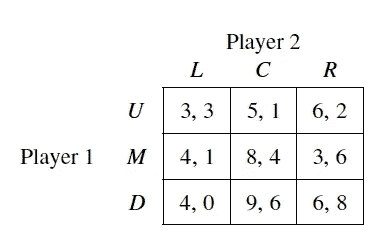

# 博弈论:解决方案概念和战略优势(第四部分)

> 原文：<https://medium.com/nerd-for-tech/game-theory-solution-concepts-f6298fec59f9?source=collection_archive---------17----------------------->

## 信念和最佳对策，共同理性

由作者生成

# 介绍

让我们在这一节介绍解决方案概念的想法。到目前为止，我们强调了在战略环境中，不同的特殊玩家决策组合的收益表现。这些表示是无用的，直到我们应用一些模型来预测一个给定玩家的决策，考虑到其他理性玩家的预期决策。我们将这个模型描述为解决方案概念。例如，帕累托最优是一个解决方案概念。**帕累托最优**是一种无法在不使至少一个人变得更糟的情况下使任何一个人变得更好的情况。这种解决方案概念的使用应该理想地导致独特的行动。

# 严格优势解概念

> “不管对手选择什么，严格优势策略总是你能做的最好的策略”

在正式定义概念之前，让我们用囚徒困境的例子来说明概念。

囚徒困境

如果玩家选择保持沉默，可能的结果是-1 和-3，取决于玩家的对手是否选择保持沉默和背叛。如果玩家选择背叛，那么可能的结果是 0 和-2，取决于玩家的对手是选择保持沉默还是背叛。

在这里，我们可以很容易地推断出，对于每个玩家来说，选择保持沉默{**RS**(保持沉默)}比背叛{**BE**(背叛其他囚犯)}更糟糕，不管该玩家的对手做什么。我们说这样一个背叛{BE}的策略占优。

**定义:**假设 Sᵢ∈ Sᵢ和 s"ᵢ∈ Sᵢ是参与人 I 的可能策略。我们说 s"ᵢ严格受 sᵢ支配，如果对于其他参与人策略的任何可能组合，s₋ᵢ∈ S₋ᵢ，参与人 I 在 s"ᵢ的收益严格小于在 sᵢ的收益。也就是说，
vᵢ(sᵢ，s₋ᵢ) > vi(s"ᵢ，s₋ᵢ)为全 s₋ᵢ∈ S₋ᵢ。我们将写 sᵢᵢs"ᵢ来表示 s"ᵢ被 s₋ᵢ严格控制

我们可以使用严格优势概念上的定义提出一个新的解决方案概念:“严格优势策略是一种不管对手选择什么，你总是能做的最好的策略”

# 严格支配的局限性

用这个严格的支配概念并不难。它基本上要求我们为每个参与者确定一个严格的优势策略，然后使用这个策略来预测或规定行为。
在囚徒困境问题中，每个参与者都有一个背叛的严格劣势策略，所以你可以预测参与者会选择背叛。

但是，这个解的概念只适用于一部分有严格支配的问题。通过研究广告游戏，我们很容易理解这种解决方案概念不适用于其他类型的问题。
两个竞争品牌可以从三个营销活动中选择一个——低(L)、中(M)和高(H)——回报由以下矩阵给出:

很容易观察到双方都没有严格的优势策略。
观察，如果玩家 2 玩' **M'** ，那么玩家 1 也应该玩' **M'** ，而如果玩家 2 玩' **H** ，那么玩家 1 应该玩' **H** '。很清楚没有严格的支配地位。
在缺乏严格优势策略的情况下，我们需要得出结论，严格优势解的概念可能不适用于所有类型的博弈。

# 理性的常识

这是一个重要的假设，它表明博弈的结构和参与者的理性是参与者的常识。

例如，如果我们考虑使用严格优势解的概念，所有的参与人都知道每个参与人都不会采取非严格劣势策略，他们可以忽略对手不会采取的非严格劣势策略，他们的对手也可以这样做。

理性的玩家永远不会采取非劣势策略。我们可以排除那些玩家不一定会选择的策略。
我们可以迭代消除原博弈，得到一个受限博弈。事实上，我们可能会发现在限制博弈中占优的其他策略，这些策略在原始博弈中并不占优。

这听起来可能有点令人困惑，但是通过一个例子就很容易理解这个概念。让我们用一个例子来说明这些概念。考虑以下两人有限博弈:

如果参与人 1 选择 U，参与人 2 收益最高的策略是 l，如果参与人 1 选择 M，参与人 2 收益最高的策略是 r，通过这种方式分析，可以推导出两个参与人都不存在严格优势策略。如果你仔细观察，就会发现参与人 2 有一个严格劣势策略。

策略 C 严格受 r 支配。

在这个新的矩阵表示中，对于参与人 1，M 和 D 都严格受 U 支配。

这导致了下一级的消除，其中 M，D 行为被消除。

从这里开始很简单，参与人 1 选择 U，参与人 2 选择
L，因为 v(L) = 3 > v(R)=2。

# 信念和最佳对策

如果参与人 I 有严格的优势策略，那么不管参与人 I 的信仰体系如何，他总是选择严格的优势策略。

如果参与人 I 的 sᵢ策略不是严格劣势策略，那么肯定存在参与人 I 对手的策略组合，sᵢ策略是参与人 I 的最佳选择。

> 这是博弈论的一个核心概念。玩家必须选择一个最佳策略来回应对手的策略。玩家选择一个行动，认为对手的信念是他/她的最佳对策。

定义:策略 sᵢ ∈ Sᵢ是参与人 I 对对手策略 s₋ᵢ ∈ S₋ᵢ如果
vᵢ(sᵢ，s₋ᵢ)≥s₋ᵢ).vᵢ(s"ᵢ的最佳对策∀s"ᵢ∈ Sᵢ

假设 sᵢ是参与人 I 对对手 s'₋ᵢ.的最佳对策只有当参与人 I 相信他的对手会选择 s'₋ᵢ.时，他才会选择 sᵢ信念的概念对战略行为的分析至关重要。玩家的严格占优策略是他独立于对手策略的最佳对策。

## 例子

如果一号认为二号选择策略 R，那么 U 和 D 都是最佳对策。所以一个玩家可能有不止一个最佳对策，因为他相信对手的选择。
现在，我们已经学习了很多战略环境中的决策。在本系列的下一篇博客中，我们将深入探讨混合策略和更多的解决方案概念。

谢谢你的时间。