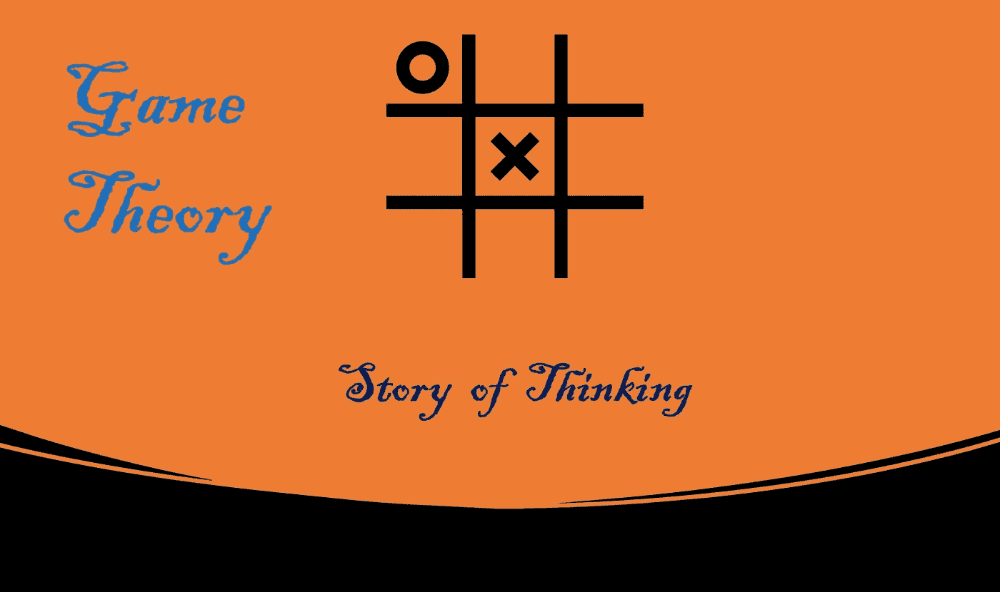
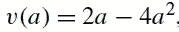
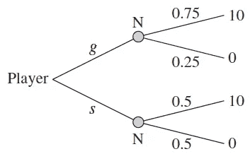
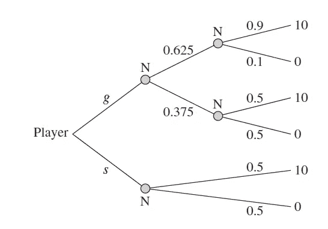
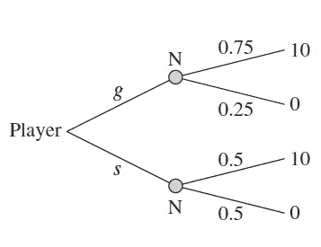
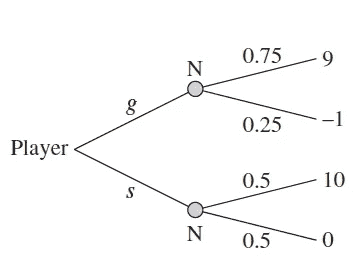
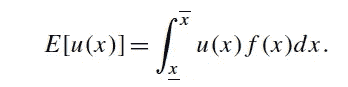
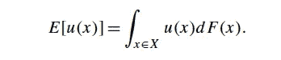
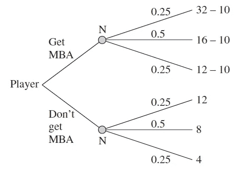
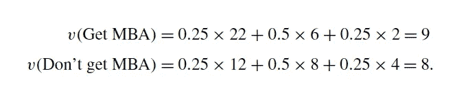

# 博弈论:思维的故事(下)

> 原文：<https://medium.com/nerd-for-tech/game-theory-story-of-thinking-8cde01a436be?source=collection_archive---------1----------------------->

## 支付函数、随机结果和决策

由作者生成

# 介绍

在这个博客中，我们将讨论思考，这是做任何决定前不可避免的过程。所有决策问题都涉及参与者、可供选择的方案、结果的后果以及对这些后果的偏好。

*动作*:玩家可以选择的选项{a，b}
*结果*:玩家动作的后果{x，y}
*偏好*:玩家如何对可能的结果进行排序

## 举例！

假设你的甜点有两种选择:奶昔和冰淇淋。动作为 A = {奶昔，冰淇淋}，我们将用 X = {x，y}来表示结果集，其中 X 表示喝奶昔，y 表示吃冰淇淋。例如，比起吃冰淇淋，你更喜欢喝奶昔。那我们就写 x>∾y，应该读作“x 至少和 y 一样好”项“**>∾”**叫做偏好关系请注意~一定不能和否定混淆。
这里的操作简单且易于解决，但在现实世界中，我们会遇到复杂的随机或连续选择。我们将在接下来的章节中对此进行更多的讨论。

# 假设

我们将对玩家思考这个决策问题的能力做两个重要的假设。

1.  给定两个结果，玩家应该选择其中一个，这样 x >∞y 或 y >∞x。这被称为“完整性公理”*。*
2.  偏好关系>∞是可传递的:对于任何三个结果 X，y，z ∈ X，如果 X >∞y 和 y >∞z，那么 X >∞z。它只是意味着如果你喜欢*冰淇淋胜过奶昔*和*奶昔胜过甜甜圈*，那么你喜欢*冰淇淋胜过甜甜圈*。这就是所谓的“传递性公理”。

给定所有可能的结果，玩家明确选择一个结果。这样我们可以确保玩家行为一致。

# 支付函数

我们看到了如何用符号>∾来表示“偏好”而不是结果。但是想象一下有成千上万的行动和结果。我们不能代表成千上万种结果的偏好。因此，我们需要一个回报函数，它可以量化结果，并作为偏好的完美代理。
若 A 是行动集，则每个行动 a ∈ A 产生利润π(a)。然后，我们可以只看每个行动的利润，选择一个最大化利润的行动。

*支付函数* **V** :X→R 表示偏好关系>∞若对任意一对 X，y ∈ X， **V** (x) ≥ **V** (y)当且仅当 X>∞y

## **举例！**

我们来讨论一个连续作用空间的例子。我们把吃多少蛋糕作为一个决策问题，有一个一斤的蛋糕，那么你的动作集是 A = [0，1]，其中 a ∈ A 是你能吃多少蛋糕。您的偏好由以下行动的支付函数表示:

你必须最大化你的收益，为了做到这一点，求一个微分，并使它等于零。我们得到
28a = 0，a = 0.25。
暗示为了让你的收益最大化，你必须吃 250 克。

# 随机结果

玩家采取行动的结果并不总是确定的，这些结果可能是随机的。
我们可以合理地猜测概率在这种情况下对我们有所帮助，因此玩家可以以一种有意义的方式比较不确定的结果。我们可以利用决策树来描述包含不确定性的玩家决策问题。

## 举例！

举个决策问题:
假设玩家有两个选择‘g’和‘s’，那么行动集合:{g，s}。如果玩家选择**行动‘g’**，那么玩家以 0.75 的概率获得 10 个单位的回报，以 0.25 的概率获得 0 个单位的回报。如果玩家选择行动 s 获得 10:0 的收益，概率是 0.5:0.5。
构建了一个简单直观的决策树:

玩家决策问题

从上面的例子中，我们可以用一个简单的决策树来完全定义一个决策问题。

我们将了解如何在随机/不确定结果的情况下做出决策。在此之前，让我们先介绍类似但更复杂的决策问题，如下所示。

修正决策问题

随机性随着时间而展开，对于一个给定的行为，回报的分布会随着时间而变化。这个决策树描述了完全相同的事情。

## 连续随机结果

我们在上面的例子中讨论了一个蛋糕的例子，其中动作集是连续的。如果我们把随机性和连续的行为结合起来，那么决策树的描述就变得多余了。
我们必须借助统计概念，如*随机变量*、 *PDF* (概率分布函数)和 *CDF* (连续分布函数)。我们将在下一节对此进行更多的讨论。

# 决策

如果结果是确定的，那么决策就很简单。让我们考虑另一个涉及随机结果的决策问题。

直观上，似乎 g 和 s 后面的两个概率很容易比较。两者都有相同的结果，利润 10 或利润 0。选择 g 有更大的机会获得利润 10，因此我们期望理性的玩家选择 g。

现在比较明显了。但并不是所有时候，我们必须量化结果的预期回报。所以让我们引入预期收益的概念

定义:设 u(x)是玩家在 X = {x₁，x₂，中的收益函数。。。，xn }，并设 P= (p₁，p₂，。。。pn)是 x 上的彩票，使得 Pⱼ = Pr{x = xⱼ}.然后我们定义玩家对彩票 p 的期望收益为 E[u(x)|p]= ⅀pⱼ.u(xⱼ) = p₁.u(x₁) + p₂.u(x₂) +。。

## 示例 1

判定问题

使用上面的定义，如果我们试图通过选择'**g【T4 ']来解决上面的决策问题
，期望收益是**

v(g)= E[u(x)| g]= 0.75 *(9)+0.25 *(1)= 6.5

通过选择' **s** '，期望收益为
v(s)= E[u(x)| s]= 0.5 *(10)+0.5 *(0)= 5。

' **s** '的期望收益仍然是 5，而' **g** '的期望收益是 6.5，所以' **g** '是他的最佳选择。

## 连续案例

让我们通过使用下一节中引入的累积分布函数(CDF)的主题，在连续动作空间中继续这个决策评估案例。

定义设 *u(x)* 为玩家在区间 *X* 内的收益函数，彩票由累积分布 *F(x)* 给出，密度为 *f(x)* 。然后我们定义玩家的预期收益:

预期收益

我们还必须记住，密度函数 *f(x)* 只是 *CDF F(x)的一个导数。*

了解自己每个行动的随机后果的玩家，会选择一个给他最高预期收益的行动。

# MBA 与非 MBA 的例子

让我们用一组有限的行动和结果来举例说明另一个最大化期望回报的例子，假设你一直在为一家公司工作，你正在决定是否加入 MBA。MBA 学费和辅导费要 10 英镑(包括机会成本)

如果劳动力市场强劲，经济看涨。你拥有 MBA 学位的收入价值是 32L，而你目前工作的收入价值是 12L。
如果劳动力市场平均，经济单调。你拥有 MBA 学位的收入价值是 16L，而你目前工作的收入价值是 8L。如果劳动力市场疲软，经济不景气。你拥有 MBA 学位的收入价值是 12L，而你目前工作的收入价值是 4L。让我们假设劳动力市场以 0.25 的概率强劲，以 0.5 的概率平均，以 0.25 的概率疲软。

这个决定是:你应该攻读 MBA 吗？

让我们用决策树来说明这个决策问题:

注意，如果玩家选择攻读 MBA:那么我们从三种自然状态的收入收益中减去学位的成本。

让我们计算一下每个行动的预期收益。通过评估预期收益值，我们可以知道哪个结果更好。

通过观察预期收益值，理性玩家会选择攻读 MBA。

到目前为止，单个玩家参与决策问题。在本系列的下一篇博客中，我们将讨论多人游戏场景。

谢谢你的时间