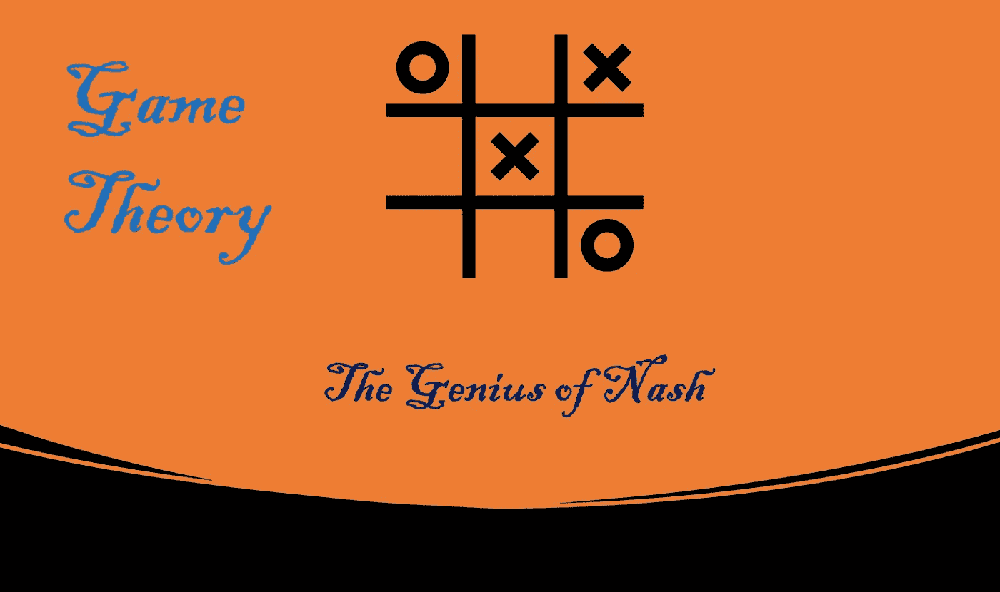
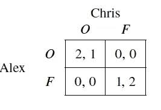
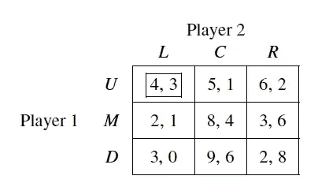
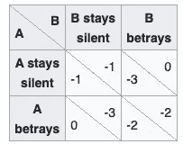
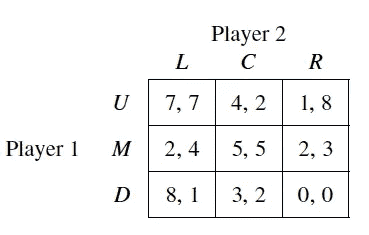
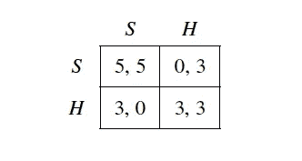

# 博弈论:纳什的天才(第五部分)

> 原文：<https://medium.com/nerd-for-tech/game-theory-the-genius-of-nash-3682751c0ee2?source=collection_archive---------0----------------------->

## 纳什均衡，最佳对策

# 介绍

我们在上一篇博客中详细讨论了严格优势解的概念。它的应用是有限的，只适用于博弈的某一部分(严格占优策略的博弈)。严格的优势策略往往不存在。

我们来考虑一下**性别之战**游戏。

 [## 性别之战(博弈论)-维基百科

### 在博弈论中，性别之战(BoS)是一个两个玩家的协调游戏，然而游戏也涉及到元素…

en.wikipedia.org](https://en.wikipedia.org/wiki/Battle_of_the_sexes_%28game_theory%29) 

没有优势策略。
在上一篇博客中，我们讨论了信仰的概念。玩家会对他们的信念做出最佳反应。克里斯可能会表现最佳，去踢足球，因为他相信亚历克斯会去看足球比赛。但是他们的信仰可能是错误的。

在这个博客中，我们将讨论博弈论中最核心和最著名的解决方案概念之一。这克服了其他解决方案概念面临的许多缺点，这是由**约翰·纳西**开发的。

# 纳什均衡解概念

我们来定义一下纳什的解概念。纳什均衡是一个策略的轮廓，每个参与者都在选择对所有其他参与者策略的最佳反应。
纳什均衡中的每个策略都是该均衡中所有其他策略的最佳对策。让我们正式定义纳什均衡:

**定义**:纯策略剖面图 **s*= (s*** ₁ **，s*** ₂ **，。。。，s*n) ∈ S** 是纳什均衡如果 **s*ᵢ** 是对 **s*₋ᵢ** 的最佳对策，对于所有 i ∈ N，也就是说

**v** ᵢ **(s∗ᵢ，s∗₋ᵢ) ≥ v** ᵢ **(sᵢ，s∗₋ᵢ)** **对于所有 sᵢ ∈ Sᵢ和所有 i ∈ N.**

请注意，s*是战略简介，不是战略。战略概况指的是战略环境/游戏中所有玩家采取的一系列行动。

## 示例 1

让我们通过一个例子来理解这个定义。

考虑这个矩阵表示。现在让我们写下所有可能的策略概要。
**S** = {(L，U)，(C，U)，(R，U)，(L，M)，(C，M)，(R，M)，(L，D)，(C，D)，(R，D)}。现在让我们评估最佳对策的收益函数。
如果参与人 1 选择 u 参与人 2 的最佳对策是 l:br₂(u)= l
**br**₂**(u)= l**，BR₂(M) = C，br₂(d)= r
**br**₁**(l)= u**，BR₁(C) = D，BR₁(R) = U
现在仔细观察如果参与人 2 选择 l，那么参与人 1 的最佳对策是{ u }；同时，如果参与人 1 选择 U，那么参与人 2 的最佳对策{L}。它显然符合上面的定义。

> 所以这就是 **s*: {L，U}** 纳什均衡。

## 示例 2

让我们将纳什的解概念应用于囚徒困境。

S = {(RS，BE)，(BE，BE)，(BE，RS)，(RS，RS)}
纳什均衡 s*是(BE，BE)
我鼓励读者解决这个，找出(BE，BE)是怎样的纳什均衡。

## 纳什均衡的假设

下面是纳什均衡的假设:

1.  每个玩家都在对自己的信念做出最佳回应。
2.  球员对对手的信念是正确的。

我们不会深究这些假设，因为这会让我们陷入一些哲学讨论。

# 与其他解决方案概念相比

## 示例 1

让我们将 Nash 解决方案概念与其他解决方案概念进行比较:

这里很容易推断出两个参与者都没有严格优势策略*:因此严格优势概念失效。
任何玩家都没有严格劣势策略，所以 ***迭代消去法*** 不适用。*

*让我们看看纯策略纳什均衡是否存在。
BR₁(L) = D， **BR** ₁ **(C) = M，** BR₁(R) = M
BR₂(U) = L， **BR** ₂ **(M) = C** ，BR₂(D) = L
我们发现 **(M，C)** 是**纯策略纳什均衡**——而且是唯一的。*

*如果解决方案概念预测或规定了独特的策略，那么它就是最好的。有必要了解纳什均衡是否总是产生唯一的策略。*

## *示例 2*

*让我们考虑性别之战游戏。*

**

*我们来求解这个博弈的纳什均衡。
S = {(O，F)，(O，O)，(F，F)，(F，O )}
BRa(O) = O，BRa(F) = F
BRc(O) = O，BRa(F) = F*

*我们可以清楚地观察到，我们可能没有唯一的纳什均衡，但它通常会导致比严格的占优解概念和迭代消除更精细的预测。*

*纳什均衡解概念在经济学、政治学、法学、甚至生物学中都有广泛的应用。*

# *更多纳什均衡的例子*

*让我们讨论一个例子，在这个例子中，我们可以将纳什的解决方案概念应用于现实生活中的问题。*

## *例子 1:猎鹿(社会合作)*

> *两个人出去打猎。每个人都可以选择猎鹿或猎兔。每个玩家必须在不知道对方选择的情况下选择一个行动。如果一个人猎杀一头牡鹿，他们必须得到同伴的合作才能成功。一个人可以自己得到一只野兔，但野兔的价值低于一只雄鹿。这被认为是社会合作的一个有用类比，例如关于气候变化的国际协议。收益矩阵如下*

**

*BR₁(S) = S，BR₁(H) = H
BR₂(H) = H，BR₂(S) = S
博弈有两个纯策略均衡:(s，s)和(h，h)。然而，来自(S，S) **的收益优于来自(H，H)的收益。***

*如果一个玩家预料到另一个人不合作，那么他会选择猎取一只野兔。但是如果他相信其他人会合作，那么我们会选择 stag。当两个人都选择 stag 时，也就是说，当两个人都相信另一个人会合作时，作为一个整体，两个人都会更好*

*让我们在这里结束关于离散行动的纳什均衡的讨论。我们将在我的博客系列的下一篇博客中讨论更多关于纳什均衡的内容。*

**