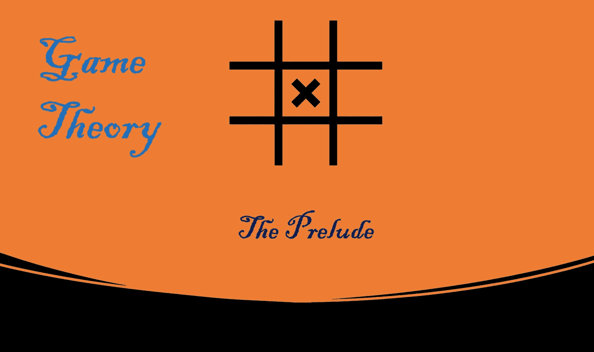

# 博弈论:前奏(上)

> 原文：<https://medium.com/nerd-for-tech/game-theory-the-prelude-c6fe8791f035?source=collection_archive---------0----------------------->

## 介绍性笔记、形式主义和直觉

由作者生成

# 介绍

打算写这一系列的博客来介绍博弈论，不需要任何高等数学的先验知识。博弈论在外交、经济、贸易和冲突处理等领域有着巨大的应用。

我们每天都面临决策问题，我们无时无刻不在和父母、朋友甚至竞争者玩策略游戏。有些游戏涉及琐碎的决定而其他的是严重的，有些后果无关紧要而有些有严重的反响。

# 为什么是博弈论？

我们对这些决策有本能的专业知识，但是在争论中形式化这些决策过程并为这种战略思维创造一种语言的需要是由博弈论者提供的。

每个领域都在某种程度上涉及决策、战略思考，比如战争、外交、金融、经济、贸易，甚至室友间的租金分摊。博弈论提供了一般概念和技术的分析来帮助决策。

# 形式主义！

让我们从形式化一些我们常用的术语开始，但是在博弈论方法中有微妙不同的含义。
1。博弈论
2。战略思维
3。理性
4。战略游戏

1.  博弈论是对这种互动决策的分析，或者说是科学。提供一些思考战略互动的一般原则。
2.  战略思考是关于在相似的情况下与相似的玩家进行相似的思考。正如我们必须考虑到其他玩家在想什么一样，对手也在考虑我们在想什么。
3.  如果你根据你自己的标准，考虑到你的目标或偏好，以及对你行为的任何限制或约束，选择你的行为，你就被认为是理性的。

> **博弈论**为思考**战略互动**提供了一些通用原则，以便理性地**行事**

4.战略游戏包括相互了解的玩家之间的互动，每个人的行动决策取决于竞争者采取的行动以及竞争者和他自己采取的这些行动所产生的交叉效应。假设是相互意识到行动的交叉影响。

# 例子

让我们讨论几个例子，这些例子有助于激励博弈论的许多概念或理论框架的发展。

# **例 1:猜平均值的 2/3**

一种游戏，几个人猜测他们猜测的平均值的 2/3 是多少，数字限于 0 到 100 之间的实数，包括 0 和 100。获胜者是最接近 2/3 平均值的人。

> 阿兰·勒杜是普通游戏“猜 2/3”的创始人。1981 年，勒杜在他的法国杂志《Jeux et Stratégie》中用这个游戏打破了僵局。他询问了大约 4000 名读者，他们在之前的谜题中达到了相同的分数。

# 例 2: **凯恩斯选美大赛**

要求参赛者从一百张照片中选出六张最有吸引力的面孔的游戏。选出最受欢迎面孔的人有资格获得奖励。

> 约翰·梅纳德·凯恩斯提出的概念，并在他的著作*《就业、利息和货币通论》* (1936)的第 12 章中引入，用来解释股票市场的价格波动。

这是两个被学术界用来解释博弈论概念的流行例子。试着找出上述两种情况的答案。
**请注意，这不仅关乎你认为答案是什么，还关乎所有其他竞争者认为答案是什么。

在下一篇博客中，我们将陈述决策问题的一些基本概念和术语。

谢谢你的时间