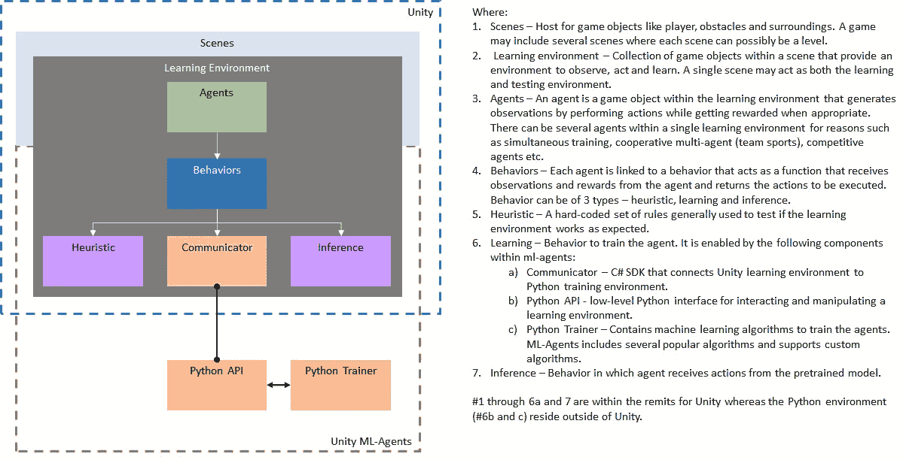
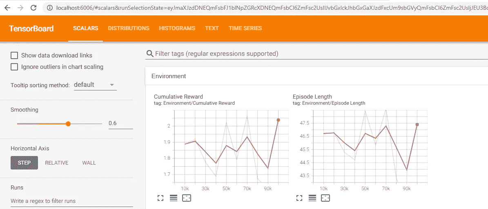

# 游戏人工智能:深度强化学习的统一

> 原文：<https://medium.com/nerd-for-tech/gaming-ai-unity-with-deep-reinforcement-learning-e8be9d14f248?source=collection_archive---------8----------------------->

图片鸣谢:[https://pixelkin . org/2017/08/24/studies-reveal-video-gamings-effects-on-the-brain/](https://pixelkin.org/2017/08/24/studies-reveal-video-gamings-effects-on-the-brain/)

在我的数据科学之旅中，我听说强化学习被用于游戏开发和自动驾驶等领域。根据[维基](https://en.wikipedia.org/wiki/Reinforcement_learning)的定义:

> **强化学习** ( **RL** )是[机器学习](https://en.wikipedia.org/wiki/Machine_learning)的一个领域，涉及[智能代理](https://en.wikipedia.org/wiki/Intelligent_agent)应该如何在一个环境中采取[行动](https://en.wikipedia.org/wiki/Action_selection)以最大化累积回报的概念。[【1】](https://en.wikipedia.org/wiki/Reinforcement_learning#cite_note-1)

因此，游戏环境中的非玩家角色(NPC 的)成为这种智能代理的明显候选者。然后我看了这个由 Paris Buttfield-Addison 在 North Bay Python (2019) 制作的[视频，让我着迷。](https://www.youtube.com/watch?v=8fLyMPPixdU&t=2s)

在这篇文章中，我将描述我用 [Unity ML-Agents Toolkit](https://github.com/Unity-Technologies/ml-agents/tree/release_13_docs) (基于 [pytorch](https://pytorch.org/) 的深度强化学习开源项目)开发一个简单的 [Unity](https://unity.com/) 游戏的经历。希望愿意走类似道路的游戏开发和机器学习爱好者能够受益于:

*   由 ML-agent 实现的强化学习的高度可视化表示
*   一个新的游戏爱好者的视角

# 我建造了什么？

一个简单的 2D 游戏，其中一个球(如上所述的智能代理)试图在没有任何用户输入的情况下躲避粒子。最终游戏看起来如下。

游戏人工智能演示

# 我是如何建造它的？

下面的图表为我提供了一个用 ML-Agents 构建 Unity 游戏的框架。

游戏人工智能框架

上述框架转化为实现我当前目标的以下步骤:

*   创建开发环境
*   创建统一 2D 项目
*   定义一个场景作为代理(本例中为球)训练和测试的环境
*   向球(代理)添加观察、奖励和行为
*   用用户输入测试游戏(启发式)
*   训练球(学习)
*   部署模型以基于预训练的模型进行推断

我将在接下来的小节中详细阐述每个步骤。如果你已经熟悉 Unity 和 ML-Agents，请随意克隆[项目](https://github.com/siddhbhatt/Unity2DBallML.git)并尝试自己运行它。

## 创建开发环境

我需要以下物品:

*   Unity 获得了 2019.4.20f1 版本，我相信这是我写这篇文章时最新的稳定版本。要下载和安装，请访问 [Unity 页面](https://store.unity.com/?_ga=2.144558005.1262946819.1615185274-1236703739.1614019233#plans-individual)并选择符合您要求的方案。
*   python——我用的是 [Anaconda](https://www.anaconda.com/products/individual) 。创建了一个 3.6 版本的虚拟环境`conda create — name ml-agents python=3.6`
*   代码编辑器——我习惯了 [VS 代码](https://code.visualstudio.com/download)。要使用 Unity 中的 VS 代码，请转到`Edit>Preferences>External Tools>External Script Editor`。带有 Unity 的默认在线编辑器应该也能正常工作。
*   ML-Agents —我用的是 release_13。安装说明可在 [ml-agents 文档](https://github.com/Unity-Technologies/ml-agents/blob/release_13_docs/docs/Installation.md)中找到。出于这个练习的目的，我将需要`com.unity.ml-agents`包(克隆了回购协议，并在创建后将包从磁盘添加到项目中)和`pytorch`和`ml-agents` python 包。

## 创建统一 2D 项目

简单—进入 Unity Hub >新建>选择 Unity 版本> 2D 模板>项目名称= Unity2DBallML >创建

注意:在项目窗格中检查包中的 ML 代理。如果没有，使用包管理器添加`com.unity.ml-agents`。

## 定义场景

(1)添加平台

*   从文件面板，添加游戏对象> 3D 对象>立方体。
*   在检查器中，我设置立方体的变换属性。位置设置为 X=0，Y=-4，Z=0，比例设置为 X=12，Y=1，Z=1。
*   在检查器中，添加组件>物理 2D > 2D 盒碰撞器。要求球在平台上滚动。

(2)添加球

*   从文件面板，添加游戏对象> 3D 对象>球体。
*   在检查器中，我设置球体的变换属性。位置设置为 X=0，Y=0 和 Z=0(每当游戏开始/重置时，创建球从顶部落下的效果),比例设置为 X=1，Y=1 和 Z=1。
*   在检查器中，添加组件>物理 2D > 2D 盒碰撞器。
*   在检查器中，添加组件>物理 2D >刚体 2D。球需要有重力。

(3)添加球需要闪避的粒子

*   从文件面板，添加游戏对象>效果>粒子系统。
*   在 Inspector 中，我设置了粒子系统的变换属性，将其放置在可见场景的上方，以创建粒子从空间落下的效果。所以位置应该设置为 X=0，Y=7，Z=-1。
*   默认情况下，粒子沿 Z 轴移动。在 2D 空间，它将创造一个飞向顶端的效果。我希望它沿着 Y 轴下降。为此，我在检查器的粒子系统属性中添加了一个 0.3 的重力修改器。
*   默认情况下，粒子从中心生成并沿圆锥体移动。我希望粒子在整个平台上随机产生。为此，我需要去粒子系统的形状，改变形状为方块，发射体积和比例为 X=12，Y=1 和 Z=1。
*   我想检测与球的碰撞——所以我启用了类型为“世界”的粒子系统的碰撞属性(其他可以保留为默认值)。
*   为了在粒子开始出现之前留出一些时间，我在检查器的粒子系统属性中添加了开始延迟为 1。
*   最后，我在检查器的粒子系统属性中将开始速度改为 0.1。

(4)将所有游戏对象分组(这一步是多余的，但是如果我想同时训练多个代理，这一步会很有用)

*   在层次窗格中创建一个空的游戏对象，并将其命名为 TrainingArea
*   将其位置参数设置为 X=0、Y=0 和 Z=0
*   将球、平台和粒子系统拖入训练区

此时，我已经得到了我需要的所有游戏对象。如果我点击播放，球落在平台上，粒子开始从顶部落下。你将在这里看到这么多的图形——真可惜，🥱.

注:如果你有兴趣了解更多关于物理组件(如上面使用的碰撞器、刚体)或粒子系统的知识，请参考 [Unity 手册](https://docs.unity3d.com/Manual/CollidersOverview.html)。

## 给球添加观察、奖励和行为

现在是时候开始编码了。我在层级窗格中选择球。进入检查器>添加组件>新脚本> SphereAction，并在代码编辑器中打开它。C#脚本应该是这样的:

让我们检查一下剧本-

1.  我包括必要的包。
2.  定义我的类和变量。
3.  初始化函数分配球，它的速度，粒子系统和其中的粒子，这样它就可以在整个类中被引用。
4.  OnEpisodeBegin 函数将球重新定位在起点，并在每集开始或重置时重置粒子系统。稍后我会定义一集的结尾。
5.  CollectObservations 定义了在训练或推理过程中发送到大脑(ML 算法或预训练模型)的观察值，以根据输入决定行动。在这个例子中，我收集了球的位置和速度以及粒子的位置和速度。
6.  OnParticleCollision 是一个内置函数，当粒子系统检测到与一个刚体(在我们的例子中是球)的碰撞时会调用这个函数。每次检测到冲突时，我都会设置一个计数器。
7.  OnActionReceived 函数定义了动作和奖励。先说动作。在我的例子中，该函数接收关于球的位置的输入，并通过 AddForce 函数以预定义的速度向那个位置移动。奖励呢？我在粒子碰撞上高度惩罚代理(-1)，结束这一集。如果球掉下了平台，那么我也结束了这一集。最后，每当它成功避开一个粒子，我就奖励它一个小值(0.1)。
8.  启发式功能被添加到球上，以便能够根据用户输入在 X 轴上连续移动(基于右键和左键)。

到目前为止，我已经完成了最难的部分(好吧，我知道这并不难，但这难道不是我的想法吗😏).现在还剩下几样东西。

*   向球添加组件行为参数(通过检查器)，并将行为名称设置为 2DSphere，将空间大小设置为 8(我向大脑发送了 8 个观察值，每个位置向量由球和粒子及其速度的 3 个数字组成)。
*   将组件决策请求者添加到球中(通过检查员)，并将决策周期设置为 10。

## 用用户输入测试游戏(启发式)

我已经准备好测试学习环境了。在我点击 run 之前，需要将 Behavior Parameters > Behavior Type 更改为 Heuristic，以指示代理操作将被手动引导。在那里，我开始用左右箭头移动球。我玩得很烂——就像我玩的其他游戏一样。我想这是我对一个好游戏的扭曲的衡量。

## 训练球(学习)

让我们来看看闪亮的部分。我选择了近似策略优化(PPO)来训练我的代理，这是 Unity ML-Agents 中默认的深度强化学习算法。我将数学放在后面，但如果你有兴趣了解更多关于 PPO 的知识，请访问此[页面](https://openai.com/blog/openai-baselines-ppo/#ppo)。

培训练习将在 Unity 之外进行，如框架所示。要开始训练，我需要:

*   选择球，并在检查器中将“行为参数”>“行为类型”更改回默认值(在前面的步骤中，我已将其设置为启发式)
*   设置超参数—创建 2DSphere.yaml，如下所示。如果您已经克隆了 ml-agents repo，那么作为标准做法，您可能希望将其保存在 ml-agents/config/ppo 中。

*   执行培训—我在命令提示符下从 ml-agents 目录运行以下命令— `mlagents-learn config/ppo/2DSphere.yaml --run-id=2DSphereFirstRun`。在一堆消息和警告之后，它在 Unity 中提示开始游戏。我点击播放，训练开始。

为了监控训练过程，我使用 [tensorboard](https://www.tensorflow.org/tensorboard) 。这是训练结束时的样子。

培训结果

值得注意的趋势是奖励和剧集长度是否持续增长。从上面的图表中，我看到线条不稳定——这表明模型需要更多的训练。我现在就让它过去，但是你可以改变超参数中的`max_steps: 500000`并尝试训练。

## 部署模型以得出推论

训练好的模型保存为`ml-agents/results/2DSphereFirstRun /2DSphere.onxx`。它需要被移动到我的 Unity 项目文件夹中——标准做法是复制到`Unity2DBallML/Assets/Models`。现在可以从 Unity 的项目窗格中访问模型文件。我选择球，并将模型文件拖到行为参数检查器中的>模型。

就是这样！我点击播放，球从模型中推断出闪避粒子，同时自己留在平台上，如视频所示。

如果你在遵循这篇文章的同时正在构建自己的项目，并且在任何一步都停滞不前，那么从 [git](https://github.com/siddhbhatt/Unity2DBallML.git) 中克隆我的项目，并通过 Unity Hub 添加它以进行比较。希望这篇文章对你的游戏人工智能冒险有所帮助。