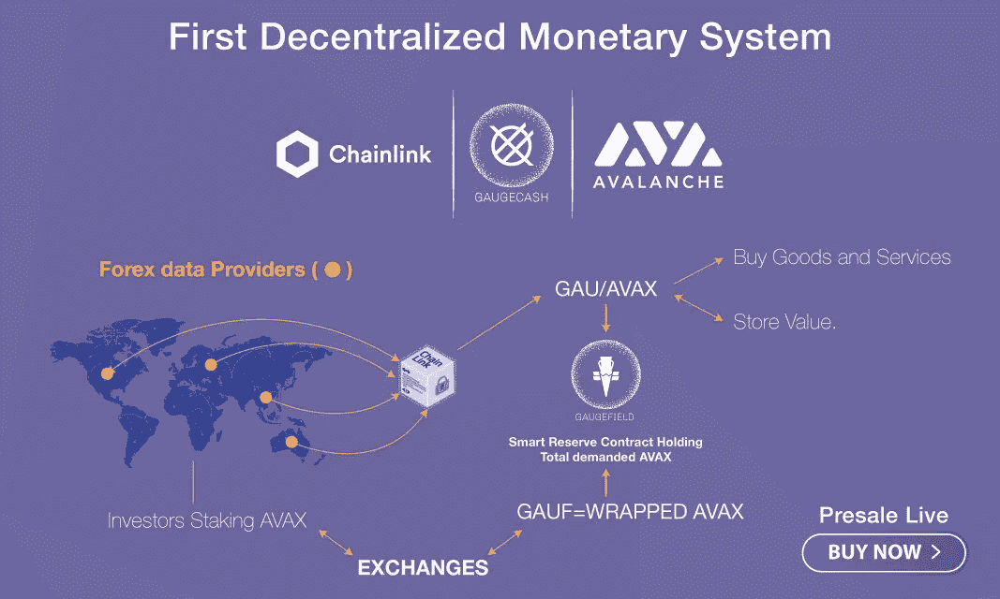

# GAUGECASH，世界上第一个分散的货币系统

> 原文：<https://medium.com/nerd-for-tech/gaugecash-worlds-first-decentralized-monetary-system-28b784874dc7?source=collection_archive---------1----------------------->

有没有人劝过你，现金存的越多，亏的越多？这是许多法定货币的事实。原因是货币的扩张和贬值过程依赖于持有国。

创造稳定的硬币是为了模拟加密货币市场中法定货币的价值。所以它们的价值会随着时间而下降。**稳定性**是指在特定时期内风险水平较低。

由“区块链资产”支持的最大的稳定货币和最大的可获得的技术区块链，还没有在世界上看到。许多人以此为目标，他们一直致力于创建一个稳定的全球货币体系。

**GAUGECASH** 与 Chainlink 合作，对整个系统进行现代化改造。 **GAUGECASH** 将使用市场领先的 oracle network Chainlink。因此，为了得到 GAU/美元的分散价格馈送。GAU 硬币平均相当于 35 种法定货币。

# **计量器现金**

GAUGECASH 是世界上第一个去中心化的货币系统。任何地方的任何人都可以使用它。大多数著名的稳定货币将资产的价格和价值与美元 1: 1 挂钩。但是 Gaugecash 协议从分散的金融系统中获得其价格和价值。这消除了与美元挂钩所带来的中央集权风险。

感谢 [GAUGECASH](https://www.gaugecash.com/)

**GAUGECASH** 是一种自我强化的财务方法，能够产生无与伦比的价值。对于用户和投资者来说。Chainlink 的 GAU/美元价格反馈确保该指标以公平的市场价值对美元定价，并且没有操纵的机会。 **GAUGECASH** 使用全球金融机构的 API 计算一篮子加权平均指数价格。

该指数包括各种法定货币，形成稳定的一篮子货币。能够承受地区货币政策变化。它还在没有一个突出的菲亚特的情况下保持稳定。新的货币指数在发送和接收货币以及持有资产时考虑了货币政策。

# **协议由两个令牌组成**

1. **GAUGECASH (GAU)** ，这是一个比任何单一法定货币都更稳定的世界货币指数，包括主要货币(英镑、欧元、美元、日元)。

2.**高格菲尔德(GAUF)** 。GAU 支持的协议流动性令牌。

# **计量现金指数**

GAU /美元汇率将由 **GAUGECASH 指数**提供。 **GAUGECASH** 旨在让用户在线进行稳定支付或保值。同时防范任何单一法定货币波动的风险。

现金备份和价格指数降低集中化风险。它是为寻找当前众所周知的稳定固定加密货币替代品的用户开发的。

价格比世界上任何其他货币都稳定，包括黄金。我们将稳定性定义为货币对本身在任何特定时期的平均变化。非央行指数在监管和分散化方面具有明显优势。

它将比其他任何货币对美元都要贵。它有一个积极的购买力效应。它包含了世界货币政策的信息。

货币可能会贬值或出现意外波动。例如，2015 年瑞士央行用瑞士法郎引发了一场危机。在这种新的加权平均中实施的数学创新将使该指数在那一刻对所有其他货币(包括黄金和白银)更加稳定。

# **高格菲尔德(TOKENOMICS )**

Gaugecash 协议的 **GAUGEFIELD** 或 **GAUF** 令牌是一个 **ERC-20** 令牌。对稀缺流动性**高格菲尔德**池中**高格现金**的需求可以建模为贝叶斯博弈中的纳什均衡。GAUF 充当协议的流动性和冗余令牌。这是给所有想用他们的资产提供现金服务并赚更多钱的 DeFi 投资者的。

**GAUGECASH** 使用 Tether 目前平均每天 1000 亿美元的交易量。它的目标是使其流动性池 GAUGEFIELD 成为一项成功的投资。

公司将确认 **GAUGECASH** 将在全球采用。它将被用作全球范围内产品和服务的定价和交易标准。有兴趣投资 GAUGECASH 的用户可以加入该公司目前的预售。

一旦第一个金币销售一空，T21 将发行第二个 1 亿金币的金币。目前，1GAUF 价值 0.1 AVAX，收益率为 30 倍。 **GAUGEFIELD** 、 **GAUGECASH 的**流动性池将打包 AVAXs，并将其公开，以确定收益率时间框架。

因此，先追逐泰铢，再追逐主要货币对欧元/美元的投资者将获得丰厚利润。

很多人从来不喜欢稳定币所赋予的明显的经济风险和集权。除此之外，像 USDC、泰瑟、TUSD 和其他人这样的象征性代表并不能取悦他们。这是将他们的加密货币投资于 **GAUGECASH** 的最佳时机。

**GAUGECASH** 将是一个免费使用的解决方案，将满足加密货币市场的所有需求。

# **什么是链环？为什么 Gaugecash 要和 Chainlink 整合？**

## **链环**

Chainlink 是实现通用智能合约的最广泛使用和最安全的方式。开发人员可以使用 Chainlink 将任何区块链与来自其他区块链的高质量数据源链接起来。以及来自真实世界的数据。

一个由数十万人组成的全球分散社区运营着 Chainlink。它引入了更公平的合同模式。其网络目前在智能合同中提供了数十亿美元。分散金融(DeFi)、保险和赌博生态系统的价值。

GAUGECASH 集成了市场领先的 Chainlink oracle 网络。这将有助于进入分散的 GAU /美元价格渠道。基于 Chainlink 的 GAU /美元价格流确保了该指标将按照公平的市场价值对美元进行估值，并且不会受到任何可能的干扰。

市场领先的 oracle networks chain link 为我们提供了成熟的即插即用 Oracle 解决方案。它目前通过 DeFi 带来了数十亿美元的安全保障。链环是我们发展的一个关键因素。何时将离线外汇市场数据引入区块链生态系统。

以太坊推出了 **GAUGECASH** 系统。它基本上是独立于区块链的，所以我们需要一个像 Chainlink 这样的 oracle。这支持各种其他区块链环境。

我们选择 Chainlink 是因为它在技术、安全性和市场优势方面的绝对优势。显著增加 **GAUGECASH** 价值的一些 Chainlink pricing feed 功能包括:

*   Chainlink Oracles 具有内置的凭据管理功能。这允许他们访问用于创建我们的**指标**的高级密码保护外汇数据。
*   Chainlink 使用抗 Sybil Oracle 节点的分散式网络。这可以保护我们的智能合同免受单个 oracle 造成的停机或数据操纵攻击。
*   Chainlink 提供了 Oracle 网络性能的透明可视化。允许用户验证他们正在接收公平的市场汇率。
*   Chainlink ETH / USD 价格流示例展示了 Oracle 网络活动的透明可视化。

# **底线**

在过去的一百年里，大约有三十次“开箱即用的债务危机”。这导致数百万人失去了他们的财富和交易价值。

在加密领域，解决方案在于将代币与美元挂钩。它没有解决资产的分散化和长期稳定性问题。

解决方案:我们提出了第一个分散的货币系统，任何地方的任何人都可以使用。是**计量器现金**。它有两个主要组成部分

它根据外汇市场的最终形成创建了一个指数。它比世界上任何其他货币都稳定，包括黄金和白银。

我们用区块链级本身强化了 **GAUGECASH** 的价值。这利用了它的经济稀缺性。

它创造了一个自我强化的经济体系。它以分散和不变的方式向投资者和用户提供难以置信的价值。

对全世界的投资者来说，这可能是最赚钱的投资之一。我们有史以来第一次可以与全球最大的金融市场——欧元/美元——的 DEFI 解决方案竞争。这个金融市场每天交易 6 万亿美元。