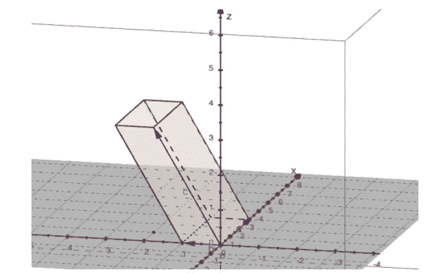

# 广义 Matthew 包

> 原文：<https://medium.com/nerd-for-tech/generalized-matth-493fc1fbf3fa?source=collection_archive---------2----------------------->

## 这个包能做什么？

## 用 [Uri Itai](/@uriitai) 编写



图片来自 https://arxiv.org/pdf/2208.05651.pdf

# 马太相关系数是多少？

马修相关系数(MCC)是一种拟合优度，旨在提供比常见 KPI(如 **F1** 或 **AUC)更好的结果。**特别是，MCC 更好地处理了不平衡数据的情况(它对流行率更具竞争性)。从数学上讲，如果我们考虑一个二元分类问题，它是两个随机变量之间的一个正则皮尔逊系数:目标( **Y** )和预测(**Y’)**。在二进制的情况下，皮尔逊相关崩溃为一个简单的公式。这里可以找到[这里](https://bmcgenomics.biomedcentral.com/articles/10.1186/s12864-019-6413-7)可以找到[。](https://www.voxco.com/blog/matthewss-correlation-coefficient-definition-formula-and-advantages/#:~:text=Matthew%27s%20correlation%20coefficient%2C%20also%20abbreviated,2%20x%202%20contingency%20table.)

# MCC 对多类问题的推广

## 不是很直白吗？

皮尔逊相关在非二元分类世界中不存在。因为拓扑是离散的并且值的集合是不可排序的。因此，将 MCC 推广到多类问题需要对我们的定义进行一些修改。在我们发表的一篇论文中。我们通过使用不同类型的**方法来解决这个问题。**

我们在这里展示的 python 包是这些思想的实现。

我们将简要介绍显著类型的方法，这里我们只讨论正数。

## 等差中项

两个数的权重相等时最常用的型均值

## 加权平均数

类似于算术平均值，但权重不同

## 几何平均值

这里我们计算两个正数乘积的[平方](https://en.wikipedia.org/wiki/Geometric_mean)根。了解对数分数的读者可能会觉得很熟悉。

## 调和平均值

两个[倒数之和的倒数](https://en.wikipedia.org/wiki/Harmonic_mean)

调和平均值的一个 ML 例子是 [F1-score](https://en.wikipedia.org/wiki/F-score) ，它是**精度**和**召回**之间的调和平均值。

## HM-GM-AM 不等式

一个常见的不等式表述为:对于两个正数 **X** 、**和 Y** ，它们的调和均值小于它们的几何均值，几何均值小于它们的算术均值。

在[论文](https://arxiv.org/pdf/2208.05651.pdf)中，我们利用这些手段将 F1 和 Matthew 推广到多类问题。

# python 包

数学是美好的，证明关于手段的引理是可怕的。然而，正如每个数据科学家都知道的那样，只有当你可以用法律语言(如 Python、Python 或在极端情况下用 Python)谈论数据科学项目时，它才存在。因此，我们在一个新的 Python 包中组织了我们的结果:[**generalized _ matth**](https://pypi.org/project/generalized-matth/)**。**

因为我们专注于两个目标:

*   将马修推广到多类问题
*   创建一个工具来与我们的广义 F1 进行比较

我们需要一组函数，既能计算综合得分，又能比较拟合质量的优劣:

## 调用基对象

我们从调用执行函数计算的主对象开始:

```
**import** generalized_matth
**from** generalized_matth.matt_funct **import** matthew_multiclass
```

matthew _ mlticlass 是我们用来运行函数的类。我们描述一个新的枚举:

```
**class** AVERAG_TYPE(Enum):
    MATTHEW_GEN = 2
    F1_GEN = 3
```

此枚举包含要使用的方法的类型。当前版本只有广义 F1 和广义 Matthew (F1_GEN 和 MATTHEW_GEN)。在一些更高级的代码版本中，我们将其扩展为附加手段。

## matthew _ 多类呼叫

我们提供了枚举和类名，现在我们可以展示如何调用它。

它接收两个变量:

*   **y_true** —目标值列表
*   **y_pred** —预测值列表

这些数组具有相同的长度。

```
y_true = np.asarray([1,0,0,1,1])
y_pred = np.asarray([1,1,1,0,1])
test_class =matthew_multiclass(y_true,y_pred )
```

对于这样的调用，test_class 将计算广义 Matthew 分数。它相当于添加了这一行:

```
**from** generalized_matth.matt_funct **import** AVERAG_TYPE 
```

打电话

```
y_true = np.asarray([1,0,0,1,1])
y_pred = np.asarray([1,1,1,0,1])
test_class =matthew_multiclass(y_true, y_pred, avg_type=AVERAG_TYPE.MATTHEW_GEN.value )
```

分数大概是-0.4082。

如果我们希望使用广义 F1，我们执行以下操作:

```
 y_true = np.asarray([1,1,1,0,0])
y_pred = np.asarray([1,1,1,0,1])
test_class =matthew_multiclass(y_true, y_pred, avg_type=AVERAG_TYPE.F1_GEN.value )
```

要获得的分数是 0.75

## main_matthew_mult_class

这是在包中运行的主进程。来源如下:

```
**def** main_matthew_mult_class(self):
    G_mat = self.norm_confusion_mat()
    **return** self.scalar_op(G_mat)
```

使用了两个通用函数。后者由我们希望使用的平均类型决定:

## 广义 F1

```
**def** gen_f1_scalar_op(self, h_conf_mat):
        l_mat = len(h_conf_mat)
        **return** st.mstats.hmean([h_conf_mat[i][i] **for** i **in** range(l_mat)])
```

## 广义马修

```
self.scalar_op = np.linalg.det
```

# 一些测试

在本节中，我们将介绍一些测试，让读者验证他们的代码:

```
y_true = [0] * 13 + [1] * 21 + [2] * 20
y_pred = [0] * 5 + [1] * 6 + [2] * 2 + [0] * 2 + [1] * 8 + [2] * 11 + [0] * 8 + [1] * 2 + [2] * 10test0 =matthew_multiclass(y_true, y_pred, avg_type=AVERAG_TYPE.F1_GEN.value)
print (test0.main_matthew_mult_class())
```

分数是 0.4130

如果我们做到以下几点:

```
test0 =matthew_multiclass(y_true, y_pred, avg_type=AVERAG_TYPE.MATTHEW_GEN.value)
print (test0.main_matthew_mult_class())
```

分数约为 0.031

很明显，如果我们跑:

```
test0 =matthew_multiclass(y_true, y_true, avg_type=AVERAG_TYPE.MATTHEW_GEN.value)
print (test0.main_matthew_mult_class()) 
```

这两项功能的得分都是 1.0。

## 感谢

我们要感谢亚历山大·莫拉克在整个工作过程中所做的富有成效的讨论和有益的想法。