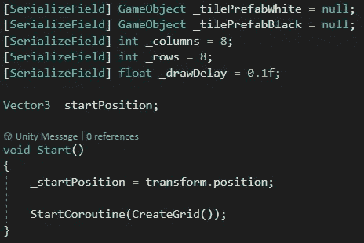
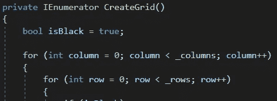
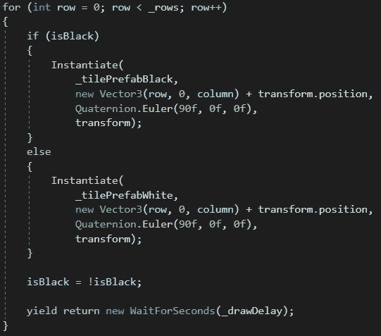
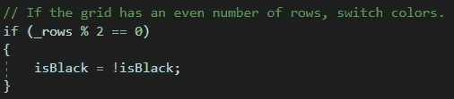
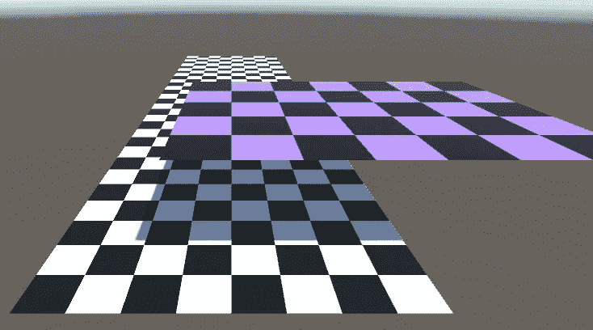

# 在 Unity 中生成游戏板

> 原文：<https://medium.com/nerd-for-tech/generate-a-game-board-in-unity-bcc6c1ff6237?source=collection_archive---------9----------------------->

**目标:**在 Unity 运行时生成一个矩形游戏板。

我们将通过定义几个参数开始创建我们的棋盘:组成交替方块的两个预设，我们想要的列和行的数量，以及我们想要绘制每个方块的速度。

棋盘由两个循环绘制，行循环嵌套在列循环下。因此，首先将绘制一整行，然后脚本将移动到下一列。

如果要放置一个黑色方块，脚本将在棋盘起始位置的适当位置实例化黑色方块预置，设置适当的旋转，并使该方块成为棋盘对象的子对象。如果*不是*是黑色的，我们将实例化另一个方块。

画完正方形后，我们将切换 *_isBlack* (从*真*到*假*，反之亦然)。然后我们会在画下一个方块之前等一会儿。

最后，如果网格有偶数行，我们将再次切换 *_isBlack* 。这将确保网格正确地交替颜色！

较低的板为 30x8，而较高的板为 5x7。