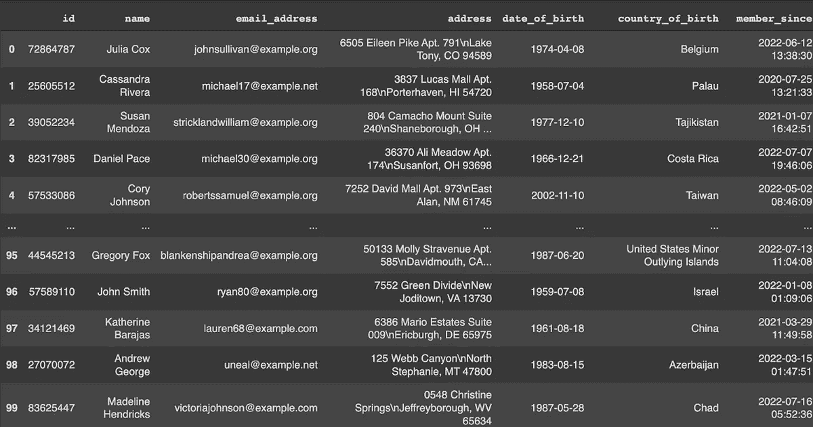

# 使用 Faker 生成虚拟数据

> 原文：<https://medium.com/nerd-for-tech/generate-dummy-data-with-faker-f4483934625f?source=collection_archive---------2----------------------->

## 关于如何使用 python 的 Faker 包创建虚拟数据集的指南。由法西尔·s·叶瓦拉

*照片由* [*对比纤维*](https://unsplash.com/@comparefibre?utm_source=medium&utm_medium=referral) *上* [*上*](https://unsplash.com/?utm_source=medium&utm_medium=referral)

各种目的都需要虚拟数据。无论是为了测试、匿名敏感数据，还是向训练数据集添加“噪音”，访问与真实数据形状相同的假数据集都是有益的。出于测试和操作目的，您可能还需要生成虚拟数据。也就是说，测试您开发的内容以及您的代码如何对不同类型的输入做出反应。

然而，找到我们想要的特定格式的必要数据可能很困难。那么，您从哪里为自己的应用程序获取虚拟数据呢？Faker 包是这个问题的一个很好的解决方案。使用 Python，您可以使用 Faker 包根据您的数据需求生成数据。Faker 是一个开源库，旨在生成不同类型的合成数据。

在本文中，我们将快速浏览 Faker 的特性以及如何使用它们来创建虚拟数据集。

# 安装和使用

Faker 允许你用几十种语言生成随机数据。因为 Faker 是一个面向社区的开放库，所以它在不断发展。提供者——特定类型数据的生成者——由社区定期添加。让我们来看看如何在代码方面使用它。

可以通过 pip 使用以下命令完成安装:

*pip 安装伪造者*

通过下面两行代码，你可以初始化 Faker。第一行导入生成器(Faker 类)，第二行使用英语作为默认语言参数来初始化生成器。如果您想用其他语言初始化 Faker，您需要指定语言参数(例如德语的 Faker(“DE _ DE”)。​

*从 faker 进口 Faker*

*fake = Faker()*

# 制造假货

现在，您已经准备好生成您想要的任何数据。生成的数据就叫假的。顾名思义，就是随机生成的假数据。其目的是作为实际数据的替代或占位符。当调用对应于该数据类型的方法时，会生成一个 fake。

name()方法可用于创建全名。让我们直接进入代码，看看这些方法是如何工作的。​

*对于范围(5)中的 I:#返回全名*

*print(fake.name())*

*> > >萨曼莎·费尔南德斯*

*> > >丹尼斯巴恩斯*

*> > >杰森强*

*> > >艾德·伯顿*

*>>>Tonya Rocha*

​

但是，如果您只想要名或姓，可以使用 first_name()和 last_name()方法。​

*fake.first_name() #返回名字*

*> > >缪*

请注意，每次调用这些方法都会生成一个随机名称。​

*fake.last_name() #返回姓氏*

*> > >埃斯皮诺萨*

要创建地址，您可以使用地址()。

*fake.address() #返回一个地址*

*> > > 3066 玛丽·希尔斯组曲 873*

*>>>NV 湖 32423*

此外，fake.sentence()方法将返回包含随机句子的字符串，而 faker.text()将返回随机生成的文本。​

*fake.sentence() #返回一个随机的句子*

*> > >从不跨越人员注意之内。*

​

如下图所示，faker.text()生成了一个随机段落。

f *ake.text() #返回一个随机文本*

*> > >从发床。国家可以透露派遣角色。盖伊涉及的问题图片得到选举。当然做记忆厨房候选鱼辩护。尝试将论文向前推进，打造气人。*

假设您想要生成一个包含 5 个电子邮件地址的列表。每次，下面的代码产生 5 个随机的名字。

*对于范围(5)中的 I:#生成 5 封随机电子邮件*

*打印(fake.email())*

*>>>*[*garciaeric@example.com*](mailto:garciaeric@example.com)

*>>>*【logan01@example.net】

**>>>*[*contrerasaustin@example.org*](mailto:contrerasaustin@example.org)*

**>>>*[*rpreston@example.org*](mailto:rpreston@example.org)*

**>>>*[*brandy16@example.net*](mailto:brandy16@example.net)*

*​*

*但是当数据变大时，你可能会不止一次收到同一个电子邮件地址。因此，要使用 Faker 包创建唯一的伪数据，可以使用。生成器的独特属性。*

**对于范围(10)内的 I:#生成 5 封独特的随机电子邮件**

**print(fake . unique . email())**

**>>>*[*hughesbrian@example.org*](mailto:hughesbrian@example.org)*

**>>>*[【raymondchapman@example.org】](mailto:raymondchapman@example.org)*

**>>>*[*vicki25@example.com*](mailto:vicki25@example.com)*

**>>>*[*munozzachary@example.net*](mailto:munozzachary@example.net)*

**>>>*[【karen44@example.org】](mailto:karen44@example.org)*

*上述代码每次运行时，都会生成 5 个唯一的电子邮件地址。当您生成像 ID 这样不需要重复的数据时，这非常有用。*

*Faker 也有一个生成虚拟个人资料的方法。​*

**fake . profile()#返回一个假的个人资料**

**> > > { '地址':' 64992 贝基流 Apt。932\nRebeccaville，WV 34184 '，**

**> > >【生日】:datetime.date(2000，3，24)，**

**> > >【血族】:‘O-’，**

**> > >《公司》:《洛佩兹父子》，**

**> > >'当前 _ 位置':(十进制(' 78.061493 ')、十进制('-114.798399 ')、**

**> > >【职务】:【药理学家】，**

**> > >【邮件】:*[*【rebeccahansen@yahoo.com】*](mailto:rebeccahansen@yahoo.com)*’，**

**> > >【姓名】:《秋桑切斯》，**

**> > >【住宅】:8702 马太圈贴切。938\nDickersonfurt，WA 82226 '，**

**> > >【性别】:【F】，**

**>>>【SSN】:【534–29–2074】，**

**> > >【用户名】:【允许】，**

**> > >【网址】:[’*[*【http://hawkins.com/*](http://hawkins.com/)*’，*[*【https://wolf.com/*](https://wolf.com/)*’]}**

*到目前为止，我们已经使用了伪造生成器属性，如 name()、first_name()、last_name()、email()等。还有很多这样的属性打包在‘Providers’里。有些是标准提供者，有些是社区开发的提供者。*

# *标准提供商*

*有许多标准的提供者，如地址，货币，信用卡，日期时间，互联网，地理，人，个人资料，银行等。帮助创建相关的虚拟数据。关于标准供应商及其属性的完整列表的更多信息可在[这里](https://faker.readthedocs.io/en/master/providers.html)找到。*

*让我们看看 faker.providers.address 中的一些例子*

**对于范围(5)中的 I:#返回 5 个国家名称**

**print(fake.country())**

**> > >卢森堡**

**> > >越南**

**> > >汤加**

**> > >莫桑比克**

**> > >奥地利**

*​*

*你也可以得到国家代码。​*

**对于范围(5)中的 I:#返回 5 个国家代码**

**print(fake . country _ code())**

**> > > ES**

**> > > RO**

**> > > MH**

**> > >先生**

**> > > CL**

*​*

*如前所述，默认语言是英语，默认国家设置为美国。​*

**fake . current _ country()#返回当前国家**

**> > >美国**

*​*

*当区域设置改变时，当前国家()，当前国家代码()，地址()等的输出将改变如下:*

**假=假(" de_DE")**

**fake . current _ country _ code()#返回当前国家代码**

**> > >德**

# *社区提供者*

*有许多社区提供商，如信用评分、航空旅行、汽车、音乐等。您也可以创建您的提供商并将其添加到 Faker 包中。关于社区提供者及其属性的完整列表的更多信息可在[这里](https://faker.readthedocs.io/en/master/communityproviders.html)找到。*

*我们来看看 Faker_music 的一些例子。在你开始使用社区提供商生成假音乐数据之前，你需要使用 pip 安装包。​*

**pip 安装 faker_music**

*​*

*然后需要将提供者添加到 Faker 实例中:*

**从 faker_music 导入音乐提供商**

**fake = Faker()**

**fake.add_provider(音乐提供者)**

*​*

*现在，您开始生成假音乐数据:*

**对于范围(5)中的 I:#返回音乐流派**

**print(fake . music _ genre())**

**> > >摇滚**

**> > >世界**

**> > >古典**

**> > >弹出**

**> > >声乐**

# *本地化提供商*

*您可以通过向虚拟生成器提供所需的语言环境作为参数来创建本地化的虚拟数据。它还支持多种语言环境。在这种情况下，必须在 Python 列表数据类型中提供所有语言环境，如下例所示。​*

**fake = Faker(['De_DE '，' fr_FR '，' ja_JP'])**

**for _ in 范围(10):**

**print(fake.name())**

**>>>山本 陽子**

**> > >莉娜·温霍尔德**

**> > >多萝西·胡恩**

**> > >夏嫣·亨克-赫尔勒**

**> > >伊隆卡德鲁宾 MBA。**

**> > >菲洛梅娜·罗德尔**

**>>>高橋 裕太**

**> > >雅克·杜蒙·勒佩兰**

**>>>斎藤 治**

**>>>小林 淳**

*​*

*默认区域设置为“美国”，即美国英语。让我们在德国编码创建 5 个地址。​*

**fake=Faker("de_DE") #返回德国地址**

**对于范围(3)中的 I:**

**print(fake.address())**

**> > >拉斐尔-门德-普拉茨 04**

**> > > 04196 史坦福**

**>>>Resi-Atzler-Allee 843**

**> > > 96746 科堡**

**>>>Scheibeplatz 5/1**

**> > > 52115 斯托尔伯格**

**fake = Faker(" DE _ DE ")#返回德国联邦各州**

**对于范围(5)中的 I:**

**print(fake . administra tive _ unit())**

**> > >不来梅**

**> > >黑森**

**> > >莱茵-普法尔兹**

**> > >北威**

**>>拜仁**

# *生成虚拟数据集*

*我们将创建一个 100 人的虚拟数据集，其属性包括 id、姓名、电子邮件、地址、出生日期、出生地等。我们将使用标准的提供者“配置文件”来创建这些数据，并使用 Pandas Dataframes 来保存这些数据。​*

**#导入包**

**从 faker 导入 Faker**

**从 faker_music 导入音乐提供商**

**进口熊猫作为 pd**

**#声明 faker 对象**

**fake = Faker()**

**#添加音乐骗子**

**fake.add_provider(音乐提供者)**

**#定义函数生成假数据并存入 JSON 文件**

**def generate_dummy_data(记录):**

**数据={}**

**#迭代循环，生成假数据**

**对于范围内的 I(0，记录):**

**数据[i]={}**

**data[I][" id "]= fake . unique . random _ number(8)**

**data[I][" name "]= fake . name()**

**data[I][" email _ address "]= fake . unique . email()**

**data[I][" address "]= fake . address()**

**data[i]["出生日期"]= fake.date_between("-67y "，"-18y")**

**data[i]["出生国"]= fake.country()**

**data[I][" member _ since "]= fake . date _ time _ between("-2y "，" now")**

**返回数据**

**#调用函数生成假数据并存入 json 文件**

**假数据=生成假数据(100)**

**#将 JSON 转换为 DataFrame**

**fake_data = pd。DataFrame(fake_data)**

**假 _ 数据=假 _ 数据。T**

**假 _ 数据**

**

# *结论*

*Faker 是一个用于生成假数据的 Python 库。在某些情况下，这是非常实用的。Faker 有几种替代方案，但它仍然是 Python 中最广为人知的选择。它之所以受欢迎，是因为这是创建看起来像真的假记录的最简单的方法。您可以使用它来创建虚拟数据循环-通过简单的步骤，它可以在几秒钟内生成大量数据。​*

*我希望你喜欢这篇文章。如果你有任何问题，请在下面留言。*

# *本月即将发布的 datadice 博客文章*

*   *[新的 Looker Studio 功能:链接 API](/geekculture/new-data-studio-feature-linking-api-98b307a63661?source=your_stories_page-------------------------------------)*
*   *[谷歌数据分析的最新更新(2022 年 8 月)](/geekculture/latest-updates-on-google-data-analytics-august-2022-5be3c178a75a?source=your_stories_page-------------------------------------)*

# *更多链接*

*查看我们的 [LinkedIn](https://www.linkedin.com/company/datadice) 账户，深入了解我们的日常工作生活，并获得关于 BigQuery、Looker Studio(以前称为谷歌数据工作室)和营销分析的重要更新*

*我们也从我们自己的 YouTube 频道开始。我们讨论重要的 DWH、BigQuery、Looker Studio(以前称为 Google Data Studio)和许多其他主题。点击这里查看频道。​*

*如果你想了解更多关于如何使用 Google Looker Studio 并结合 BigQuery 更上一层楼，请在这里查看我们的 Udemy 课程。*

*如果您正在寻求帮助，以建立一个现代化的、经济高效的数据仓库或分析仪表板，请发送电子邮件至 [hello@datadice.io](mailto:hello@datadice.io) ，我们将安排一次通话。*

**最初发布于*[*https://www . data dice . io*](https://www.datadice.io/generate-dummy-data-with-faker)*。**