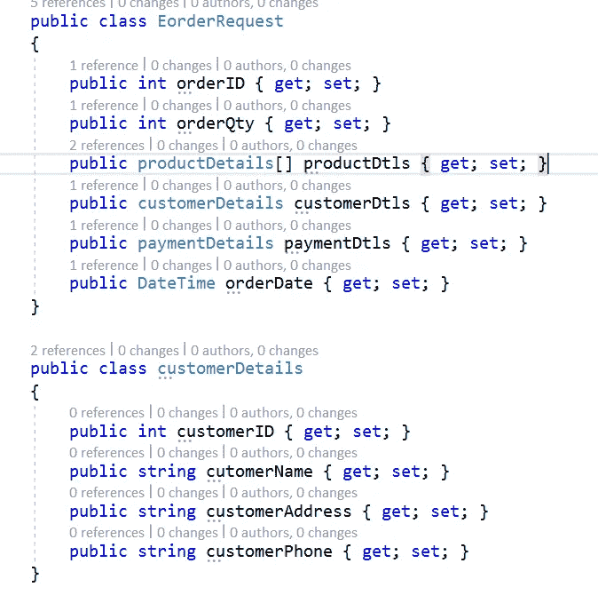
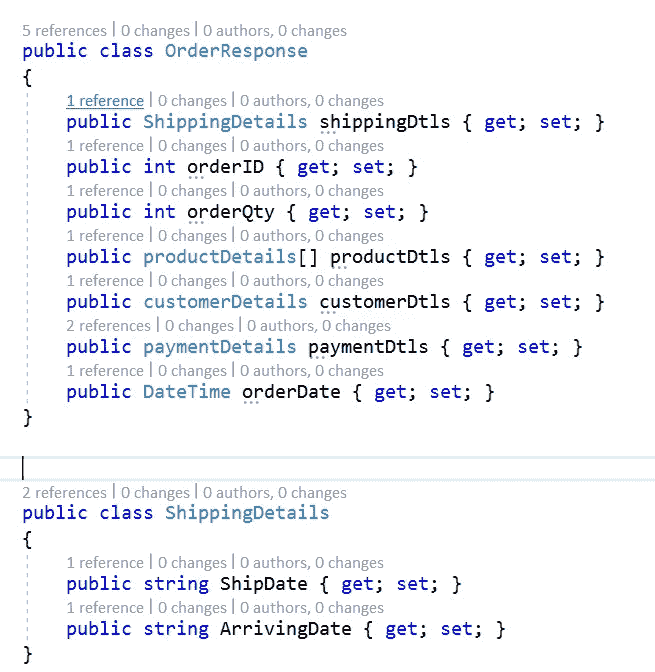
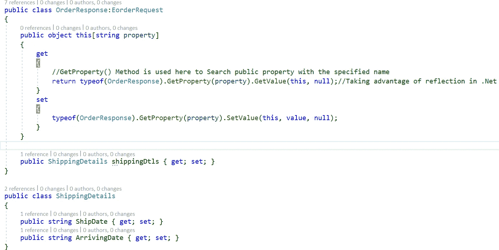
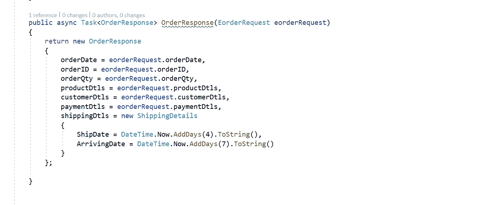

# 中的动态数据传输对象。网络核心

> 原文：<https://medium.com/nerd-for-tech/generating-poco-classes-dto-during-runtime-in-net-core-278e6f78d538?source=collection_archive---------0----------------------->

在 c#中，从源到目的地组装属性值可以通过将源 DTO 属性映射到目的地 DTO 类属性来实现。

EorderRequest.cs(源 poco 类)

OrderResponse.cs(目标 poco 类)

EorderRequest.cs 是 DTO 的源类，包含客户从电子商务网站购买产品的订单、产品、客户、付款详细信息。

OrderResponse.cs 是目的地类 DTO，包含订单处理后客户收到的发货、订单、产品、客户、付款详细信息。

OrderResponse.cs 和 EorderRequest.cs DTOs 具有订单、产品、客户类别等共同属性。

为了避免 OrderResponse.cs 类中的重复属性，我们可以利用。Net 在运行时检查或检索某个类型的元数据。

使用反射(系统。反射)、GetProperty(字符串属性)方法可用于生成目标 d to 类属性，这些属性是源类中的公共属性。

**请访问以下网站，了解中的完整代码实现。Net Core webApi 以及在。网络核心**

 [## 中的动态数据传输对象。Net Core WebAPI

### 1.开发所需的软件或工具。net core webapi a)Visual Studio 2019(用于写 c#代码)b)…

codetocallmethod.software](https://codetocallmethod.software/dynamic-data-transfer-object-dot-net-core/) 

使用反射的 OrderResponse.cs

OrderResponse DTO 类继承 EorderRequest 类，并使用反射 GetProperty(property)方法在运行时从 OrderResponse.cs (destination)中的 eorderequest . cs(source)生成公共属性。

OrderProcessor.cs

OrderProcessor 类将处理订单，并根据产品可用性决定订单发货日期和交付日期。orderResponse 方法将集合源和目标属性。这里的 OrderResponse 类(目的类)包含在运行时使用。净反射。

这就完成了在运行时生成 POCO 类(dto)。Net Core webapi:)