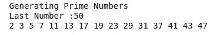

# 用 Python 生成素数

> 原文：<https://medium.com/nerd-for-tech/generating-prime-numbers-in-python-b56ee119c4ab?source=collection_archive---------1----------------------->

数学中有几种数，其中一种是质数。质数是大于 1 的数，它有两个因子，1 和这个数本身意味着这些数不能被除了 1 和这个数本身之外的任何数整除而不留余数[1]。

在这里，我想使用我自己的算法在 Python 中生成素数，用户只需要输入最后一个整数类型的数字。如果最后一个数是质数，它将被包括在质数序列中，如果不是，序列中的最后一个数是小于用户输入的最后一个数的最大数。

用户界面如下:



图 1:用户界面

在上面的例子中，因为 50 不是一个质数，所以程序没有显示它。数字 49 和 48 也不是质数。数字 47 是一个质数，所以这个数列中的最大数是 47。

打印序列号的算法如下:
1。输入一个整数作为序列
2 中的最大数。用条件对数字进行迭代:
—迭代数模 2 不等于 0(迭代数为奇数)。
—且迭代次数不等于 1
—或迭代次数等于 2
3。检查这个数，看它是否能被除了 1 和这个数本身之外的任何数整除而不留余数。
4。按顺序打印结果

基于上面的算法，我用 Python 创建了如下代码:
1。输入一个整数。

```
print("Generating Prime Numbers")
bil=int(input(“Last Number :”))
```

我创建了一个标题和输入号码，保存在“bil”变量。输入的数字被直接转换为整数，因为在 Python 中，任何输入都被视为字符串，尽管它是一个无法计算的数字，所以我必须将其转换为整数或浮点数才能计算或被视为数字。

2.用条件对数字进行迭代:
—迭代次数模 2 等于 0
—迭代次数不等于 1
—或者迭代次数等于 2

```
print("Generating Prime Numbers")
bil=int(input(“Last Number :”))
for i in range(bil+1):
    if (i % 2 !=0 and i!=1 or i == 2):
```

3.检查这个数，看它是否能被除了 1 和这个数本身之外的任何数整除而不留余数。
这里，我在主程序上创建了一个函数，在主程序中，我插入结果，不管是假还是真。

```
def cek_number(x):
    res=True      
    for i in range(x+1):
        if i>2 and i!=x:
           if x % i ==0:
              res=False
              break  
    return resprint("Generating Prime Numbers")
bil=int(input(“Last Number :”))
for i in range(bil+1):
    if (i % 2 !=0 and i!=1 or i == 2):
       if cek_number(i)==True:
```

4.按顺序打印结果
最后，我按顺序打印结果。

```
def cek_number(x):
    res=True      
    for i in range(x+1):
        if i>2 and i!=x:
           if x % i ==0:
              res=False
              break  
    return resprint("Generating Prime Numbers")
bil=int(input("Last Number :"))
for i in range(bil+1):
    if (i % 2 !=0 and i!=1 or i == 2):
       if cek_number(i)==True:
          print(i, end=" ")
```

**结论**该程序应用一种算法来按顺序生成素数。我们还需要输入一个将在序列中生成的最大数，如果该最大数是一个素数，它将被包含在序列中，但如果不是，则前一个素数是序列中的最大数。

**参考** 【1】splash learn，素数—定义举例[，
https://www . splash learn . com/math-vocabulary/代数/素数](https://www.splashlearn.com/math-vocabulary/algebra/prime-number)。访问时间:2022 年 10 月