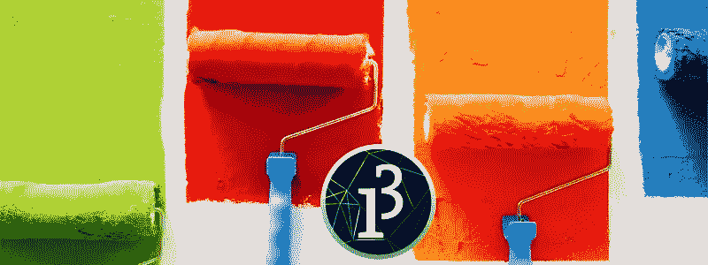
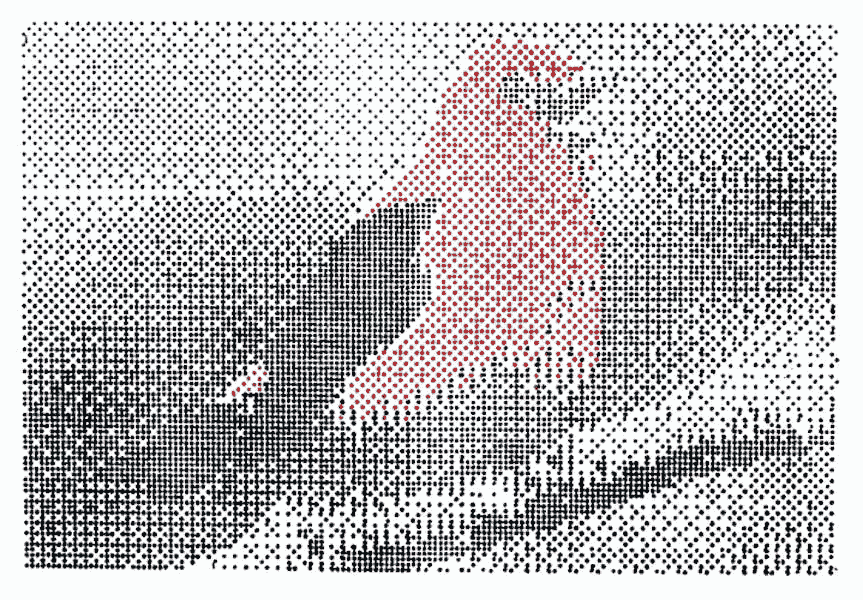
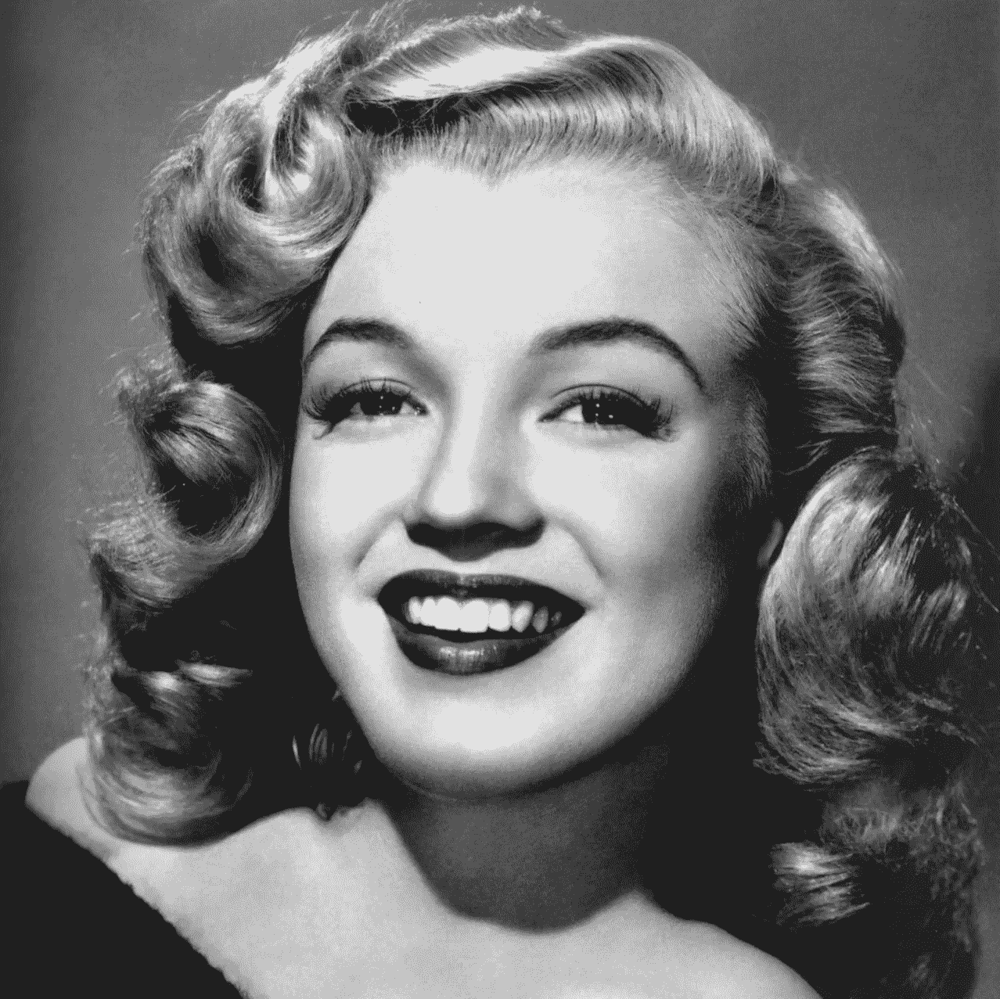
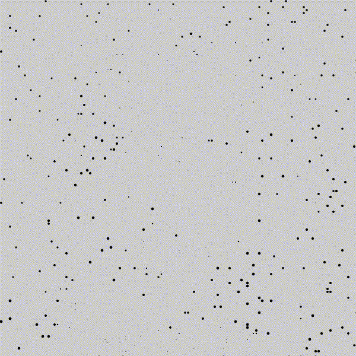

# 加工中的生成艺术—点阵打印机风格

> 原文：<https://medium.com/nerd-for-tech/generative-art-in-processing-dot-matrix-printer-style-ab4b5cb4f53e?source=collection_archive---------5----------------------->



# 介绍

## 什么是加工？

[Processing](https://processing.org/) 是一种相对不太为人所知的编程语言，这很遗憾，因为它是对[创造性编码](https://en.wikipedia.org/wiki/Creative_coding)和可视化最有用的语言之一。“开放处理”和“[CreativeApplications.Net](https://www.creativeapplications.net/category/processing/)”网站展示了人们利用处理技术创造艺术和现场装置的天才方式。2013 年偶然发现了这门语言，在工作太忙之前学了一段时间。对生成艺术的兴趣突然复苏，让我再次思考美丽的语言。虽然它是基于 Java 的，但是语法更加简单和直观，有许多定制的内置函数和可用的模块来扩展功能。

## 什么是点阵打印机？

出生于 80 年代或之前的人可能听说过[点阵打印机](https://en.wikipedia.org/wiki/Dot_matrix_printing)。当时它们在办公室里很受欢迎。打印机使用针在纸上打印点，因此在打印任意图案时很有用。与现代打印机相比，它们非常慢，但是看到一个人创造的图案会引起怀旧之情！上学的时候，我经常让我哥哥用他办公室的打印机打印[剪贴画](https://blog.hubspot.com/marketing/clip-art-history)，然后把它们当贴纸贴在我的书上。



点阵打印机打印的图像示例(来源: [hackster.io](https://www.hackster.io/news/3d-printer-becomes-2d-dot-matrix-printer-using-web-app-8de2be90b09a)

# 创造艺术

## 原象

我用玛丽莲·梦露的肖像(来源: [Pexels](https://www.pexels.com/photo/marilyn-monroe-53453/) )来创作生成艺术，原图如下:



## 代码背后的逻辑:

点阵打印机用于修改点的密度，以描绘图像中的亮区和暗区。我计划做的是改变点的大小，而不是密度。较小的点将描绘较亮的区域，较大的点将描绘较暗的区域。代码不会像打印机一样打印图像，而是在画布上随机绘制一些点，玛丽莲的肖像就会从这些点显现出来。

## 初始设置:

打开处理 IDE 后，首先编写这两个命令:

`setup()`功能用于设置画布及其属性，如画布的大小、背景颜色、帧速率(如果是动画)等。

`draw()`函数本质上是一个循环，一遍又一遍地重复相同的命令，因此对于创建动画非常有用。如果你想要一个静态图像，同样的`draw()`功能会被使用，它只会重复显示相同的图像。

## 设置画布:

我将创建一个大小为 600 x 600 像素的画布，动画的帧速率为 10。

## 在代码中导入图像:

第二步是导入原始图像，因为艺术将基于此生成。

`PImage`类用于导入和存储图像数据类型。首先，我将`img`声明为`PImage`类的变量，然后使用`loadImage`将图像加载到变量中。最后，我调整图像大小以适合画布。`width`和`height`是两个存储画布尺寸的内置变量。

注意`img`变量是在设置函数之外声明的，因为它被声明为一个全局变量。全局变量可以在代码中的任何地方使用，甚至可以在其他函数中使用。在函数中声明的局部变量只能在该函数中使用。

## 准备拉伸循环:

画在画布上随机位置的点将是黑色的，没有笔画。`fill`命令声明填充颜色。如果在命令中使用了 0 到 255 之间的单个数字，则处理将使用灰度。如果使用 3 个逗号分隔的数字，处理使用颜色(RGB 或 HSB，取决于提到的`colorMode`)。`noStroke`命令声明圆圈中没有笔划。

重要的是将画布分成网格，并在网格的单元格内绘制点。这样，当(假想的)网格叠加在原始图像上时，我们可以提取每个单元格的亮度，并使用它们来决定要在里面绘制的点的大小。我声明单元格的大小为 5 个像素。

## 在画布的随机位置画点:

`draw`循环是一个非常好的迭代工具，因为它消除了使用`for`或`while`循环的需要。但是在每一帧画一个点会花很长时间来完成图像，所以我在每一帧画 100 个点来加速这个过程。

首先，使用两个`for`循环创建一个嵌套循环，第一个用于 x 轴(行)，第二个用于 y 轴(列)。每个循环将运行 100 次迭代，以在画布中选择 100 个 x，y 坐标。使用`random`选择随机坐标。在每次迭代中，随机的 x 和 y 位置作为整数保存在`xloc`和`yloc`变量中。将值保存为整数是必要的，因为我们将使用它们来提取每个像素的颜色，像素的数量是整数。

下一步，我们提取每个细胞的颜色，并使用每个细胞颜色的亮度值，我们在里面画点。直接使用`xloc`和`yloc`值来提取颜色是错误的，因为它们会指向每个单元格左上角的像素。为了纠正错误，我将这些值乘以像元大小。`PImage`类的`get`方法用于提取每个随机选择的单元格的颜色。此后，使用`brightness`功能提取每个单元颜色的亮度值。

由于亮度值的范围是从 0 到 255，如果直接使用这些值，产生的点将会太大。因此，为了限制单元格内点的大小，我使用`map`函数将亮度值映射到 0–5(单元格大小)的范围内。映射被反转以停止结果图像的反转。

在最后一步，我们使用`ellipse`功能在调整后的坐标中画出点。点的大小由映射的亮度值决定。

不过，我需要做一个更正。由于`xloc`和`yloc`值的最小值为 0，并且由于加工以点的中心坐标绘制点(默认情况下)，左边缘和上边缘的点将被切成两半。为了防止这种情况，我们使用`translate`函数将整个画布移动单元格大小的一半。

## 将帧存储为动画 GIF:

当您点击运行按钮时，创成式艺术在处理窗口中显示为动画，但是为了能够保存动画，我们需要提取帧。在`draw`循环内部使用了`saveFrame`函数来保存每一帧(记住，我在开始时将帧速率设置为 24)。

我把这些帧保存在一个名为 render 的文件夹中，每一帧都有一个数字序列，并保存为 PNG 格式(render001.png，render001.png 等)。).您也可以保存为 TIFF、TARGA 或 JPEG 文件，但 PNG 在质量和文件大小之间取得了最佳平衡。

在处理过程中，可以使用 Movie Maker 工具将这些帧拼接成一个电影文件，但为了便于共享，我将其拼接成了一个动画 GIF。我用 [FFMPEG](https://www.ffmpeg.org/) 做了拼接，使用了以下命令(鸣谢:[栈溢出](https://stackoverflow.com/a/29542944)):

```
ffmpeg -f image2 -framerate 24 -i render-%3d.png render.gif
```

# 结果呢



版权:作者

结果看起来几乎像一个点阵打印的图像，从随机绘制的点出现的图像是美丽的。

完整的代码如下所示:

# 信用

丹尼尔·希夫曼的《编码训练》——学习处理和获得灵感沉迷于创造性编码的最佳场所。