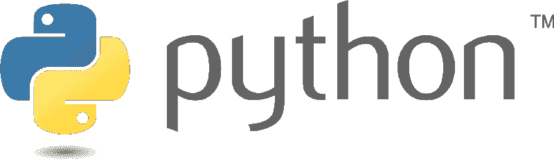
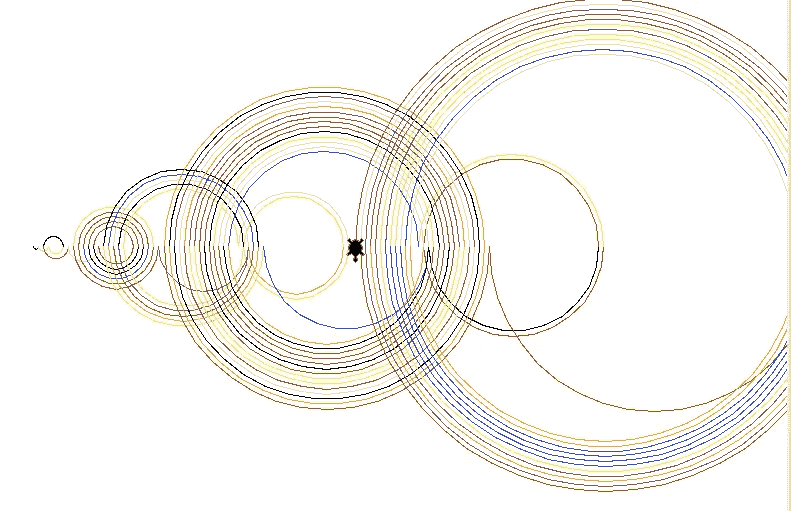
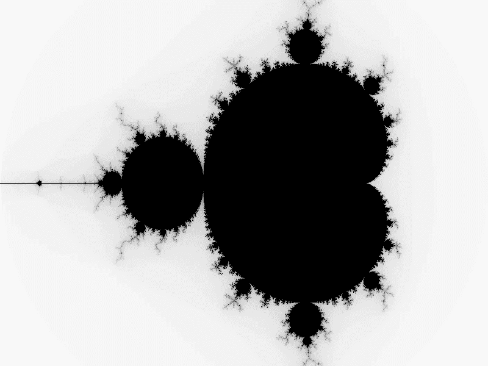

# Python 中的生成艺术

> 原文：<https://medium.com/nerd-for-tech/generative-art-in-python-cac561e7f623?source=collection_archive---------0----------------------->

大家好！经过一段时间的闲置，我又开始写作了！我在我的 GitHub 资源库中挖掘，偶然发现了一堆很酷的(至少在我看来)项目，这些项目是我不久前在[黑客马拉松](https://localhackday.mlh.io)期间完成的。我决定和大家分享一些我的 GitHub 复活节彩蛋，所以事不宜迟，让我们来看看这个吧！

# 乌龟(不是动物)是什么？

计算机编程语言

**Turtle** 是一个 [Python](https://www.python.org) 模块，它允许你在虚拟画布(可以有可变大小)上创建图片、绘制形状和做任何艺术化的事情。它还用于创建迷你游戏和有趣的动画。比如可以用它玩 Hangman。虚拟笔/画笔被称为*海龟*，因此得名“海龟”。

太好了！现在让我们去了解一下我们(或者我应该说是海龟)将要从事的艺术类型，也就是 [**生成艺术**](https://en.wikipedia.org/wiki/Generative_art) **。**

# 生成艺术简介

曼德尔布罗分形

生成艺术是被生成的艺术。好的。不是一个非常有用的定义，是吗？更具体地说，它是使用代码构建的艺术，并且可以包括自治系统。我们将使用的自治系统被称为**随机性**。随机性元素确保了每次运行代码时，您的输出都是不同的(根据概率)，我认为这很好，因为您永远不知道会得到什么。当然，也有不那么“随机”的自治系统，比如通过一个简单方程生成的 [**曼德尔布罗分形**](https://en.wikipedia.org/wiki/Mandelbrot_set) 。为了这个项目，我决定平衡混乱和秩序来创造一些有点类似 M **andelbrot 分形的东西。**

# 该项目

## 模块

第一步，一如既往的导入我们的模块，会是*随机*和*海龟*。对于这个项目，我们不需要使用 pip 进行任何安装，因为*随机*和*海龟*模块是内置的。

导入模块

**全局变量**

下一步是定义一些全局变量，稍后会用到。第一个是 *eps* (代表ε)，一个用于创建随机性的常数，第二个是*颜色*，它包含了我们可以绘制的颜色列表。最后，我们有*比例*，这将是一个随机数，它定义了我们的绘图将有多大。

实例化变量

## 设置

我们差不多准备好进入程序的主体了。但是首先，我们需要设置海龟屏幕并初始化它。我们可以有任何大小的画布，但我选择了 800 乘 600 像素，所以它很适合。只需选择屏幕尺寸以下的任何尺寸。

屏幕设置

现在屏幕准备好了，我们终于可以见到我们的海龟了。出于与黑客马拉松相关的原因，我决定将其命名为*甜瓜*。我们希望乌龟从靠近屏幕左下方的某个地方开始，因为乌龟会向右移动，它可能会离开屏幕。

乌龟！

## 主循环

现在我们终于进入**主循环**。这是所有艺术绘画实际发生的地方。我们希望程序循环相当多的次数，所以我把它设置为 100 到 10，000 之间的一个随机数。乌龟会以锯齿形左右移动，同时画出几乎是半圆形的圆(实际上只是有大量边的多边形)。每一次迭代，笔的颜色将更好地设置为随机颜色，这样我们就可以制作出丰富多彩的艺术作品。

**快速总结:**

1.  乌龟面朝右。
2.  海龟在 177 度和 183 度之间画了一个不同半径的弧度。
3.  笔的颜色会改变。
4.  乌龟以与(2)完全相同的方式画了另一条弧线。
5.  钢笔颜色再次改变。
6.  乌龟面朝左，做第 2-5 步
7.  重复 100 到 10，000 次

这里发生了很酷的事情

如果想让美术更有条理，可以将*比例*设置为 5，将*妖*设置为 2。同样，将弧度设置为 180 度会产生一个完美的半圆，将笔的颜色设置为单一颜色会使输出看起来不那么迷人。

## 排除故障

在运行程序之后——希望它执行成功——它应该产生(我应该说是生成)了 art，如果没有，那么很可能是 Turtle 出了问题。检查你正在使用的 IDE 是否与 Turtle 兼容，并且一切都配置正确。另一个解决方案是使用在线 IDE，如 [Replit](https://replit.com) ，并确保在创建项目时选择 **Python(带 Turtle)** 。

像这样。

## **输出:**

在修复了所有的错误之后，这个程序现在应该可以运行了。输出会有所不同，但这里有一个例子是我们的艺术海龟为我们制作的。看起来相当惊人！

生殖艺术——海龟制作

# 曼德尔布罗分形

我们可以更进一步，尝试生成 [**【曼德尔布罗分形】**](https://en.wikipedia.org/wiki/Mandelbrot_set) **。**另一个名字是 **Mandelbrot 集合，**当在复平面中绘制时，产生分形。所述集合由复数集合 *c* 定义，对于该集合，序列 *Z* 保持绝对值有界。序列 *Z* 定义如下:

复数的*模数*是它在复平面上到 0 的距离。在 Python 中，这是使用 *abs(z)* 完成的，其中 *z* 是一个复数。我们假设，如果序列 *Z* 的一项的模大于 2，则该序列是无界的。

## 太好了！那我们怎么画这个东西呢？

复数 *(a+bi)* 可以在复平面上表示。复平面与笛卡尔平面完全相同，但 y 轴被替换为代表 *bi* 中值 *b* 的虚轴。实部 *a* 在 x 轴或实轴上。

我们可以画出 Mandelbrot 分形如下:对于复平面的一部分的每个点 *c* ，我们确定 *Z* 是否有界。达到模数 *>* 2 所需的迭代次数将决定我们使用什么颜色。

## 步伐

首先，我们导入 *PIL* ，这将帮助我们形象化我们制作的图像的细节。接下来，我们定义一些变量，这些变量将帮助我们计算序列 *Z.* 的各项。同样，我们定义图片的大小为 768x768，并使用 RGB 颜色。之后，我们循环 768 * 768 *(最多)511 次以产生我们的输出，每次迭代计算下一项并以给定的颜色绘制。我所说的颜色，实际上是指不同深浅的黑色和白色。

在我们运行完代码后，它应该会显示一个彩色的 Mandelbrot 分形图。如果没有，试着把最后一行改成`image.save('Mandelbrot.png', "PNG")`，这样会把图片保存到你的电脑里。它会产生这样的东西:

曼德尔布罗分形——由你制造！

# 结论

恭喜你！你已经完成了这篇文章的结尾，而且，你已经生成了你自己的由 Turtle 创建的艺术，还有 Mandelbrot 分形！您已经学习了生成艺术和 Mandelbrot 集，以及 Python 编程！你甚至有两幅(或更多)艺术杰作可以挂在墙上！

## 后续步骤

我鼓励您尝试一下代码，并对其进行一些调整。尝试添加更多的颜色，改变一些变量和参数，或者运行代码进行更多的迭代，看看你会得到什么样的输出！要有创意！

## 更多即将推出！

我将继续浏览我的 GitHub 库，在不久的将来，我将发布更多的“GitHub 隐藏的宝石”文章。与此同时，敬请关注— **剧透警报！—** 下次见，我们将创建一个**音乐可视化工具。如果你想先睹为快，点击 [*这里*](https://www.youtube.com/watch?v=dQw4w9WgXcQ) ！**

# 参考

1.  [https://github.com/TKSMax/CoolStuff/tree/main/GenerativeArt](https://github.com/TKSMax/CoolStuff/tree/main/GenerativeArt)
2.  [https://www . freecodecamp . org/news/an-introduction-to-generative-art-what-it-and-how-you-make-it-b0b 363 b 50 a 70/](https://www.freecodecamp.org/news/an-introduction-to-generative-art-what-it-is-and-how-you-make-it-b0b363b50a70/)
3.  [https://www . codingame . com/playgrounds/2358/how-to-plot-the-Mandelbrot-set/Mandelbrot-set](https://www.codingame.com/playgrounds/2358/how-to-plot-the-mandelbrot-set/mandelbrot-set)

# 关于我

大家好！我是对量子计算、区块链和机器学习/人工智能等技术以及空间技术充满热情的人类。艺术上无用，但音乐上有用；演奏古典和爵士钢琴。我目前正在研究一个量子卷积神经网络，用于使用 Tensorflow 进行高效的图像识别。