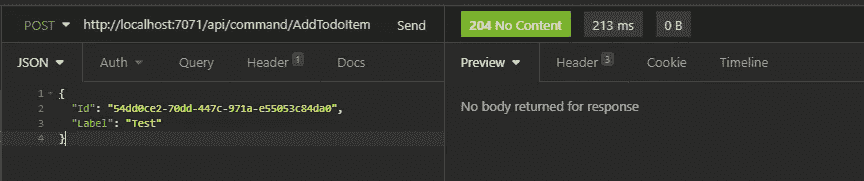
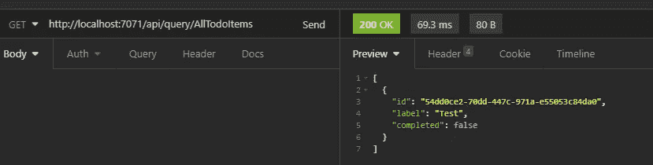

# 通用无服务器 CQRS Azure 功能端点

> 原文：<https://medium.com/nerd-for-tech/generic-serverless-cqrs-azure-functions-endpoints-cabfda5d7f4b?source=collection_archive---------7----------------------->

在这篇文章中，我将简要描述如何使用 Azure 函数和 MediatR 实现一个无服务器的通用 CQRS Http 端点。

假设我们有一个 *ICommand* 和一个 *IQuery < T >* 接口。在这里，我们通过扩展现有的 MediatR 契约来实现它们:

然后，我们可以实现由 Http 请求触发的两个通用函数，并通过 MediatR 将这些命令和查询发送给它的处理程序:

然后，您可以简单地从客户端向服务器发送命令和查询，这些命令和查询以无服务器的方式执行:

这种实现非常灵活，可以很容易地调整和扩展。例如，您可以简单地生成这些命令和查询的 TypeScript 表示(这是我在一些项目中所做的)。

要获得更完整的示例(是的，这是另一个 TodoList 示例)，请看一下这个 GitHub 存储库:【Cogax/azure-functions-TodoList(github.com)。