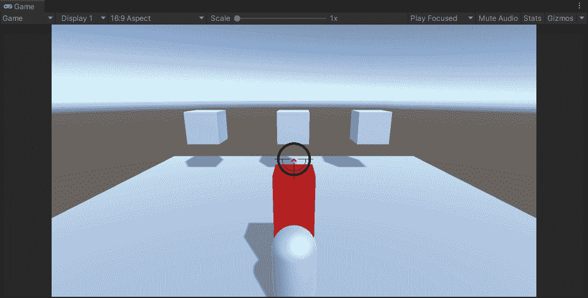

# 通用脚本——生命和伤害

> 原文：<https://medium.com/nerd-for-tech/generic-universal-scripts-health-and-damage-a57db50fc920?source=collection_archive---------4----------------------->

## 开始 Unity 3D 游戏开发

## //接口的替代

射杀敌人

虽然你可能看不出来上面的屏幕显示的是我们射击敌人。目前还没有发生这种情况的视觉指示器，但我们正在拍摄红盒子 10 次。