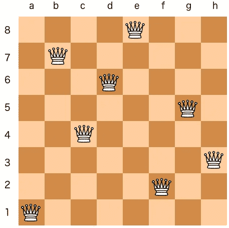
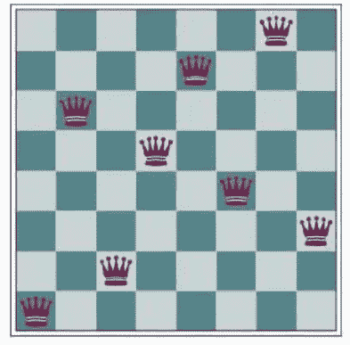
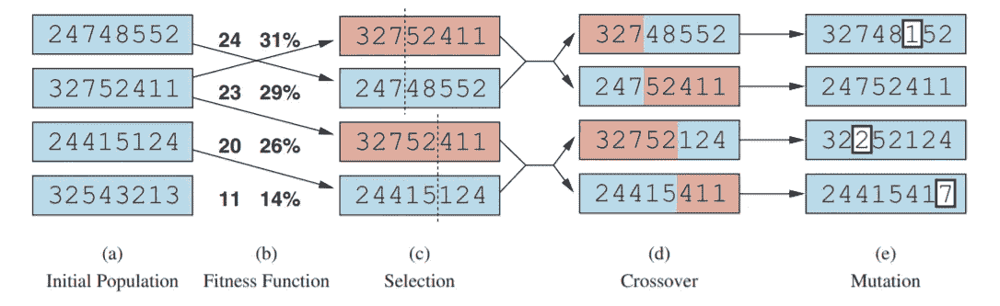
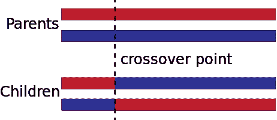
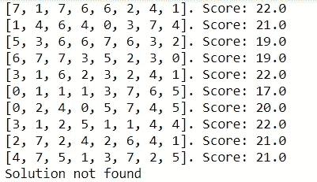
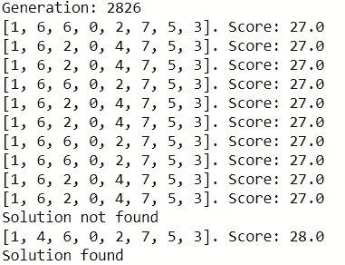
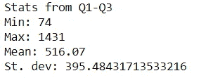
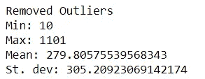
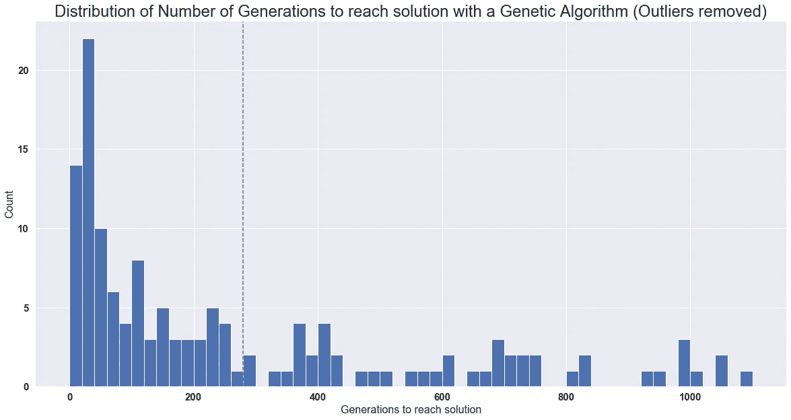

# 遗传算法:8 皇后问题

> 原文：<https://medium.com/nerd-for-tech/genetic-algorithm-8-queens-problem-b01730e673fd?source=collection_archive---------0----------------------->

在我最近关于人工智能(CS4100)的讲座中，我遇到了一个有趣的概念:遗传算法。正如 Stuart 等人在“人工智能:现代方法”中所描述的，进化算法可以被视为随机波束搜索的变体，它试图复制生物学中自然选择的隐喻。教科书是这样描述该算法的:“存在一个个体(状态)群体，其中最适合的(最高值)个体产生后代(继承状态)来填充下一代，这一过程称为重组。”当我第一次听说这个概念时，它让我想起了这个[视频](https://www.youtube.com/watch?v=qv6UVOQ0F44)，一个使用遗传算法学习玩超级马里奥世界的神经网络，这是我仍然希望有一天尝试并实现的东西。这个概念看起来很抽象，但却非常有意义。毕竟，你可以把一个朝着解决方案努力的算法看作是进化。在这篇博文中，我将应用一个简单的遗传算法来解决经典的 8 皇后问题。



8 皇后问题的解决方案。

8 皇后问题很简单。在 8×8 的棋盘上，女王可以水平、垂直和对角移动任意数量的方格。通常情况下，棋盘上每一面都有一个皇后，但在这个问题中，有 8 个。这可以推广到 NxN 板上的 N 个皇后。目标是在棋盘上放置 8 个皇后，这样每对皇后就不会互相攻击。在上图中，你可以看到每个女王都不在另一个女王的视线范围内。下面是一个不是解决方案的董事会状态示例:



这张图片取自 AIMA 的教科书

第 4 和第 7 列的一对皇后正在对角攻击对方。

为了应用遗传算法框架，我们需要将棋盘状态转换成可行的输入。在遗传算法中，群体中的每个个体都是有限字母表上的一个字符串，类似于 DNA 序列。我们可以把棋盘转换成一串数字，使得每个数字的索引是列号，每个索引处的数字是行号，从左下方开始。上图会转换成 16257483。在这个实验中，我将每个字符串表示为一个列表，所以[1，6，2，5，7，4，8，3]。

下图是遗传算法工作原理的概要:



这张图片取自 AIMA 的教科书

首先，我随机选择了一个人口规模= 10 的人群。然后，我决定使用一个适应度函数来模拟算法的“自然选择”过程。最简单的一个是没有攻击性的女王对的数量。这个问题的解决方案是 8 选 2，即可能的皇后对的数量。在下面的代码中，我定义 NUM_QUEENS = 8。

```
def fitness_score(seq):
    score = 0

    for row in range(NUM_QUEENS):
        col = seq[row]

        for other_row in range(NUM_QUEENS):

            #queens cannot pair with itself
            if other_row == row:
                continue
            if seq[other_row] == col:
                continue
            if other_row + seq[other_row] == row + col:
                continue
            if other_row - seq[other_row] == row - col:
                continue
            #score++ if every pair of queens are non-attacking.
            score += 1

    #divide by 2 as pairs of queens are commutative
    return score/2
```

接下来是选择过程。我们定义一个混合数ρ，它是一个后代的父母数。正常情况下ρ = 2，(或者无性繁殖ρ = 1)。然而，由于这只是一个模拟，我们可以选择ρ > 2。为了选择亲本，一种方法是选择随机的 n 个个体，并使ρ适应性得分最高的个体成为亲本。在这个实验中，我将父母的数量限制在人口规模的一半，并选择了概率与他们的健康分数成比例的父母。

然后，我们有交叉。当ρ = 2 时，我随机选择了一个交叉点(列表中的索引)。第一亲本的第一部分与第二亲本的第二部分杂交产生后代。对第二个后代重复这一过程。下图显示了发生的情况:



例如，我们有双亲 1234 和 5678，其中交叉点是 2，那么产生的后代是 1278 和 3456。

我还想考虑ρ > 2，所以我决定以这种方式实现交叉:在[0，NUM_QUEENS]之间生成ρ-1 个随机交叉点。使用这些交叉点，我们将生成由ρ个亲本组合而成的后代的排列。给定 x 个父母，就会有 x 个选择ρ * ρ！后代。在下面的代码中，我定义了 MIXING_NUMBER = 2。

```
import itertoolsdef crossover(parents):

    #random indexes to to cross states with
    cross_points = random.sample(range(NUM_QUEENS), MIXING_NUMBER - 1)
    offsprings = []

    #all permutations of parents
    permutations = list(itertools.permutations(parents, MIXING_NUMBER))

    for perm in permutations:
        offspring = []

        #track starting index of sublist
        start_pt = 0

        for parent_idx, cross_point in enumerate(cross_points):    #doesn't account for last parent

            #sublist of parent to be crossed
            parent_part = perm[parent_idx][start_pt:cross_point]
            offspring.append(parent_part)

            #update index pointer
            start_pt = cross_point

        #last parent
        last_parent = perm[-1]
        parent_part = last_parent[cross_point:]
        offspring.append(parent_part)

        #flatten the list since append works kinda differently
        offsprings.append(list(itertools.chain(*offspring)))

    return offsprings
```

最后是突变。对于序列中的每一个数，都有一个任意的突变率= 0.05，即变成一个不同的数。

```
def mutate(seq):
    for row in range(len(seq)):
        if random.random() < MUTATION_RATE:
            seq[row] = random.randrange(NUM_QUEENS)

    return seq
```

使用我们编写的函数，我在参数 POPULATION_SIZE = 10、NUM_QUEENS = 8、MIXING_NUMBER = 2 和 MUTATION_RATE = 0.05 上测试了该算法。以下是试运行的初始群体:



当我生成随机人群时，我没有想到适应度分数会这么高。最高分是 22 分，离 28 分的目标只差 6 分。为了检查我是否只是运气好，我随机生成了 100，000 个棋盘状态，得到的平均健康分数为 20.13518，标准差为 2.3889，所以 22 是正常的。

运行算法后，在第 162 代上找到了解。这出乎意料地快，所以我试着再运行一次。这一次，差不多用了 3000 代。我的猜测是，一个随机的正向突变可能发生在加速进化或幸运重组的过程中。



运行该算法 200 次，我获得了以下统计数据:3813.53 代的平均值和 27558.146 的标准偏差。看标准差，很明显，出了问题。最高世代为 377241，最低世代为 10。至于 377241 异常值，我猜测种群中有一些个体具有高适应值，但在棋盘上有重复的位置，导致重组的变异很低，因此算法必须依靠突变来摆脱死锁。



如果我们看看第一季度和第三季度之间的结果，我们的均值和标准差不会太远。当我使用异常值移除函数从[堆栈溢出](https://stackoverflow.com/questions/11686720/is-there-a-numpy-builtin-to-reject-outliers-from-a-list)中调整结果时，距离中值的中值小于值 m=2，统计数据看起来更有希望。



虚线是平均值

如果我们看一个猜测正确解的纯蛮力方法，假设生成个体时是正态分布，得到解的概率大概是 P(解)= 0.0005。猜对答案的概率是 0.5，大约需要 1386 代，或者 0.95 的概率需要 5990 代。与平均值 280 相比，遗传算法平均要快 21 倍。总之，使用遗传算法是解决 8 皇后问题的一种方法。

总的来说，这个实验是探索遗传算法的一种有趣的方式。客观地说，我不认为遗传算法是解决 8 皇后问题的最好方法，而且我怀疑学术束搜索会更有效。如果我们在混合棋盘状态和放置皇后的背景下观察重组，它确实看起来像是随机产生的后代，而不是“更强”的后代。我认为我可以进一步探索的一些其他实验将会看到算法对 N 个皇后的作用，或者增加混合数，这将产生更多随机的后代。

代码可在:[https://github . com/cheng i600/rl stuff/blob/master/Genetic % 20 algorithms/8 queens _ ga . ipynb](https://github.com/chengxi600/RLStuff/blob/master/Genetic%20Algorithms/8Queens_GA.ipynb)获得