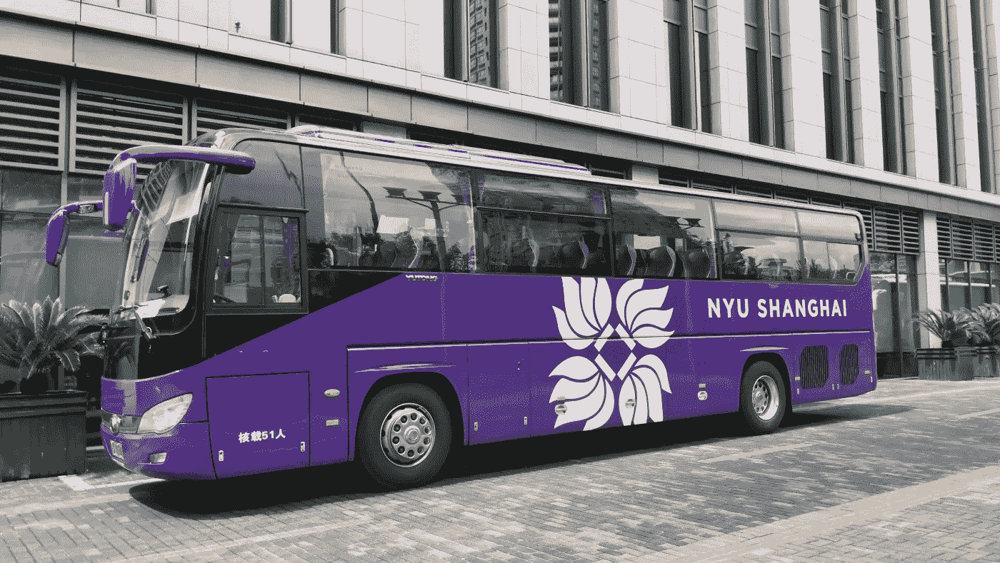
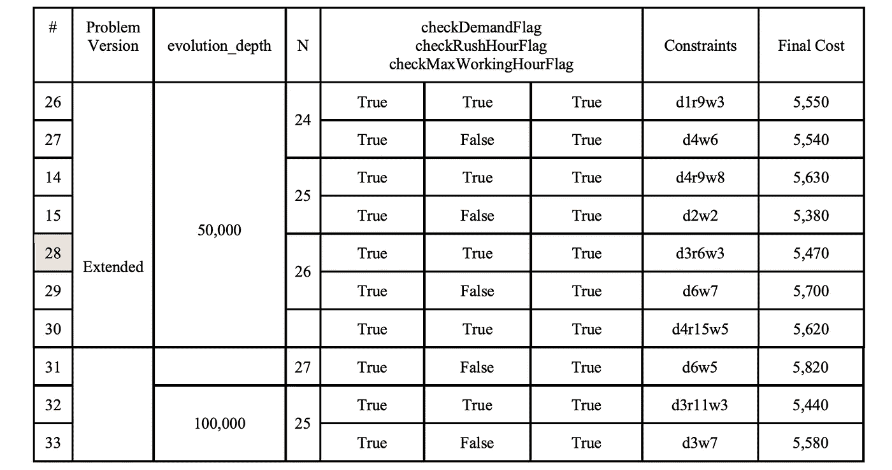
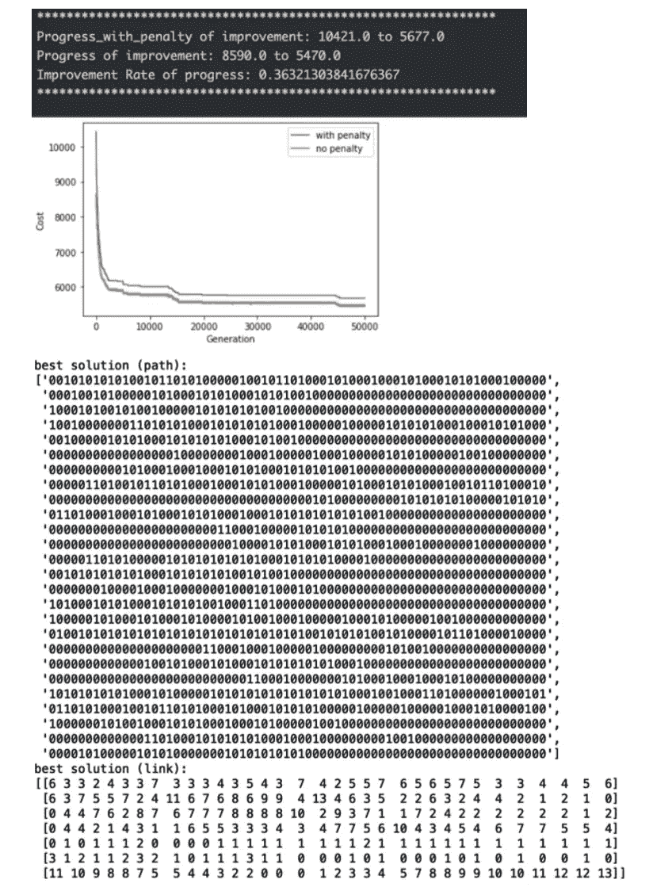
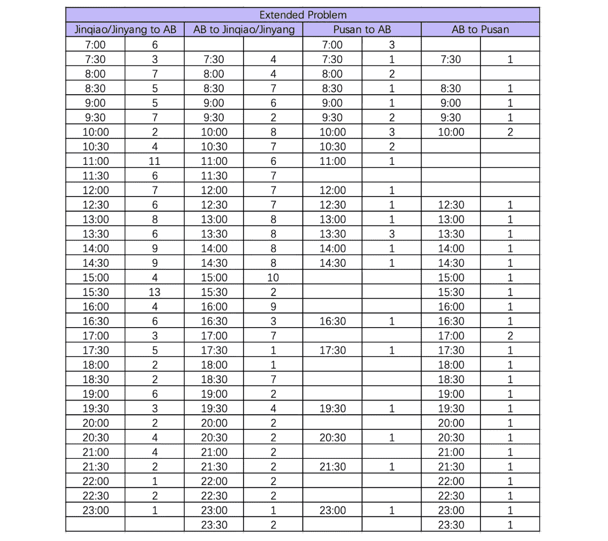

# 遗传算法与时空网络:校园班车时刻表优化(三)

> 原文：<https://medium.com/nerd-for-tech/genetic-algorithm-spatio-temporal-networks-optimization-of-campus-shuttle-bus-schedule-part-3-7f961d46a3cb?source=collection_archive---------6----------------------->

## 第 3 部分:用于扩展问题的 Python 遗传算法& Web 应用程序演示

作者图片

> 代码可以在这个 [GitHub repo](https://github.com/AlisonYao/DURF-Bus-Schedule-Optimization) 中找到。

在[之前的帖子](/codex/genetic-algorithm-spatio-temporal-networks-optimization-of-campus-shuttle-bus-schedule-part-2-255a25daf53e)中，我解释了关于基线问题的理论和实现的每一个细节。在这里，我将把它扩展到一个更接近现实生活的场景中，并带您了解扩展问题中的变化。如果你忘了扩展问题是什么，请回到本系列[第一篇博客](/codex/genetic-algorithm-spatio-temporal-networks-optimization-of-campus-shuttle-bus-schedule-part-1-e0dc3bcdb30c)的 3.2 节。

# 与扩展问题有什么不同？

扩展问题比基线问题更复杂，因为我们有三个选择，而不是两个选择 0 和 1。比如 AB 的班车可以选择在 AB 停一段时间，或者去 JQ/JY，或者去 PS。那么，0 和 1 两个数字不足以代表三个选择。所以基因在延伸问题中变成了 00，10，01。路径染色体现在看起来像 0010100000101000100000010
110101010100000000100000011010101000010。它仍然有 34 个基因，但是有 68 个数字。00 表示公共汽车在同一位置静止不动；10 表示公交车行驶在 AB 和 JQ/JY 之间；01 表示总线在 AB 和 PS 之间运行。同样，基因为 10 或 01 也不一定意味着公交车载有学生。为了满足下一个间隔开始时的巨大需求，公共汽车可能会空载前往 JQ/JY 或釜山。剩下的和基线问题一样。

我们认为 00 相当于 0，10 和 01 相当于 1，因此成本和惩罚的计算与基线问题相同。然而，当突变基因时，我们将需要一起突变这两个数字。

# Python 实现

基本上，实现将是两个基线问题合并在一起，但我们需要特别注意检查路径的完整性，并确保每个染色体都是实际上有意义的路径。

# 结果

这是我运行的所有测试的比较表。不幸的是，给定一个 24 到 27 之间的 N，我无法找到一个可行的解。

作者图片

但是比较约束违反，测试 28 和 15 是更好的。

对于每个测试，您应该能够看到如下所示的结果:

作者图片

因此，根据测试 28，针对扩展问题的优化公共汽车调度如下:

作者图片

# Web 应用程序演示

我使用基本的 HTML、CSS bootstrap 和 Python Flask 构建了一个简单的 web 应用程序。

作者提供的视频

谢谢你阅读我的博客！希望对你有帮助。

我的 Github:[https://github.com/AlisonYao](https://github.com/AlisonYao)

我的卡格尔:【https://www.kaggle.com/alisonyao】T2