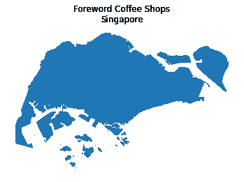
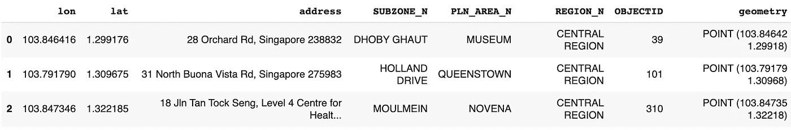

# 使用 Geopandas & Shapely 进行地理位置分析

> 原文：<https://medium.com/nerd-for-tech/geo-location-analysis-using-geopandas-shapely-d93775ae8a01?source=collection_archive---------4----------------------->

新加坡的咖啡店

如今，企业在衡量业绩或计划拓展新分支机构时，会关注地区、次地区和城市层面。

地理位置分析近年来变得流行起来，以帮助企业满足他们的需求。在这篇文章中，我们将介绍关于 shapefiles、坐标参考系统的基础知识，最后是使用 python 的实现和可视化。

## Shapefile

地理空间数据可以使用矢量格式(点、线或多边形)之一以 shapefile 格式存储。但是，由于结构不同，每个 shapefile 只能包含一种矢量类型。

存储在 shapefile 中的对象有一组描述数据的相关属性。例如，包含国家/地区子区域位置的多边形 shapefile 可能包含子区域名称、代码等。

与文本文件不同，空间数据通常存储在多个文件中。shapefile 由 3 个或更多文件组成，所有文件必须具有相同的名称，并存储在相同的文件目录中，以便在 Python 中打开。与 shapefiles 相关联的三个重要文件是。所有特征的几何图形。shx(索引几何图形)和。dbf(表格格式的要素属性)。

## 坐标参考系统

我们生活在一个三维的地球上，但是当我们制作地图时，我们需要把它转换成二维空间。CRS 用于定义二维投影地图和地球上真实位置之间的关系。

以下代码片段显示了 CRS 的几个关键组成部分，包括坐标系(如纬度/经度或北距/东距)、单位(如度或米)、包含用于放置空间坐标系的原点信息的数据。

了解数据使用的坐标系非常重要，尤其是当我们处理存储在不同坐标系中的各种数据时。

# 数据源

数据取自[data.gov.sg](https://data.gov.sg/dataset/subzone-census-2010)，是 2010 年新加坡人口普查的分区边界指示多边形。分区是规划区内的划分，通常以一个焦点为中心，如邻里中心或活动节点。地理数据由 311 行和 16 列组成。

对数据的快速检查为我们提供了关于区域和地区及其相应子区域数量的信息。层级结构是区域和区域，后面是子区域。

区域级别的子区域数量

地区一级的子区域数量

之后，让我们检查数据集的 CRS。它是投影的 CRS — [SYV21](https://app1.sla.gov.sg/SIRENT/About/PlaneCoordinateSystem) ，采用横轴墨卡托法创建，坐标系统为东/北。

检查协调参考系统

因为我希望我的 CRS 是经度/纬度格式，所以使用了重投影方法来改变位置的表示。

重新投影坐标参考系统

现在，我们有了 WGS84 格式的地理定位，让我们创建一些矢量数据(点)来检查它们属于哪个子区域。

旁注:我特别选择了[前言咖啡](https://forewordcoffee.com/)，因为我钦佩他们的远见。

在点地理数据中创建前言咖啡店位置

接下来，我编写了一个小循环来检查每个点的位置，并结合多边形地理数据的一些属性。

用于将多边形分配给相应点的代码

下面是我们的最终数据集，包括具有各自面属性的感兴趣的商店。

前言具有各自多边形属性的咖啡店

最后，让我们在新加坡地图上画出咖啡店的顺序。

请随意使用 [github](https://github.com/ZinTun/Geolocation/blob/main/geolocation_singapore.ipynb) 中的代码。