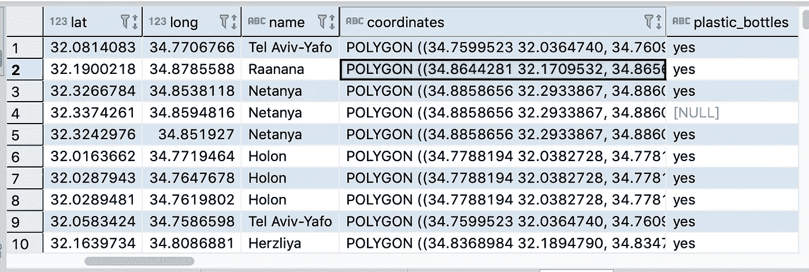

# 快速地理空间分析

> 原文：<https://medium.com/nerd-for-tech/geospatial-analysis-with-presto-38c567443ee3?source=collection_archive---------18----------------------->

## 在本帖中，我们将探索 Presto 的地理空间功能，并利用 Presto 的地理空间功能来丰富数据和获得地理见解。


*本文是一个系列——*[*Presto*](https://blog.bigdataboutique.com/series/intro%20to%20presto)*简介的一部分。如果你有兴趣，请订阅我们的* [*简讯*](http://bigdataboutique.hubspotpagebuilder.com/subscribe) *保持联系。*

在上一篇文章中，我们已经看到了如何[使用 Presto 来探索我们的数据并将其存储在 S3 上](https://blog.bigdataboutique.com/2020/10/exploratory-analysis-and-etl-with-presto-and-aws-glue-iwtkxs)。在这篇文章中，我们将探索 Presto 的另一个特性——地理空间功能。一些示例用例可能是找出感兴趣的地理点之间的距离，找出哪些点距离单个点最近，或者使用点之间的连接甚至形状来提供对数据的见解并丰富数据。我们将在这篇文章中探讨所有这些内容，然后简单讨论一下与 Presto 一起使用的地理数据格式。

## —内容

*   **理解所需的数据格式**
*   **寻找包含点** 的关系——将数据转换成 WKT 格式。
    -使用 Presto 查询数据。
*   **找出哪些点最接近单个点** ——获取店铺数据。
    -计算哪些商店离单点最近。

# 了解所需的数据格式

为了支持地理空间功能，Presto 需要特定类型和格式的数据(或数据的转换)。我们将使用的基本格式是 with 众所周知的文本。在这种格式下，几何数据点如下所示:

然而，数据点并不是唯一可用的几何图元类型。例如，多边形和多多边形允许我们将形状作为一种数据类型，从而将它们与一行数据相关联。那有什么用？好吧，考虑到数据条目可能不仅仅代表地图上的一个特定点——一座建筑、一座城市或一条道路。

```
LINESTRING (0 0, 1 1, 1 2) POLYGON ((0 0, 4 0, 4 4, 0 4, 0 0), (1 1, 2 1, 2 2, 1 2, 1 1)) MULTIPOINT (0 0, 1 2) MULTILINESTRING ((0 0, 1 1, 1 2), (2 3, 3 2, 5 4)) MULTIPOLYGON (((0 0, 4 0, 4 4, 0 4, 0 0), (1 1, 2 1, 2 2, 1 2, 1 1)), ((-1 -1, -1 -2, -2 -2, -2 -1, -1 -1))) GEOMETRYCOLLECTION (POINT(2 3), LINESTRING (2 3, 3 4))
```

请注意，我使用了“几何”一词，而不是“地理”或“地理空间”来描述这些类型，因为它们实际上指的是地图上的形状，而不是描述这些点的真实语义。因此，在获取点之间的实际距离的上下文中，我们首先需要将它们转换成地理空间形式。我们稍后将讨论如何做到这一点，但首先，我们必须首先将我们的数据转换成 WKT 格式。

# 寻找包含一个点的关系

在之前的帖子中，我们已经找到了以色列回收容器的位置。现在我们想找出每个集装箱在哪个城市。OpenStreetMap 实际上并不包含这些信息:相反，它包含了描述自治市 边界的 [**关系。因此，要了解一个数据点位于哪个城市，我们需要尝试并查明它位于适当类型的哪个关系中。现在您可能开始将点连接起来:地理空间功能允许您这样做，但是您首先必须获得 WKT 格式的点数据和自治市数据。**](https://www.openstreetmap.org/relation/1382494)

## **把数据转换成 WKT 格式。**

由于点数据是容易的部分，我们将从市政数据开始。我们已经可以通过前一篇文章中建立的 Presto 访问 OpenStreetMap，因此尝试使用 Presto 从市政关系中收集 WKT 数据是很有诱惑力的，但这在这一点上有点超出范围。我们将把它作为一个练习，取而代之的是，使用一些现有的服务和一些代码来完成这项工作。

我发现[**transition-turbo**](https://overpass-turbo.eu/)是为这篇文章提取相关数据的一种充分的方法，尽管还有其他可能的方法来实现相同的结果。transition-turbo 允许以多种格式从 OpenStreetMap 中导出选择。具体来说，可以提取包含所需信息的 GeoJSON 文件，然后可以很容易地将其转换为 WKT。

我们需要的信息是以色列的城市边界。根据[**OpenStreetMap WIKI**](https://wiki.openstreetmap.org/wiki/Israel#Municipalities)，在以色列境内查询 admin_level=8 可以找到这个。为此，只需将站点中的地图集中在相关的地理位置上，然后粘贴查询:

```
[out:json][timeout:25]; ( // query part for: "admin_level=8" relation["admin_level"="8"]["boundary"="administrative"]({{bbox}}); ); out body; >; out skel qt;
```

然后可以点击“导出”导出数据，并选择 GeoJSON 格式。

我们将使用 python 脚本将其转换为 WKT。相关代码可以在 这里找到 [**。关于这个脚本，我不会讲太多细节——一般来说，它的作用是:**](https://github.com/BigDataBoutique/presto-training/tree/master/gj2wkt)

1.  **过滤数据以仅返回我们有多边形数据的城市，而不是点数据。**
2.  **用 WKT 格式的自治市的英文名称和几何形状创建记录**
3.  **将这些记录保存在 S3 的一个拼花文件中**

您会注意到这不是一个完整的以色列城市列表，所以我们肯定会有一些缺失的数据。

## **使用 Presto 查询数据。**

对于这一部分，您需要将对 S3 存储桶的引用更改为您自己的 S3 存储桶。

现在我们有了 S3 的数据，我们可以很快为它创建一个表。

```
CREATE TABLE glue."bdbq-osmplanet".boundaries ( name varchar, coordinates varchar ) WITH ( external_location = 's3://bdbq-israel-boundaries/parquet/', format = 'PARQUET' )
```

现在，我们可以将这个表和上一篇博客中创建的 recycling containers 表连接起来，使用地理空间函数 ST_Contains 将数据点与相关自治市进行匹配:

```
SELECT * FROM glue."bdbq-osmplanet".containers CROSS JOIN glue."bdbq-osmplanet".boundaries AS b WHERE ST_Contains(ST_GeometryFromText(b.coordinates),ST_POINT(lat,long))
```

而且……没有任何结果。哪里出了问题？

事实证明，地理空间函数使用的正确格式是(long，lat)而不是(lat，long)。虽然这对几何函数没有直接影响，但我们没有得到匹配，因为从市政当局提取的数据是一种格式，而创建的点是另一种格式。为了解决这个问题，正确的查询具有相反顺序的坐标:

```
SELECT * FROM glue."bdbq-osmplanet".containers CROSS JOIN glue."bdbq-osmplanet".boundaries AS b WHERE ST_Contains(ST_GeometryFromText(b.coordinates),ST_POINT(long,lat))
```



太棒了，我们现在有了每个集装箱的市政数据。有了这些数据，您可以做更多事情，比如找出每个自治市有多少个集装箱，但是我们这里关注的是地理空间功能，所以让我们探索另一个功能。

# 找出哪些点最接近单个点

在我们的下一个地理空间壮举中，我们将帮助一名来自以色列面包店的卡车司机确定他的确切位置。

地理空间查询的一个常见用例是“附近有什么”——您可能已经尝试过向手机中的应用程序询问这个问题，甚至可能已经问过一两次。卡车司机通常有预先确定的路线:至少他们知道在某个时间段内应该去哪些地方(比如便利店)。然而，一旦他们真的在商店里，知道他们在哪是一个优势:司机通过应用程序搜索当前商店的送货细节可能会意外地选择错误的商店。能够精确定位坐标并确定最近的商店将节省时间并提高效率。

## **获取商店数据。**

我们首先要创建一个额外的表，包含司机可能去的所有商店。

由于 OpenStreetMap 中的元数据通常是与地区相关的，我们需要阅读[上的相关标签](https://wiki.openstreetmap.org/wiki/Tag:shop%3Dsupermarket)，并做一些探索性分析，以便找到正确的查询。由于我们在之前的帖子中已经做了类似的事情，这次我将跳过细节。最终的查询看起来像这样:

```
CREATE TABLE glue."bdbq-osmplanet".supermarkets_il WITH ( external_location = 's3://bdbq-osmplanet/supermarkets_il', format = 'ORC') AS (SELECT * FROM glue.osm.osmplanet WHERE lat BETWEEN 29.5013261988 AND 34.2654333839 AND long BETWEEN 33.2774264593 AND 35.8363969256 AND element_at(tags, 'shop') IN ('supermarket','convenience'));
```

请注意，我们仍然使用 lat 和 long 来确定“以色列有什么”，尽管到目前为止，您应该知道使用地理空间函数可以更准确地完成这项工作。这种函数需要更长的时间来运行，毕竟，它不是直接处理坐标字段，而是对它们进行变换。但是，它会产生更准确的结果。因为细节已经讨论过了，所以这也是一个练习。

## **计算哪些商店离单点最近。**

一旦我们创建了表，我们就可以查询它。假设司机在[拉宾广场](https://geohack.toolforge.org/geohack.php?pagename=Rabin_Square&params=32_4_51.18_N_34_46_50.06_E_type:landmark)附近的一个坐标处。要使用地理空间距离函数，我们需要将几何点转换为球面地理:

```
SELECT *,distance FROM (SELECT element_at(tags,'name:en'),*,ST_DISTANCE( to_spherical_geography( ST_POINT(long,lat)),to_spherical_geography(ST_POINT(34.780572,32.080883))) as distance FROM glue."bdbq-osmplanet".supermarkets_il) AS b WHERE distance < 200 ORDER BY b.distance ASC;
```

该查询首先计算商店的距离，然后根据该距离对商店进行排序，以返回最近的商店。根据给定的坐标，我们可以说司机可能在返回的商店之一(当然假设 OpenStreetMap 用相关的商店更新)。

显然，这里还有很多东西需要探索-距离的使用可以扩展到更复杂的分析用例，例如查找商店和最近的自动取款机之间的距离。Presto 还支持 Bing 图块，这允许确定可缩放图块中点的存在。然而，与其深入研究地理空间功能，不如像您对我们的 Presto 系列感兴趣一样，我们希望听到您对我们在未来帖子中涉及的内容的意见。

*原载于 2021 年 4 月 13 日 https://blog.bigdataboutique.com*[](https://blog.bigdataboutique.com/2021/04/geospatial-analysis-with-presto-m2nqdw)**。**