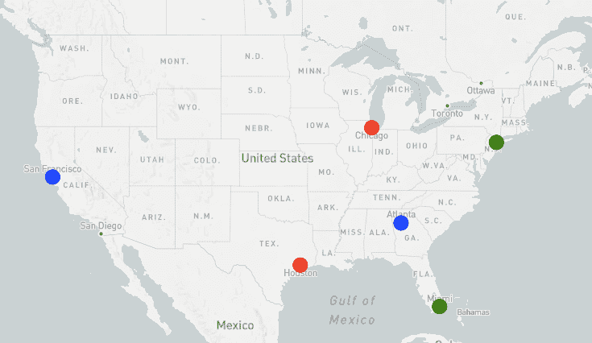
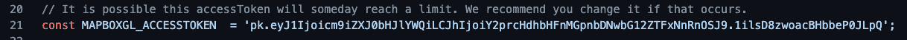
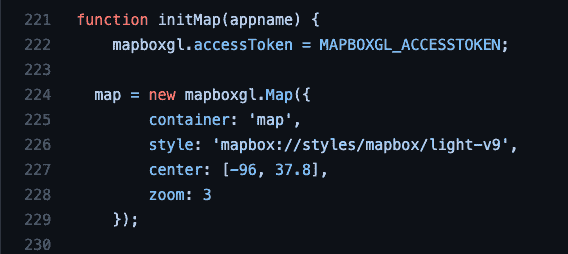
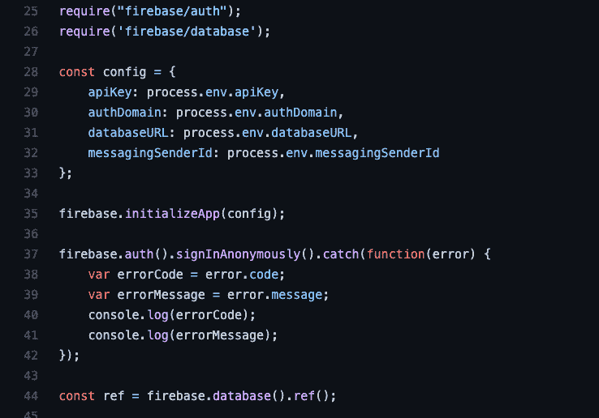
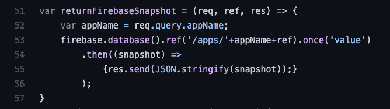
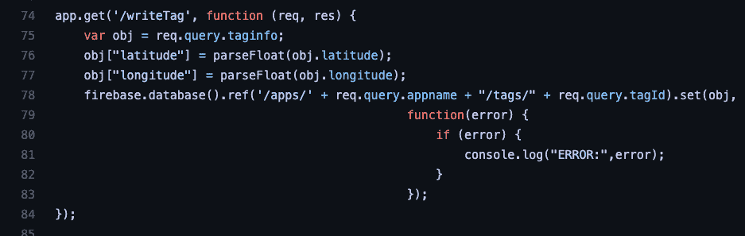
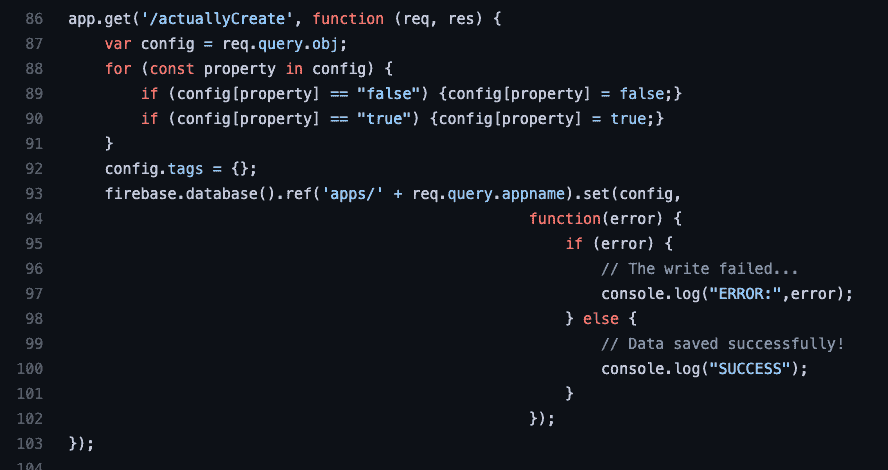
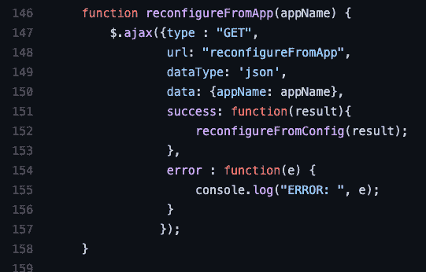

# Geotagtext，教程:由免费工具组成的免费地理标记 Web 应用程序

> 原文：<https://medium.com/nerd-for-tech/geotagtext-a-tutorial-a-free-geotagging-web-application-composed-of-free-tools-b42bcbcca202?source=collection_archive---------9----------------------->

罗伯特·里德、迭戈·阿斯平沃尔和尼尔·马蒂斯

使用地理标签文本的地理标签示例

注:这篇短文写于 2021 年。公共发明现在正积极尝试将这种代码的一个版本用于灾难，无论是自然的还是人为的，比如入侵乌克兰。如果你对那个项目([https://github.com/PubInv/pjournal](https://github.com/PubInv/pjournal))感兴趣，请联系罗伯特·l·里德(read.robert@gmail.com)。

[Geotagtext](https://geotagtext-server.herokuapp.com/) 是一个由[公共发明](https://www.pubinv.org/)志愿者开发的网络应用程序，它允许用户通过在智能手机或更大的电脑上运行的浏览器，对对他们来说重要的地方和事物进行地理标记。用户只需创建自己的地图应用程序，就可以立即开始使用自己的一套特殊地理标记，其中可以包括简短的文本片段。如果您单击地理标签文本中的某个点，它将显示与该地理标签相关联的消息。使用浏览器内置的地理定位功能，用户的当前位置可以被记录为地理标签。这些地图应用程序都是公共的，只需给出应用程序的名称就可以与他人共享。

我们相信 Geotagtext 是一个值得学习的有用工具。更重要的是，本文教你如何通过组合广泛可用的*免费*(零成本)工具( [Firebase](https://firebase.google.com/) 、 [Mapbox](https://www.mapbox.com/) 、 [Express](https://expressjs.com/) 和 [Heroku](https://www.heroku.com/) )来构建一个零部署、浏览器交付的 web 应用程序。它展示了现代自由软件的力量，包括免费午餐和自由言论。[地理标签文本代码](https://github.com/PubInv/geotagtext)本身是在 [GNU Affero 通用公共许可证](https://www.gnu.org/licenses/agpl-3.0.en.html)下发布的自由软件。

虽然 [Firebase](https://firebase.google.com/) 、 [Mapbox](https://www.mapbox.com/) 、 [Express](https://expressjs.com/) 和 [Heroku](https://www.heroku.com/) 为我们工作过，但这些绝不是创建类似 Geotagtext 的东西的唯一方法。虽然我们将在本文的后面进行更深入的讨论，但是这里有一个我们将要教授的每个服务的简要概述。Firebase 用作远程数据库来存储地图应用程序上的数据。Geotagtext 访问数据库来编写新的标签和应用程序。Mapbox 用于在地图上显示存储在数据库中的信息。标记的颜色和位置被读出，然后分别写在世界地图上。Heroku 是开发者用来创建应用的云平台。它允许我们通过隐藏密钥和在远程服务器上运行每个引用来保持数据库信息的秘密。您还将学习如何在将编辑内容推送到 github 之前在本地测试它们。 [Node.js](https://nodejs.org/en/) 用在我们的服务器上，后端框架 [Express](https://expressjs.com/) 处理请求。

尽管其中一些组件在扩大规模时需要付费，但我们创造的产品除了时间之外没有任何成本。我们的应用程序不能处理大量的流量，但是这证明了用一点点空闲时间就能把一个 web 开发想法变成现实是可能的。此外，大多数装有最新浏览器的电脑，如 chrome，都可以运行我们的应用程序，这使得超过 20 亿人可以使用它。该应用程序严重依赖于在浏览器中运行的 javascript，这意味着不需要下载文件就可以开始使用地理标签文本。Geotagtext 很简洁，有两个独立的 html 文件，不到一千行代码。然而，它非常灵活，这意味着它可以用于任何事情，从跟踪入侵物种到标记最喜欢的旅行地点。

本教程面向有一定经验的程序员，他们有兴趣编写工具来创建一个强大的网站，或者专门针对那些对简单的地理标记应用感兴趣的人。

# 地理标签文本可以用来做什么？

由于 Geotagtext 是一个地图应用*构建器*，它的确切用途并不是一成不变的。如果某项活动需要记录带有附加信息的地理标签并与他人分享，那么地理标签文本可能是最合适的选择。在“应用程序构建器”页面中，还可以在一定程度上自定义您的地图应用程序，这些设置将应用于使用您的应用程序的任何人。虽然地理标签文本可以用于许多原因，但我们将我们最喜欢的例子分为*社会*、*信息*和*紧急*类别。

社交应用是为了娱乐或实现个人目标。

*   山峰标记:每当你登上一座山峰，就放下一个地理标记。随着时间的推移，您将拥有覆盖您最喜爱的山脉的点的海洋。如果你愿意投入时间，你可以开发自己的方式来存储峰会照片。
*   观光地图构建器:城市(或任何地方)中相对于您所在位置的最佳游览地列表。
*   捉人游戏:你的一个朋友穿过树林，设置标记。几分钟后你跟着他，在他的 30 英尺内设置你自己的标记。如果你都拿到了，你就赢了！
*   地理藏宝:在你的区域寻找隐藏的藏宝处。你甚至可以用你最喜欢的地点制作一张个人地图。
*   个人娱乐场所:制作一张地图，标出你最喜欢的骑车、滑雪或看日落的地方。

*一观再访！*

**信息**应用程序用于记录您可能想与朋友或公众分享的重要数据。

*   有趣的事情:追踪你感兴趣或正在研究的花、植物或动物。
*   入侵植物标记:跟踪植物，如上所述，但使用您的数据来根除您所在区域的入侵物种。与几个忠实的朋友或整个城镇共享您的应用程序。
*   步道/道路更新:报告您所在区域的道路或步道的状态。如果有损坏或坑洞，放下你的标记，让其他人知道。
*   位置更新:在远足或旅行时为家人和朋友提供位置更新。GPS 信标既昂贵又复杂，但每个人都有一部手机。

*检查入侵物种*

**紧急**应用程序用于快速定位和帮助有需要的人。请记住，地理标签文本只能在良好的手机网络连接下工作，不应该总是依赖它。这些都是理论上的应用，不应该在实际紧急情况下使用——我们还没有对 geotagtext 进行足够的测试，以表明它适合任何用途，并可能随时将其关闭。

在自然灾害或其他紧急情况下，有各种各样的理由在地图上定位事物。一个明显的例子是，处于困境中的人不能马上得到帮助..一般来说，人们可以想象定位其他问题或资源，例如病人和诊所、受伤的人和急救站。曾经可以标记抛锚的汽车、搁浅的鸟或鲸鱼。你大概可以想出几十个其他的例子。

*潜在危险的徒步旅行情况*

然而，开源软件和我们方法的美妙之处在于，你可能会想到它完全不相关的用途。请成为我们的客人，探索我们从未想过的想法！

# 限制和警告

Geotagtext 与其说是一个产品，不如说是一个示例代码库。请记住，它既不提供隐私也不提供安全。每次你放置一个地理标签，你都有可能告诉世界你的确切位置。

当您使用地理标签文本(可能以您自己的名字命名或表明您的预期用途)构建自定义应用程序时，任何其他用户都可以使用您的应用程序，并可能通过添加他们自己的无关地理标签来破坏您的数据。然而，Geotagtext 是免费的开源代码；如果你想构建一个单独的私有版本，欢迎你这样做，只要你遵守 GNU Affero GPL 许可。

# 文件组织

这个项目中的[文件的组织很简单:](https://github.com/PubInv/geotagtext)

1.  Index.html 是网络应用的主要入口。这包含一些专门与 GUI 相关的 JavaScript，搜索要使用的特定应用程序，以及可视化配置。
2.  [Builder.html](https://github.com/PubInv/geotagtext/blob/master/builder.html)是允许构建命名应用的网页。它包含一个 JavaScript 函数，该函数调用 AJAX 来创建全新的隔离数据库。
3.  Tagscript.js 主要负责操作地图功能
4.  [Server.js](https://github.com/PubInv/geotagtext/blob/master/server.js) 是一个 Express 服务器，提供网页服务，回答 AJAX 查询，并且知道如何访问 firebase。

server.js 文件是在我们的开发中最后添加的；在我们出于安全原因搬到 Heroku 之前，它是不需要的。如果你不介意你的火基钥匙暴露的话，这是完全不需要的。

# 地图框

Geotagtext 的目的是构建地图，因此 Mapbox 是这个 web 应用程序的核心。在我们能够持久存储任何数据之前，我们首先使用了这个工具，只是为了展示我们可以使用浏览器支持的地理定位来在地图上设置标记。Mapbox 是用有用的地图快速创建网站的最简单的方法之一，尽管毫无疑问还有其他选择。

在 tagscript.js 中，您会发现下面一行，这是我们的 mapbox 访问令牌。

如果需要，你可以从 [Mapbox](https://www.mapbox.com/) 获得你自己的访问令牌，该令牌是免费的，可以有限制地使用。下面几行创建了一个非常简单的地图，它被放在名为“map”的 DOM 对象中。

这就是创建你的第一张地图所需要的全部内容，没有数据！

该文件包含如下功能:

showLngLatOnMap(lonDec，latDec，color，n，message)

showPositionOnPage(位置、颜色、消息、数字)

它利用文档化的 Mapbox 接口来添加彩色标记，并与完成文本片段呈现所需的 JavaScript 相关联。

仅使用这个，您可以实现地理标记，但您的数据不会是永久的…它会在刷新时丢失。然而，迭代和敏捷开发受益于分段测试的能力。

# 重火力点

在演示了通过单个浏览器页面的临时存储在地图上进行地理标记和渲染标记的能力之后，我们需要持久化数据的能力。虽然我们可以使用客户端存储，如[网络存储](https://developer.mozilla.org/en-US/docs/Learn/JavaScript/Client-side_web_APIs/Client-side_storage)，但 Geotagtext 的目的是创建一个应用程序，让几个用户可以同时参与并享受动态更新的地图。这需要一个共享的持久性存储。当然，我们可以在那里创建我们的服务器并使用任意数量的数据库工具，但是我们选择使用 [Firebase](https://firebase.google.com/) ，一个免费的 web 交付对象存储。它的优点是支持直接 JSON 存储相当容易。这使得我们可以构建一个有趣的应用程序，而不必一开始就实现服务器。

最初，我们没有服务器——我们在页面中做的一切都是无服务器部署。但是 firebase 访问代码没有改变。Firebase 相对容易运行。初始化代码是(现在是服务器端，但最初是浏览器端):

我们的基本方法是将所有数据作为单个快照读取。这无疑是低效的，但是过早的优化违反了 YAGNI 原则。JavaScript 和 firebase 的强大功能使得返回快照非常简洁:

这段代码在 Express 内部工作，所以它利用了一个 web 请求(“req”)和响应(“res”)，没有它们，对 firebase 的访问将是一条线(53)。

下面的代码足以通过一个 AJAX 调用将新的地理标签添加到数据库中:

# 一款应用构建应用

在我们看来，基本的地理标签文本功能非常通用。我们无法决定哪一种使用方式明显比其他方式更能吸引广大观众。尼尔和我最初的目标是——建立一个“小图书馆”共享箱中可用书籍的数据库，但当我们意识到 OCR 图像处理不足以解决这个问题时，这个目标就被放弃了。所以，我们没有选择一个特定的应用程序，而是决定放手一搏——我们开发了一个可以让你开发应用程序的应用程序。

只需输入一个新名称，我们就可以在应用程序之间隔离数据。因此，任何用户都可以建立自己的私人地理标记数据库，并将其用于任何目的。如果对网络应用程序的访问也受到控制，那么这个数据库就真的是私有的了。

下面的代码实现了一个创建数据库的 AJAX 调用。结合从用户处收集“应用”名称的 builder.html，这就足够了:

为了完成这个功能，我们需要 index.html 收集要使用的“应用程序”的名称，或者它必须在 URL 上提供。这很容易做到:

# 适度的安全

Mapbox 和 Firebase 的结合为我们提供了零部署成本和零成本的功能。我们认为它足够有趣，所以想写这篇文章，但有一个小问题:Firebase 要求你在谷歌注册一张信用卡，以防超过免费使用限制。我们的 api 密钥在 GitHub repo 中公开。虽然没有人可以做任何非常淘气的事情，但一个坚持不懈的人可以使用我们的 api 密钥不恰当地获得免费服务，达到我们在谷歌设置的限制。更好的方法是不公开密钥。当然，Geotagtext 应该是免费和开放的，所以我们希望保留一个任何人都可以通过浏览器获得的公共回购和零部署交付。

解决方案是通过创建一个服务器来显著地复杂化我们的部署。服务器将允许我们隐藏我们的密钥作为服务器上的配置，这将不会被看到，但仍然提供一个免费的网页，任何人都可以浏览。我们希望你，这篇文章的读者，能够创建自己的半私有地理标签数据库，只需按一下按钮。通过这种方式，您可以在获得自己的 Firebase 密钥之前尝试 geotagtext。(当然，如果您愿意，您可以随时修改您的代码来使用不同的数据库。)

幸运的是，Heroku 让这个变得相对简单，而且在我们现有的流量水平下，零成本。

我们创建了一个 live [Heroku app](https://geotagtext-server.herokuapp.com/) 并将其绑定到我们的 Github repo。一个小的代码更改从代码中删除了我们的 API 键。取而代之的是，我们现在从“环境”中读取所有的键(“环境”对计算机程序员来说有着特殊的意义，比一般的单词更具体。)这个“环境”由可以在 Heroku 中指定的键值对组成。它们将被传递给服务器端进程。

这需要一个主要的架构改变，因为浏览器现在不再直接从浏览器访问 Firebase，而是向服务器发出 AJAX 调用，服务器将访问 Firebase，获取数据，并在 AJAX 响应中返回数据。然而，现代免费工具(JQuery)使这变得非常简单。

Heroku 有很好的教程，我们跟着学。基本的方法是实现一个简单的 web 服务器，由 Heroku 自动托管。在 Node.js 中，最简单和最常见的方法是使用 Express。我们的文件 [server.js](https://github.com/PubInv/geotagtext/blob/master/server.js) 是一个简单的 Express 应用程序，支持由 AJAX 执行的五个 REST 调用。此外，下面一行足以满足我们的需求。hmtl 文件:

结果是一种安全的方式，让任何人都可以免费使用我们的应用程序。当然，有人可能会利用拒绝服务攻击来浪费一点点数据库空间，但一般来说，人们都表现良好。免费，不需要下载或安装任何软件，你可以用你的手机测试地理标签文本。也许你可以想出一个创造性的网络应用来放置和分享地理标签。如果你变得更认真，你可以随时分叉我们的代码，并作出修改。如果您需要更多的隐私或更大的流量，您可以创建一个 fork，获得您自己的 Firebase api 密钥，并设置您自己的 Heroku 实例，完全独立于我们的实例。**注意:**作为数据库的所有者，我们可以看到你创建的任何标签。从某种意义上说，如果你现在使用 Geotagtext，你就是在暴露你的位置，所以你可能希望在这样做之前想一想。

# 基本代码测试循环

软件通常是在一个迭代的编码-测试循环中编写的。对于 Heroku 部署，基本的迭代开发过程变成了:

1.  代码。
2.  本地运行。
3.  本地测试和评估。
4.  Git 提交，git 推送。
5.  在 Heroku 部署。
6.  在 Heroku 现场测试。

# 创建交互式、快速动态网页应用的网页开发技术

AJAX 和 JQuery 应用如此广泛，以至于人们很容易忘记这个免费工具的作者为社区做出了多么大的贡献。AJAX 使得回调 Express 服务器变得很容易；下面是获取“应用程序”(不是数据本身，它是在 tagscript.js 中完成的)的主要示例

# 弱点

软件很少做。如果你不能想出一些方法来改进任何重要的代码，你很可能缺乏想象力。

> 我们最大的失败是，为了更全面地遵循 [REST](https://en.wikipedia.org/wiki/Representational_state_transfer) 范例，我们应该对一些“GET”命令使用“POST”命令。我们试过了，但没成功，所以暂时放弃了。

# 修改地理标签文本

Geotagtext 是由我们两个人(Neil 和 Rob)创建的，部分是作为一种学习练习。迭戈振兴了这个项目，也是为了学习。它并不意味着做任何特定的事情，而是作为地理标记应用的基础构件。像现代世界中的许多软件一样，它碰巧是由其他基础构件组成的！

这意味着您可能想以任何方式修改它，并且您可以自由地这样做，只要您在 AGPL 的条款下保持您的分布式修改是自由和开放的。例如，您可以用 MongoDB 或其他数据库替换 Firebase。你可以使用不同的主机服务，比如 AWS，而不是 Heroku。您可以使用不同的映射工具。

您还可以添加特定于您自己的应用程序的功能。例如，我们已经尝试允许上传照片，并从照片中提取地理标签位置(大多数用智能手机拍摄的照片都有地理标签。)或者，你可以允许添加更多信息，而不仅仅是位置、文本和“红、蓝、绿”选项——例如，你可以允许向其他用户的地理标签添加评论。

我们邀请你制作你想要的地理标签文本。