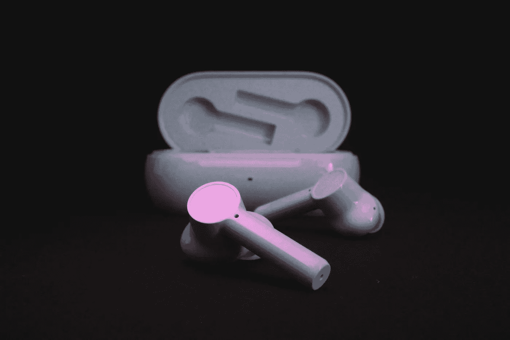

# 智能穿戴设备市场一瞥

> 原文：<https://medium.com/nerd-for-tech/get-a-glance-of-smart-wearable-device-market-b1eeba107f7a?source=collection_archive---------6----------------------->

# **可穿戴设备保持高速增长**

**Gartner 预测，2022 年可穿戴设备的出货量将跃升至 4.53 亿部。**例如，到 2022 年，耳戴设备、头戴设备和智能手表的负载将分别达到 1.58 亿、8018 万和 1.15 亿台，五年复合增长率为 49.1%。%，33.3%，22.7%，耳戴式设备将取代智能手表成为可穿戴设备领域的必备产品。到 2022 年，苹果 AirPods 等耳机设备将占据可穿戴设备市场 30%以上的份额。

**可穿戴人工智能市场增长更快。**对 AI 助手的需求不断增加，物联网技术的出现，无线技术的融合，可穿戴组件技术的增长前景，以及消费者对高级可穿戴设备的偏好和需求的增加，都是全球可穿戴市场不断增长的主要驱动力。 **MarketsandMarkets 预测，2018 年全球可穿戴 AI 市场规模预计为 115 亿美元。到 2023 年，这一数字有望达到 424 亿美元，预测期(2018–2023)**年复合增长率为 29.75%。

## **蓝牙耳机**

随着 AI 技术的引入，蓝牙耳机的功能将更加千变万化。也将是各厂商竞争的焦点之一。

可能会碰撞出什么火花？

大致可以分为这些:

(1)智能降噪将成为标配

(2)运动耳机将增加更多的检测功能

(3)耳机还能识别你是谁:声纹 ID 和 AI 语音

(4)定制情商

(5)更多 AI 功能，如智能实时翻译、听译流程等。

# 为什么高质量的训练数据对人工智能机器学习如此重要？

现在的人工智能也叫数据智能。在这个发展阶段，**神经网络的层数越多，需要的标记数据量就越大**。事实上，数据有着重要的作用。因此，从谷歌和微软到普通个人开发者，所有开发者都非常重视高质量的标签数据。

在当前的人工智能应用实践中，不同水平的数据质量显示出人工智能解决方案的价值有着非常明显的差距。如果说之前的算法模型使用的一般数据集是粗粮，那么算法模型目前需要的是定制的营养餐。如果公司想要进一步提高某些模型的商业化，他们必须逐步从通用数据集向前发展，以创建独特的数据集。

## NLP 服务

我们在电子商务、零售、搜索引擎、社交媒体等领域提供不同类型的自然语言处理。我们的服务包括语音分类、情感分析、文本识别和文本分类(聊天机器人相关性)。

ByteBridge 与全球 30 多个不同的语言社区合作，现在提供[数据收集和文本注释服务](https://tinyurl.com/25xmarwp) ，涵盖语言有**英语、中文、西班牙语、韩语、孟加拉语、越南语、印度尼西亚语、土耳其语、阿拉伯语、俄语等等**。

# 结束

将你的数据标注任务外包给 [ByteBridge](https://tinyurl.com/2p89x4t5) ，你可以更便宜更快的获得高质量的 ML 训练数据集！

*   无需信用卡的免费试用:您可以快速获得样品结果，检查输出，并直接向我们的项目经理反馈。
*   100%人工验证
*   透明和标准定价:[有明确的定价](https://www.bytebridge.io/#/?module=price)(包括人工成本)

为什么不试一试？

资料来源:https://www.eet-china.com/mp/a82045.html