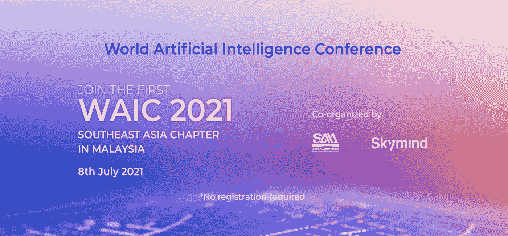

# 高质量的数据是人工智能行业的未来

> 原文：<https://medium.com/nerd-for-tech/get-a-glance-of-the-2021-world-artificial-intelligence-conference-waic-2021-49537a7ec4f0?source=collection_archive---------11----------------------->

## 2021 年世界人工智能大会(WAIC)一览

[https://waicsea.com/](https://waicsea.com/)

7 月 8 日至 10 日，2021 世界人工智能大会(WAIC)在沪开幕。这是 2018 年以来在上海举办的第四届世界 AI 大会。

# 会议概述

本次大会的主题是“智能连接，灵感城市”，300 多家企业的前沿人工智能技术和产品集中亮相。

从 2018 年的“赋能新时代”，2019 年的无限可能，到 2020 年的“共同家园”，再到 2021 年的“智慧城市”，大会的主题发生了变化，这说明 AI 正在以前所未有的速度链接世界的一切。

中国工业和信息化部部长肖亚庆在开幕式上发表讲话说，“中国在人工智能发明专利授权方面排名世界第一。”。

# 大佬们怎么说？

## 华为

华为值班董事长胡在开幕前一天参观了展区，并表达了他的感受:**少一些“炫酷科技”，多一些 AI 落地产品。**

的确，在三年的时间里，第一届提到的“未来”已经成为现实。尤其是随着疫情的影响，相关应用开始迎来加速落地阶段。如今，巴斯巨头已经接管了 AI 赛道，并在一些领域取得了突出的优势。

## 百度(全球最大的中文搜索引擎)

百度创始人李彦宏透露，最新款智能汽车正在加速研发中。Robin 表示，不久前，百度刚刚推出了新一代共享无人车。目标是让未来的旅行更便宜。在未来两到三年内，百度计划将无人车的共享推广到中国 30 个城市。

此外，李彦宏认为人工智能在助老行业有着光明的前景。无论是社区还是居家养老，AI 都可以在提供生活便利、康复护理、饮食救助、紧急救助、精神慰藉等方面发挥明显作用。自然语音理解方面的进步，可以让小智能屏和老人聊上几个小时成为可能。

## 腾讯

腾讯董事会主席兼首席执行官马化腾通过微信发表讲话称，他将在大会上与国家天文台共同提交一份联合探索计划，并将使用腾讯上海优图实验室的人工智能技术来搜索脉冲星和探索宇宙。

此外，腾讯还将 AI 引入了皇家荣耀(电子游戏)，并在展会现场与人类玩家进行了对战。结果表明，人工智能在竞赛中可以达到优胜的水平。马说，除了让人们享受最高水平的比赛，人工智能电子竞赛还将激发年轻人对人工智能研究的兴趣，为行业吸引更多人才。

## Gli

当然，除了这些高危领域，制造业作为现代社会的核心支柱，其与 AI 结合的潜力无疑会更大。

格力电器董事长董明珠认为，数字化时代给制造业带来了颠覆性的革命。在制造层面，AI 可以建立由数据驱动的“黑暗工厂”。

*黑暗工厂:智能工厂，由于从原材料到最终产品的所有加工、运输、检测都在空旷的“黑光工厂”中完成，没有人工劳动力，因此可以关灯进行操作。*

目前，格力正在珠海建设全自动、全智能、配套齐全、5G 全面覆盖、智能管理、高端智能制造的“黑暗工厂”。这将给制造业的精度、质量和效率带来巨大变化。

**更多信息:** [**数据标签服务如何赋能制造业 2021？**](https://tinyurl.com/yytsnspy)

## 人工智能瓶颈

虽然人工智能应用正在蓬勃发展，但这并不意味着人工智能开发可以很舒服。华为公司董事长胡在开幕式上表示，人工智能的瓶颈不在于技术和应用的需求，而在于开发的效率。**现在 AI 开发效率太低，太慢，严重阻碍了技术与需求的结合。**现在的模式还是传统的手工作坊，需要技术手段来改变，提高效率。

# 高质量的数据是行业的未来

目前研究界正在做无监督、小样本的深度学习工作。通过三维合成数据，用合成数据训练机器，尽量减少数据采集和标注过程。这样机器就可以自主学习和进化。

然而，由于缺乏理论上的技术突破，虽然技术发展很快，但总体水平仍然较低。目前的深度学习仍然依赖于基于统计显著性的大数据模型，需要可扩展的数据。

现在的人工智能也叫数据智能。在这个发展阶段，神经网络的层数越多，需要的标记数据量就越大。对于深度学习来说，数据只有贴好标签才有意义。

# 结束

将你的数据标注任务外包给 [ByteBridge](https://tinyurl.com/yc39phjj) ，你可以更便宜更快的获得高质量的 ML 训练数据集！

*   无需信用卡的免费试用:您可以快速获得样品结果，检查输出，并直接向我们的项目经理反馈。
*   100%人工验证
*   透明标准定价:[有明确的定价](https://www.bytebridge.io/#/?module=price)(含人工成本)

**为什么不试一试？**