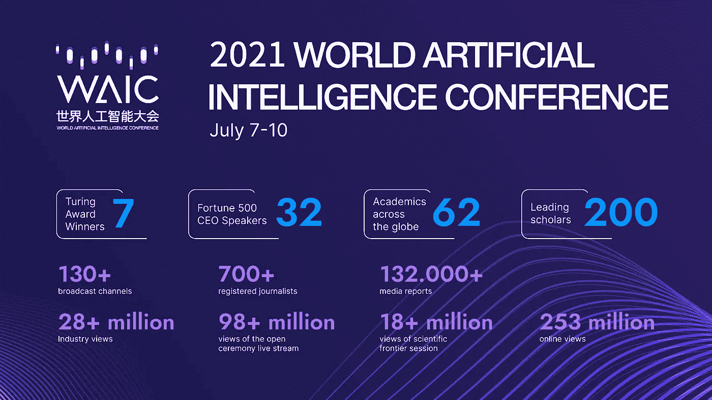

# 2021 年 WAIC 车展上的自动驾驶汽车

> 原文：<https://medium.com/nerd-for-tech/get-a-glance-of-the-2021-world-artificial-intelligence-conference-waic-2021-part2-4664ecb24e76?source=collection_archive---------13----------------------->

WAIC 官方网站

# 自动驾驶成为热点

如果你要问今年 WAIC 馆最大的亮点是什么，“自动驾驶”将是许多参观者和参展商的共同答案。

长期以来，人工智能在汽车领域的应用是全球创新和未来发展的重点。在这个领域，中国国产厂商一直走在前列。在 WAIC 2021 上，各种新的智能驾驶产品正在盛开，这标志着人工智能在自动驾驶领域迎来了井喷发展。

7 月 6 日下午，中国无人车公司 AutoX 在上海召开发布会，带来了其第五代全无人驾驶系统 AutoX gen5。大会上，AutoX 正式公布了中文名称:安泰(和平之旅)。创始人肖在大会上表示，AutoX 应该继续开发无人驾驶技术和 Robotaxi。

据悉，AutoX 推出了第五代系统的核心计算平台，国内首款 L4/L5 无人驾驶计算平台——AutoX XCU。最新的第五代系统达到了惊人的 2200 TOPS 计算力，代表了中国最高的车载超级计算能力。

2021 WAIC 世界 AI 大会期间，商汤科技还正式发布了全新自主品牌 Senseauto 解决方案，全方位展示智能汽车商用解决方案。

另外，小马。AI 宣布将在上海嘉定开设 Robotaxi 业务，覆盖主要城市路段。得益于 Ponypilot+ app，用户有机会体验安全舒适的新兴出行方式。投入使用的车辆是配备最新自动驾驶系统的雷克萨斯 RX 车型。

此外，该公司首次披露了其业务运营的细节。5 月 11 日，PonyTron 宣布正式获得商业运营的道路运输许可。截至目前，自动驾驶卡车已完成约 13650 吨货运，商业运营里程达 37466 公里。

另一方面，Inceptio Technology 也展示了自动驾驶重型卡车的 2 款量产车型；威斯特威尔的无人驾驶电动卡车 Q-Truck 直接去掉了人类驾驶室，在泰国莱姆差邦使用；图森未来的 L4 级自动驾驶卡车已经在上海港和洋山港之间使用；WM Motor 展示的自主泊车技术，展示了 AI 技术在出行中的可能性。

毫无疑问，中国自动驾驶的发展在全球处于主导地位，生态体系也在逐步建立和完善。未来，由“智能汽车”和“智能道路”构建的智能交通系统将进一步减少交通事故，提高安全通行的概率，减少碳排放。

2021 世界 AI 大会已经落下帷幕，展馆内各方的角逐也已经结束。毫无疑问，在进入 21 世纪的第三个十年，中国一直在加速发展人工智能产业，并取得了可喜的成绩。但正如英特尔物联网 CTO 张宇博士在演讲中提到的，**目前的 AI 仍然依赖人力资源，这在一定程度上造成了限制**。未来，在产业链的共同努力下，人工智能将进一步快速迭代，助力实现数字化转型和碳中和的目标。

# 自驱动算法模型和高质量标记数据

自动驾驶的主流算法模型主要基于有监督的深度学习。它是一种算法模型，推导出已知变量和因变量之间的函数关系。需要大量的结构化标记数据来训练和调整模型。

在此基础上，要想让自动驾驶汽车变得更加“智能”，形成可在不同垂直落地场景下复制的自动驾驶应用商业模式闭环，模型需要有海量、高质量的真实道路数据支撑。

在自动驾驶领域，数据标注场景通常包括变道超车、通过路口、无红绿灯控制的无保护左右转弯，以及一些复杂的长尾场景，如车辆闯红灯、行人过马路、路边以及违规停放的车辆等。

# 结束

将您的数据标注任务外包给[字节桥](https://tinyurl.com/5n6vssam)，您可以更便宜、更快速地获得高质量的 ML 训练数据集！

*   无需信用卡的免费试用:您可以快速获得样品结果，检查输出，并直接向我们的项目经理反馈。
*   100%人工验证
*   透明标准定价:[有明确定价](https://www.bytebridge.io/#/?module=price)(含人工成本)

为什么不试一试呢？