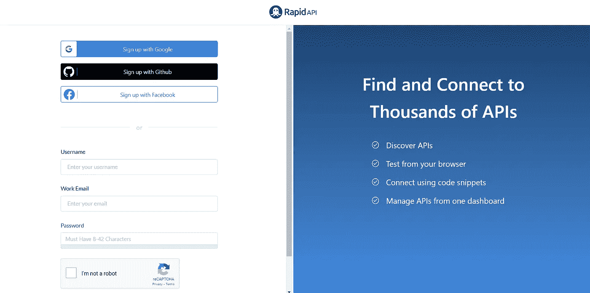
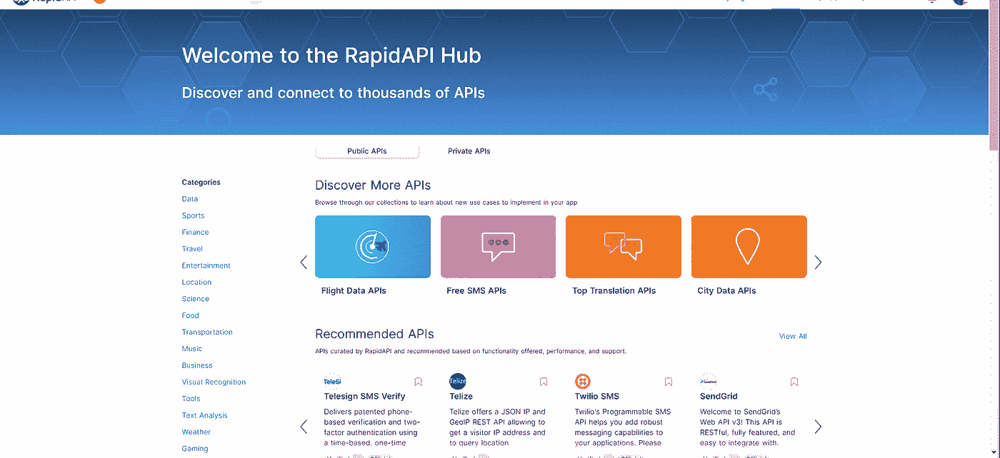
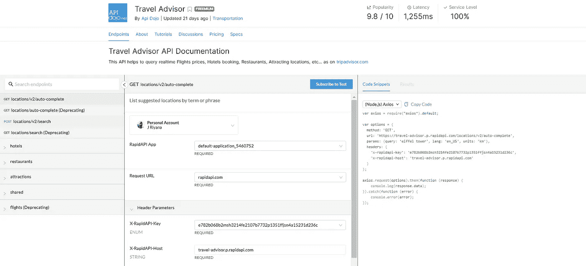
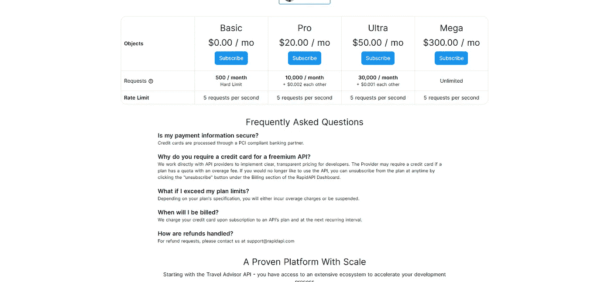
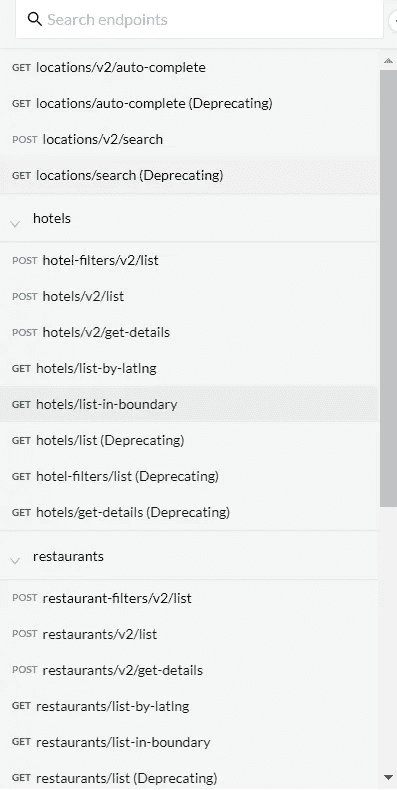
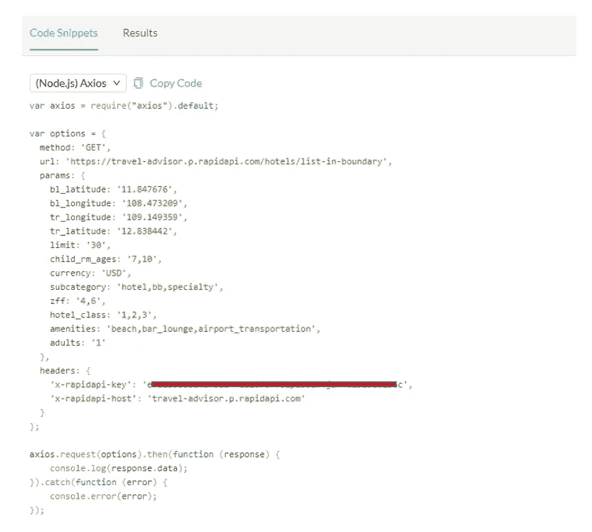
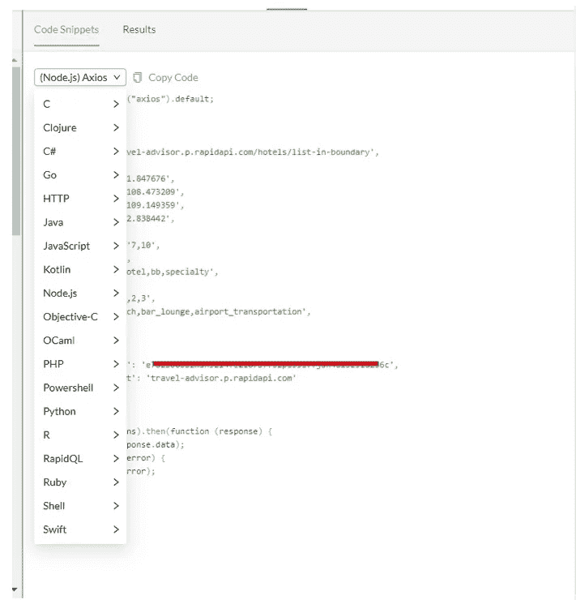

# 为您的软件项目获取 API

> 原文：<https://medium.com/nerd-for-tech/get-apis-for-your-software-project-e6e893a977a0?source=collection_archive---------11----------------------->

在这篇文章中，我将讨论如何为你的项目获得一个 API。
获取任何 API 的最简单方法是从 **RapidAPI hub 获取。**[https://rapidapi.com/](https://rapidapi.com/)
RapidAPI 是全球最大的 API 市场。开发者使用 Rapid API **来发现和连接成千上万的 API**。使用 RapidAPI，开发人员可以搜索和测试 API，订阅和连接 API。

让我们看看如何在您的项目中使用这些 API。

首先，你得做个帐。为此，你可以使用 Gmail、GitHub、脸书注册，或者提供你的工作邮箱和合适的密码。

登录后，您将重定向到一个页面，该页面包含您可以为您的项目获得的所有 API。

在这里，您可以看到如此多的 API 类别，可以用于您自己的项目。

示例:

旅游顾问 API —获取世界各地的所有酒店、餐厅和景点

open weather API——获取世界各地的实时天气

现在让我们看看如何在项目中使用任何 API。为此，我使用了旅游顾问 API。

1.  在搜索栏中输入 Travel Advisor API。现在你将进入下一页。

2.要使用它，你必须订阅测试。为此，点击**订阅测试**按钮。然后，您将进入包含价格详情的页面。

3.现在，您可以根据自己的需求选择定价方法。如果你只是需要测试项目，你可以使用基本价格-免费。

4.然后回到头中的端点。

5.在左侧栏中，您可以看到不同类型的请求。你可以根据你的需要选择任何一个。

6.选择请求方法后，您可以通过点击**测试端点**按钮(可选)来测试端点。

7.然后，您可以通过单击右边栏上的代码片段来选择 API 的代码。

8.最重要的是你可以根据你的项目所使用的语言来修改这些代码。为此，请单击下拉菜单。在那里你可以看到所有你可以修改的语言代码。

9.现在，您必须选择您的项目语言，并为您的项目复制和粘贴这些代码。

按照同样的步骤，您可以将这个 RapidAPI hub 中的任何 API 用于您的项目。

**♥️♥️感谢您的阅读。敬请关注即将发布的文章。♥️♥️**