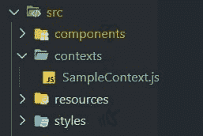
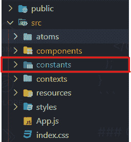

# 获取 React JS 中的全局变量

> 原文：<https://medium.com/nerd-for-tech/get-global-variables-in-react-js-490cf68f2a73?source=collection_archive---------0----------------------->


让我们假设你正在制作一个在`http://localhost:3000`向后端发出大量请求的应用程序。现在您转移到生产构建，在您使用的任何托管服务上托管它之后，URL 被更改为`https://yasharyan.com`。想象一下，找到您使用过的每一行 localhost URL 并将其更改为新的 URL 是多么痛苦。如果你能聪明地编码并使用一个全局变量来输入这个:
`${URL}/server-time-up/UTC/`不是很好吗

有很多方法可以在 React JS 中创建全局变量，这些变量可以在 web 应用程序的每个组件中访问。我将告诉你最常见和最简单的方法。

上下文提供了一种通过组件树传递数据的方式，而不必在每一层手动向下传递属性。它最好的一点是不需要安装外部依赖项。上下文与 React 捆绑在一起。它有一个简单的方法。假设你有许多组件想要使用一个公共变量。它可以很容易地从上下文中导入，而不是一直作为道具从父组件中传递。

# 怎么做？

为了便于阅读代码，最好在 react 应用程序的`src`文件夹中创建一个`context`目录。然后在该文件夹中创建一个`CONTEXT_NAMEContext.js`文件。



一个项目中可以有多少个上下文没有限制。事实上，你可以为你的应用程序想要使用上下文的每一个功能提供一个专用的上下文。创建上下文的代码如下所示:

```
import React, { createContext, useState } from 'react'
export const SampleContext = createContext()
const SampleContextProvider = (props) => {
    const [variableOne, setVariableOne] = useState('somethingRandom`)
    const Url = "http://localhost:3000"
    return (
         <SampleContext.Provider 
            value={{
                variableOne,
                Url
             }}>
               {props.children}
         </SampleContext.Provider>
    )
}
export default SampleContextProvider
```

注意，所有需要全局化的变量(甚至是函数)在 return 语句中都被作为`values`传递。既然已经导出了上下文，那么是时候将其导入到组件中了。首先，转到 App.js 文件，包装所有想要访问上下文的组件。所有子组件将自动继承上下文。

```
import React, { Fragment } from 'react'
   import Component_One from './Component_One'
   import Component_Two from './Component_Two'
   import Component_Three from './Component_Three'
   import SampleContextProvider from '../contexts/SampleContext'
   const mainComponent = () => {
      return (
        <Fragment>
            <h1>This is a sample component</h1>
            <SampleContextProvider>
                <Component_One />
                <Component_Two />
                <Component_Three />
            </SampleContextProvider>
        </Fragment>
      )
   }
```

注意所有导入的组件是如何用`<SampleContextProvider>`包装的？所有这些组件现在都可以访问上下文中的所有值。要访问(消费)它们，您必须执行以下操作:

```
import React, { Fragment, useState, useContext } from 'react'
import SampleContext from '../contexts/SampleContext'
import axios from 'axios'
const Component_One = () => {
    const { variableOne, Url } = useContext(SampleContext)
    const [getServerTimeUp, setServerTimeUp ] = useState()
    axios.get(`${Url}/server-time-up/UTC/`)
    .then(res => {
       setServerTimeUp(res.data.time)
    }
    return (
        <Fragment>
             <h1>This is the value of variableOne: {variableOne}</h1>
             <p>{getServerTimeUp}</p>
        </Fragment>
    )
}
```

这样，您可以在任何需要的组件中全局设置和获取变量。

# 使用。环境文件

如果你用过 NodeJS，你可能用过或者听说过`.env`文件。让我们在您的 React 应用程序上获得该功能。

# 案例 1:使用创建-反应-应用程序

如果你正在使用`create-react-app`来快速设置你的 React 应用，你添加一个`.env`文件的工作已经完成了一半。

*   步骤 1:在 React 应用程序的根目录下创建一个. env 文件


*   第 2 步:开始在`.env`文件中输入变量。请记住，您需要用一个`REACT_APP_`来开始每个变量，这样它才能工作；否则，您的变量不会被导入。

```
REACT_APP_DATABASE=redis
REACT_APP_FIRST_RELEASE=02Nov2019
REACT_APP_LAST_UPDATE=07Dec2020
```

*   第三步:使用`process.env.REACT_APP_`将它们导入你的组件

```
render() {
return (
  <div>
       <h1>
          We are using {process.env.REACT_APP_DATABASE}
       </h1>
  </div>
);
}
```

# 案例 2:不使用 create-react-app

如果你想对你的项目有更多的控制权，并自己编写 webpack，你需要多做几个步骤来设置`.env`支持。

*   步骤 1:使用`npm install dotenv`或`yarn install dotenv`在你的项目中安装 dotenv 包
*   步骤 2:如果您需要所有组件的支持，或者如果您希望其他组件支持，只需要特定组件的支持，请将文件导入 index.js 文件。`require('dotenv').config()`
*   步骤 3:现在，您可以按照案例 1 中的相同过程来设置您的环境变量。如果你没有使用`create-react-app`，你不需要用`REACT_APP_`开始每个变量。

# 从. js 文件手动导出

这可能是拥有全局变量的最简单的方法。

*   第一步:转到你的`src`文件夹，创建一个名为`constants`的新文件夹，或者你想给它起的名字。



*   第二步:像`global.js`一样在上述文件夹的一个新文件中创建多个变量，然后导出它们，以便它们可以导入到其他组件中。

```
const Url = 'http://localhost:5000'
const themeDefault = 'dark'
const namesOfModes = ['dark', 'moonlight', 'eclipse', 'light']

export { Url, themeDefault, namesOfModes }
```

*   步骤 3:现在是时候将这些常量导入到组件中了

```
import React from 'react'
import { Url, themeDefault, namesOfModes } from '../constants/global'
const Component_Three = () => {
  return (
     <div>
       <h1>Current Theme: {themeDefault}</h1>
       <p>Homepage: {Url}</p>
     </div>
  )
}
```

注意:*你可能会说你可以使用像 Redux 和反冲 JS 这样的包，但是让我提醒你，它们是状态管理工具，它们不应该仅仅用来存储全局常量。*

# 谢谢

希望你发现这篇文章信息丰富，耐人寻味。如果它对你有帮助，就像🧡一样给它一个名字，并与可能会发现它有用的人分享。还可以查看我的 [Instagram](https://www.instagram.com/encodable/) 和[脸书](https://www.facebook.com/enc0dable)页面了解更多内容。


考虑支持我。[https://buymeacoffee.com/yasharyan](https://buymeacoffee.com/yasharyan)