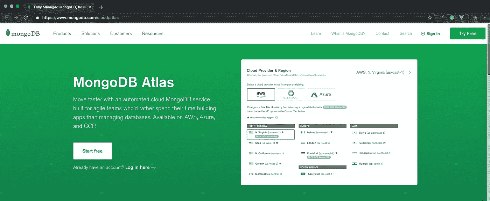
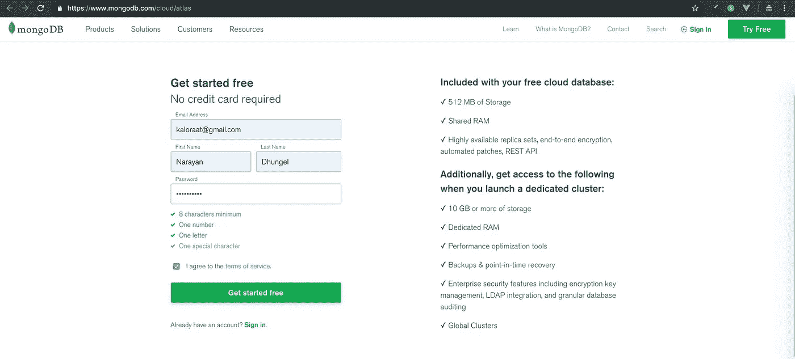
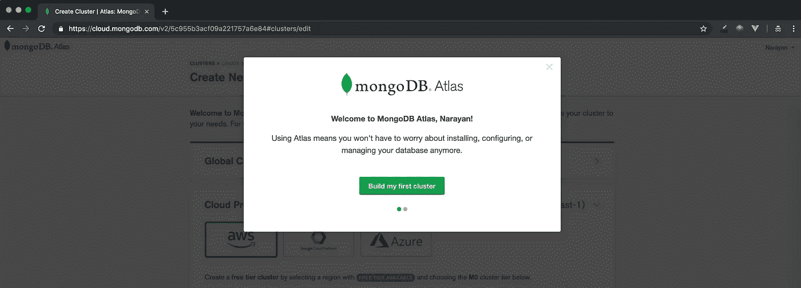
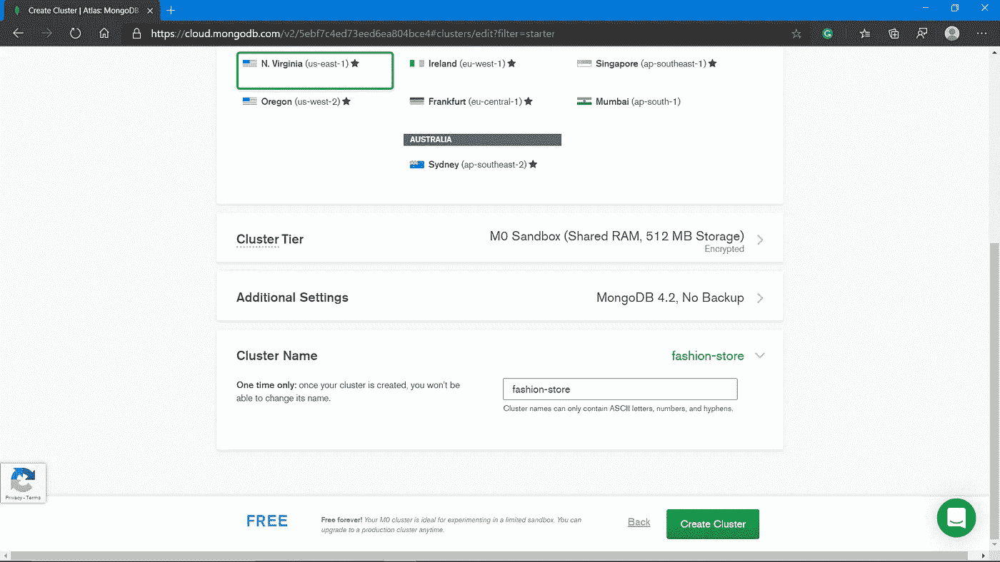
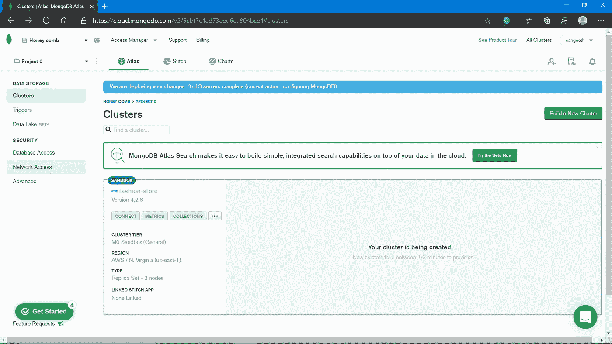
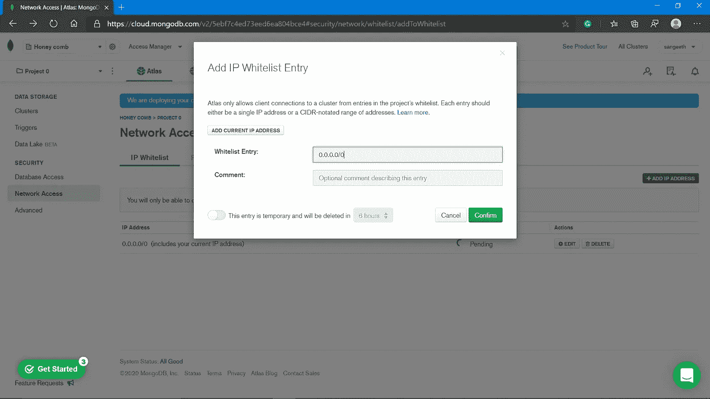
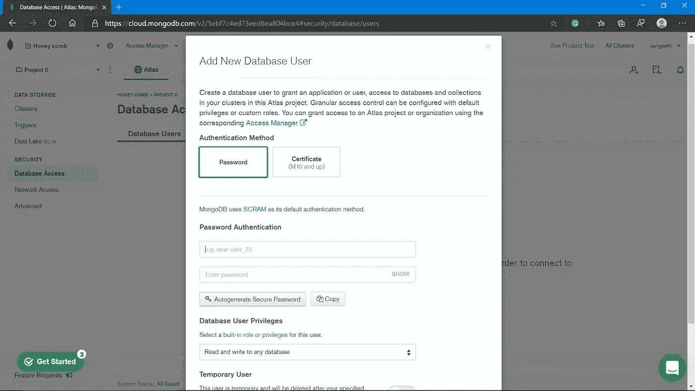
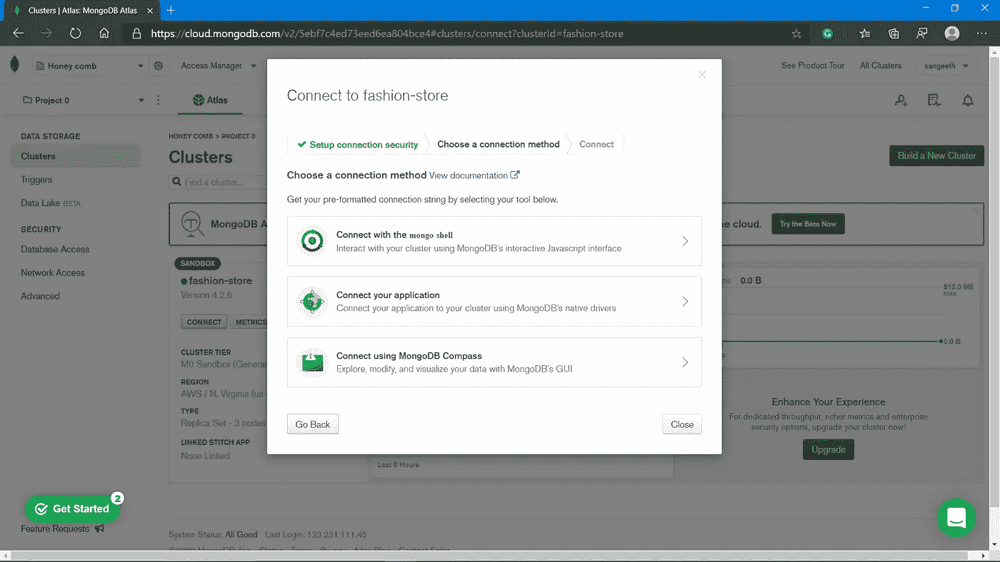
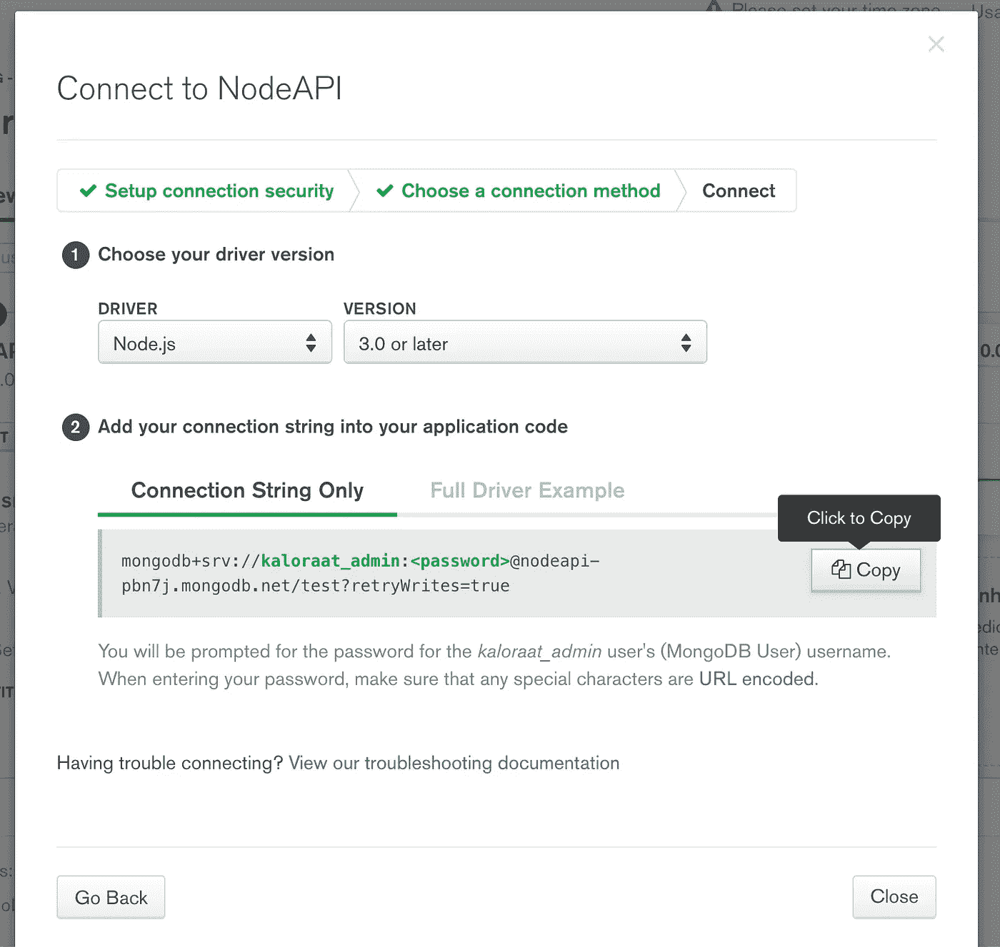
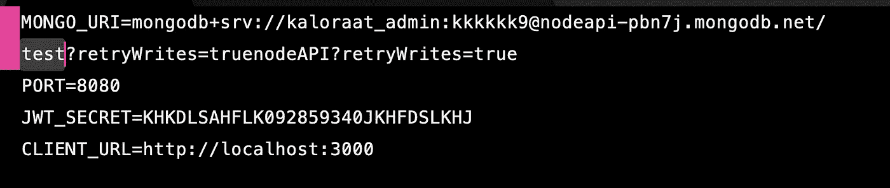

# MongoDB Atlas 入门

> 原文：<https://medium.com/nerd-for-tech/get-started-with-mongodb-atlas-dbb734726a7f?source=collection_archive---------0----------------------->

本文将指导您如何开始使用 MongoDB Atlas。

1.  访问 [MongoDB 图集](https://www.mongodb.com/cloud/atlas)

**2。**点击“免费开始”,填写您的电子邮件、姓名和密码，接受服务条款，然后点击“免费开始”按钮

3.然后你会被带到新的一页。您将看到一个按钮，上面写着“构建我的第一个集群”

4.在页面的末尾，您将看到集群名称行。单击该按钮，输入新集群/数据库的名称。给你的集群命名，点击创建集群按钮

5.在左侧栏，您将看到您的集群的名称以及一些选项，如连接、指标、集合。

6.白名单 IP 在 Mongo Atlas 中，首先点击左侧边栏安全下的网络访问

*然后你会看到以下弹出窗口。在此输入 0.0.0.0/0 作为白名单条目。这将允许用户从任何 IP 地址使用我们的 mongo atlas 集群。完成后，单击确认。*

7.用名称和口令创建数据库用户

*您需要创建一个数据库用户才能使用该服务。这不是您的登录用户和密码，而是另一个。它将用于允许访问您刚刚创建的特定 mongo 集群。单击左侧边栏中“安全”下的“数据库访问”,在随后的弹出窗口中，输入用户名和密码。*

8.获取连接 URI 字符串

*现在是时候最终获得连接 URI 字符串了，这将允许我们的应用程序使用 mongo atlas 作为云中的数据库服务。单击顶部 Atlas 下左侧边栏中的 Clusters。您将看到一个弹出窗口。点击表示* ***的选项，连接您的应用程序***

9.单击以复制连接字符串。

10.转到您的项目并创建一个名为。env 放在项目的根目录下(这一步在前面的讲座中解释过)。`nodeapi/.env` 并添加您刚刚复制并粘贴到`MONGO_URI`的连接字符串

*您需要用您之前使用的实际密码替换* `*<password>*` *部分，以创建一个 MongoDB 用户，用您的实际密码更新* `*<password>*` *。在下面的例子中，你可以看到我的密码*

