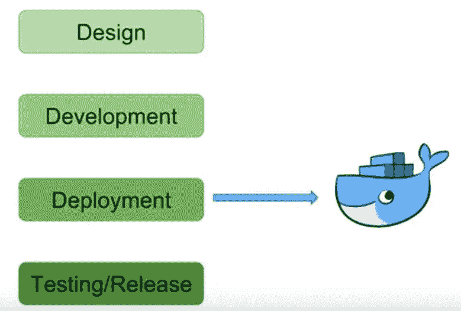
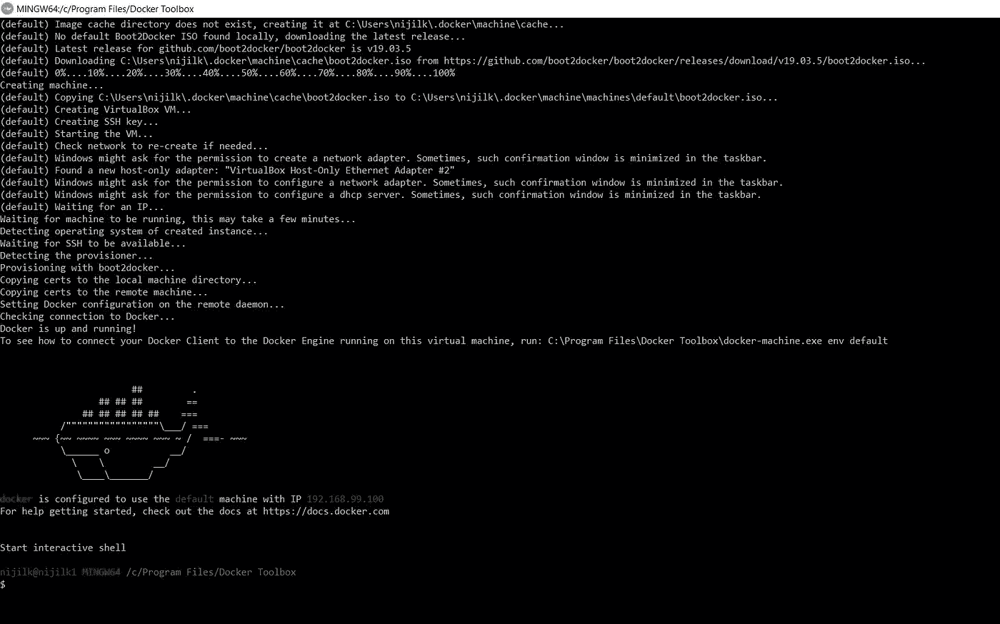
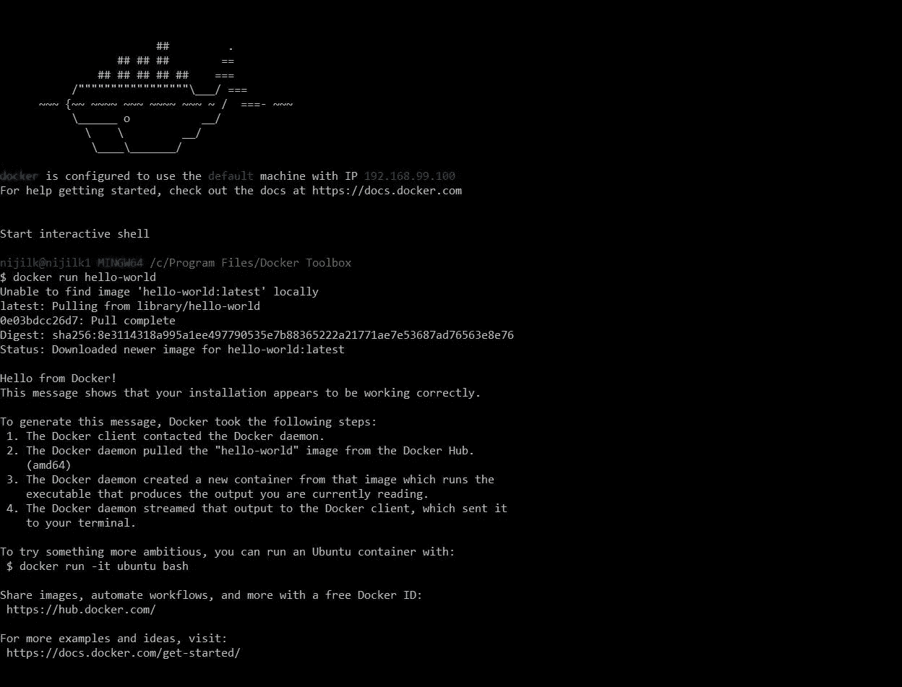

# 了解 Docker 工具箱

> 原文：<https://medium.com/nerd-for-tech/get-to-know-docker-toolbox-5e48d67cf28?source=collection_archive---------0----------------------->

你有没有面临过“这个代码在我的系统上能用，在我同事的系统上不行”的问题。

在我的软件工程生涯中，我遇到过很多次这种情况。让我们思考一下软件开发生命周期，docker 真正的作用在哪里？它存在于整个生命周期，但主要在部署阶段发挥作用。

软件开发生命周期中的 Docker

每个软件工程师的愿望都是让代码在每个可能的平台上以预期的方式工作。今天的软件产品不仅仅是几行代码。它是许多前端组件、后端组件、数据库、库和数百个依赖项的混合体。因此，作为工程师，我们需要确保所有这些组件以正确的方式在每个可能的平台上工作。

这时码头工人就派上用场了。Docker 是世界领先的软件容器平台，它解决了几乎所有与软件部署相关的难题。Docker 使用“容器”概念使软件部署比以前更容易。容器允许开发人员将所有的应用程序部分、依赖项和库打包成一个包，docker 将负责以标准方式将这个容器运送到不同类型的平台。

现在，软件工程师不需要担心这个应用程序将如何部署在不同的平台上。他们只能专注于开发应用程序的代码库，并将所有的库和依赖项打包到 docker 容器中。

让我们在不久的将来更多地讨论 docker 容器及其架构。让我告诉你如何在你的机器上正确安装 docker。

首先，您的机器需要满足安装最新 docker 桌面的一些要求。

您需要安装 windows 10:64 位计算机，该计算机的内部版本为 1703 或更高版本。当我试图安装时，由于我的机器有 windows 10，1607 版本，对于 docker 桌面(最新的 Docker 版本)来说太旧了，所以安装失败了。因此，我把重点放在安装 Docker 工具箱(V 19.03.1)上，这是较早的版本。

请在这里找到 docker 工具箱版本。

 [## docker/工具箱

### 今天就创建您的免费 GitHub 帐户，订阅这个新版本的资源库，并与 40…

github.com](https://github.com/docker/toolbox/releases) 

单击“下一步”以默认设置安装 docker 工具箱。你会在安装结束时得到 Docker 工具箱、虚拟盒子和 Kitematic。

要验证您的安装，

双击 docker 快速启动，它将启动 Docker 工具箱终端。

现在尝试下面的命令。

`docker run hello-world`

如果您得到以下类型的输出，那么您的安装可以继续进行。

现在你已经安装了 docker tool box，如果你有最新的 windows build 版本，我建议你安装 docker desktop。让我们在接下来的文章中从头开始讨论 docker 是如何工作的及其架构。发表你对这篇文章的评论、建议和想法。谢谢你。