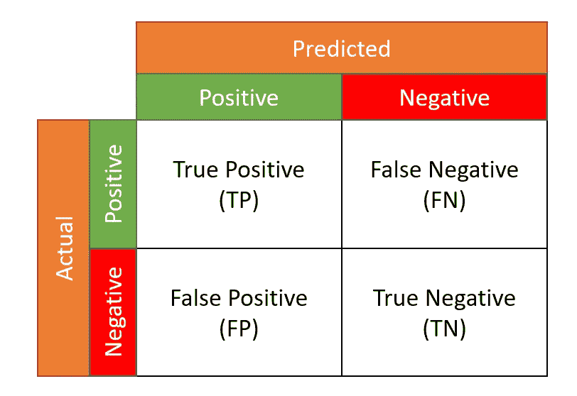
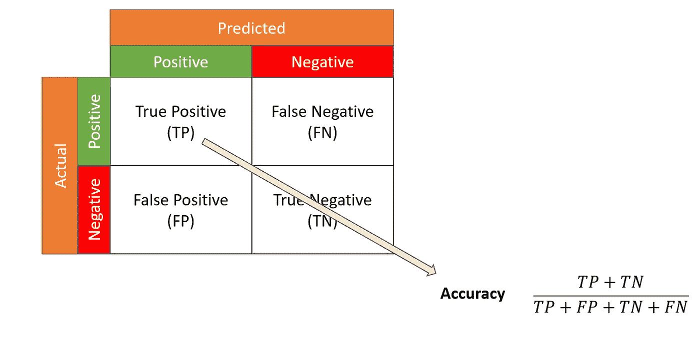
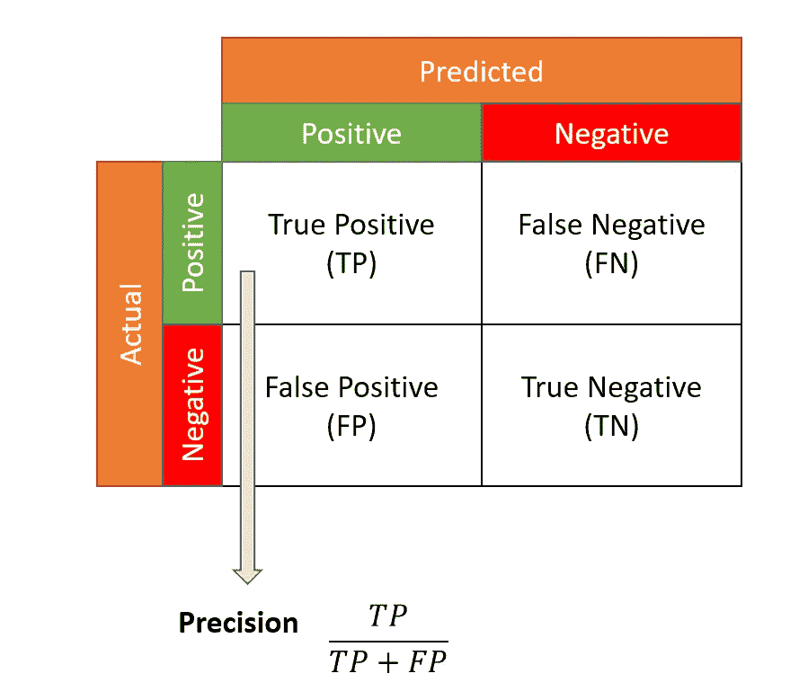
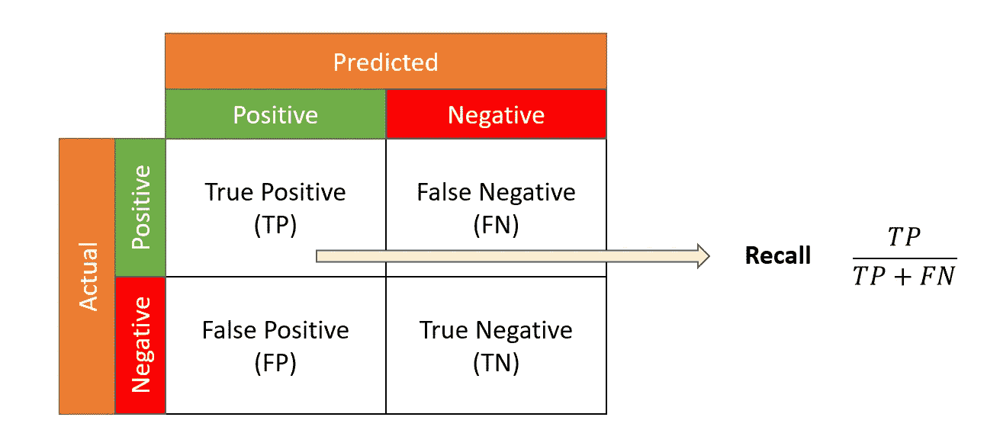
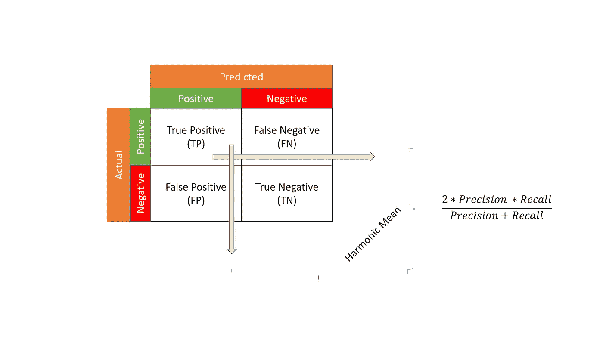

# 获取混乱矩阵！！

> 原文：<https://medium.com/nerd-for-tech/getting-hold-of-confusion-matrix-1c8481a2107e?source=collection_archive---------2----------------------->


丹尼尔·利维斯·佩鲁西在 [Unsplash](https://unsplash.com/s/photos/confusion?utm_source=unsplash&utm_medium=referral&utm_content=creditCopyText) 上的照片

混淆矩阵是分类问题预测结果的列表摘要。这是一个预测值和实际值不同组合的表。下图总结了这些组合。**此处行代表实际值，列代表预测值**。



上面的混淆矩阵显示了我们的分类模型在进行预测时被混淆的方式。因此命名为混乱矩阵。

使用这个链接来玩混乱矩阵。

## 基本术语

> ***真正* —** 预测类和实际类都为正。
> ***真阴性* —** 预测类和实际类均为阴性
> ***假阳性* —** 预测类为阳性但实际类为阴性
> ***假阴性* —** 预测类为阴性但实际类为阳性

***注:*** *假阳性又称为***I 型错误** *。假阴性被称为***II 型** *错误。*

在上面的术语中**真|假**告诉我们预测是对还是错。第二部分**正|负**告诉我们什么是**预测**。

利用这些值，我们计算出以下比率

> ***准确率***
> 错误率—(FP+FN)/(TP+TN)/(FP+FN)
> ***真阳性率(灵敏度或召回率)***
> 假阳性率— (FP)/(FP+TN)
> 真阴性率(特异性)— (TN)/(FP+TN)
> ***精度***

我们将在这个博客中讨论准确度、召回率和精确度。

## 准确(性)



仅仅准确性并不能很好地衡量模型的性能。它对类的不平衡很敏感，也不会告诉你一些类是否被一个模型忽略了。假设我们试图预测欺诈交易。如果我们的模型预测越来越多的非欺诈交易，它将具有合理的准确性，因为通常欺诈交易数据会更少。所以我们使用其他的度量标准，比如精确度，回忆..

## 精确



精确，正如这个词所说，告诉我们的模型如何精确地识别阳性。它意味着在模型预测的所有阳性类别中，有多少部分实际上是阳性的。

> 在假阳性比假阴性更受关注的情况下，精确度是一个有用的指标。

*喜欢给孩子推荐安全的视频。这里需要精确。我们不想推荐任何不安全的视频。如果我们错误地将一个安全的视频归类为不安全的，那也没关系。但是不安全的视频要正确识别。*

## 回忆



回忆为我们提供了一种方法来衡量我们的模型能够正确分类为正面的正面类别的比例。

> 当目标是*限制假阴性的数量* (FN)时，召回是有用的

在我们是否发出假警报并不重要，但实际的阳性病例不应未被检测到的情况下，召回很重要！

> 很明显，精确度和召回率是反向关联的，我们不能同时获得高分——增加精确度会降低召回率，反之亦然。这被称为*精度/召回权衡*。

为了比较具有不同精度和召回值的模型，我们使用 F1 分数。F1 分数是精确度和召回率的调和平均值。我们使用调和平均值，因为与算术或几何平均值相比，它对较高值的惩罚更严重。

```
precision = 0.9
recall = 0.4For above value if we calculate AM, GM & HM we get 0.65, 0.6 & 0.55 respectively. And we see HM has penalized the higher value most.
```

## F1 分数



## **ROC 曲线**

ROC 曲线是真阳性率(y 轴)对假阳性率(x 轴)的曲线图，我们改变了将观察值分配给给定类别的阈值。


来源[https://scikit-learn.org/](https://scikit-learn.org/)

代码示例:

```
from sklearn.metrics import confusion_matrix
from sklearn.metrics import classification_report
from sklearn.metrics import roc_curveactual = [1,0,0,1,0,0,1,0,0,1]
predicted = [1,0,0,1,0,0,0,1,0,0]matrix = confusion_matrix(actual,predicted, labels=[1,0])
print('Confusion matrix : \n', matrix)matrix = classification_report(actual, predicted, labels=[1,0])
print('Classification report : \n', matrix)
```

希望你不要被混淆矩阵所迷惑！！